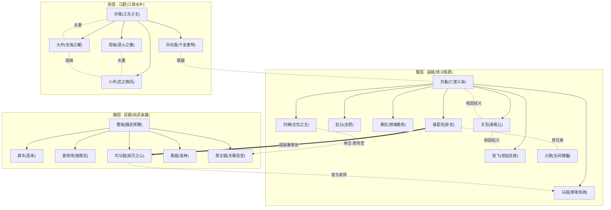
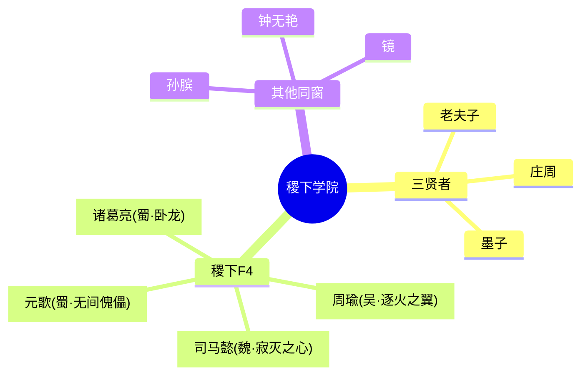
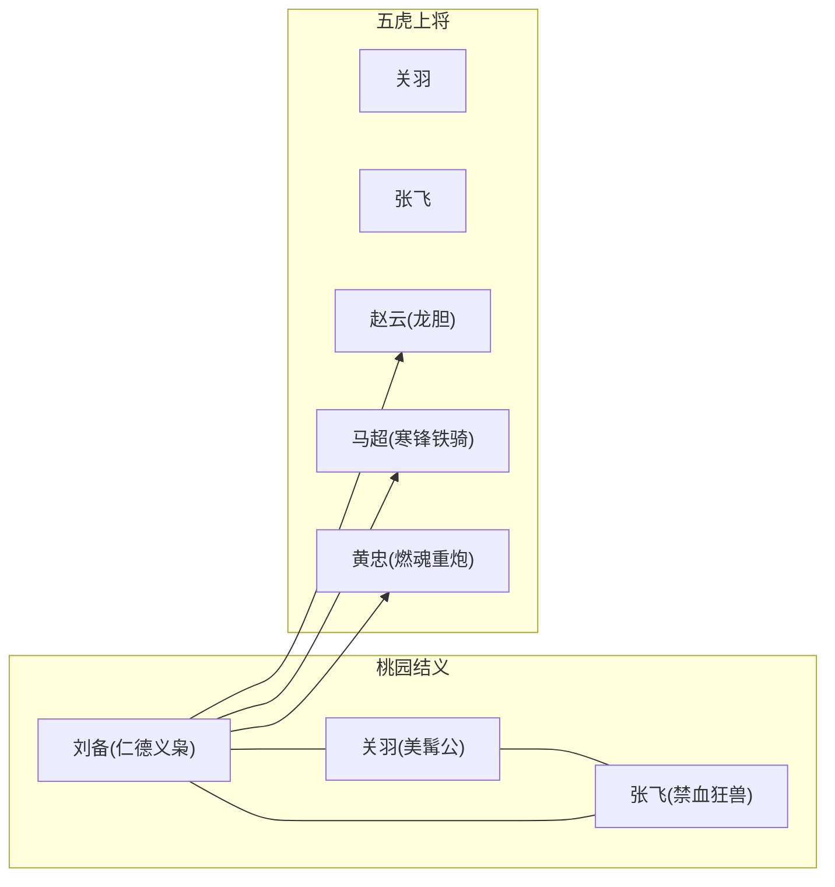
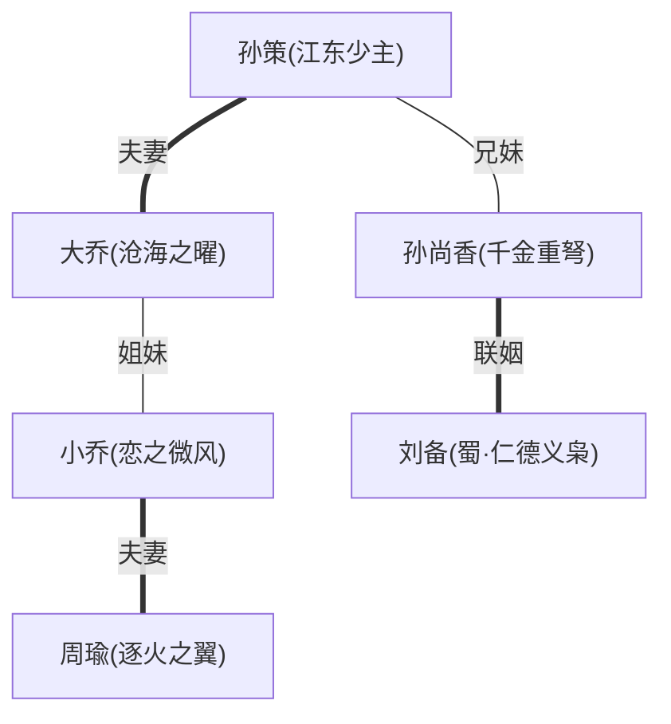

# 专题 · 三分之地与三国演义

::: quote 题记
「话说天下大势，分久必合，合久必分。」——《三国演义》开篇语，亦是《王者荣耀》「三分之地」这一整片疆域的精神底色。
:::

在《王者荣耀》的世界版图上，**三分之地**是对中国古典名著《三国演义》最系统、最完整的一次再演绎。它不是把魏蜀吴三国原封不动地搬进峡谷，而是抽取「三足鼎立、群雄逐鹿、忠义权谋」的内核，重新铸成三座地理风貌、民风性格各异的城邦——**魏国·武都**、**蜀国·益城**、**吴国·江郡**——再让一众脱胎于史书与小说的名将，在这片土地上重新厮杀、相爱、相知、相负。

本页是「三分之地」三大阵营的总纲与索引：先勾勒三国的整体设定与它对《三国演义》母题的取舍重构，再以对照表、关系图、经典战役与羁绊网络，把魏蜀吴的人物一一系连。三个阵营的详细档案，请移步各自的阵营页：[三分之地·魏国](../factions/sanfen-wei.md)、[三分之地·蜀国](../factions/sanfen-shu.md)、[三分之地·吴国](../factions/sanfen-wu.md)。

---

## 一、三分之地：一个被重铸的三国

### 1.1 何为「三分之地」

「三分之地」是三国题材英雄在《王者荣耀》世界观中的统一归属地，对应游戏导航中的 **三分之地** 阵营组（navGroup）。它由三座核心城邦构成，彼此既相互依存又彼此觊觎，构成了「三足鼎立」的经典格局：

- **魏国**以**武都**为核心，民风彪悍尚武、富侵略野心；灰色城墙、石柱天桥，兵强马壮，是三国中最具进攻性的工业化战争机器。由枭雄[曹操](../heroes/sanfen-wei.md#曹操)统领。
- **蜀国**以**益城**为核心，山清水秀、桃花绚烂，是带有神秘感的世外桃源；侠肝义胆、重情重义，是三分之地中**英雄数量最多**的阵营。由仁德枭雄[刘备](../heroes/sanfen-shu.md#刘备)统领，内含「桃园结义」与「五虎上将」两大羁绊核心。
- **吴国**以**江郡**为核心，江南水乡（苏派与徽派建筑结合）、江河富庶、私家园林造景；性情温婉而坚韧，却因富庶而被魏都觊觎。由[孙策](../heroes/sanfen-wu.md#孙策)、孙权兄弟统领（孙权暂未收录为可对战英雄，故不作英雄链接，(考据推测)其为孙策之弟），内含「孙—周—二乔」的姻亲网络。

::: info 命名上的「演义」笔法
游戏没有沿用史书中的「洛阳/许昌」「成都」「建业」等真实地名，而是改用**武都、益城、江郡**这类既有古意、又略作虚化的名字。这是「三分之地」处理三国题材的典型手法——保留可辨识的历史骨架，再以幻想笔触重新着色，使其与《王者荣耀》整体的架空世界自洽。
:::

### 1.2 对《三国演义》的再演绎：取什么，舍什么

《三国演义》是一部「七分实事，三分虚构」的历史演义；而「三分之地」是在演义之上的**二次演义**——它取走了三国故事最深入人心的母题，又为了战术对战与角色塑造作了大胆的重构。

保留的母题三足鼎立、桃园结义、五虎上将、赤壁之战、卧龙凤雏、二乔之美、孙刘联姻、忠义与权谋的对立——这些《三国演义》的「文化记忆点」被一一保留并强化。

重构的设定将文官武将统一「英雄化」为可对战角色：诸葛亮化身法术爆发的法刺，黄忠操纵巨型重炮，刘禅驾驶机关车，孙尚香手持「千金重弩」——历史人物被赋予了奇幻化的战斗形象。

跨题材的缝合三国名士并非凭空而来。诸葛亮、司马懿、周瑜被设定为**稷下学院**出身的同窗（「稷下F4」），将三国与「学院·机关」的诸子百家叙事缝合到同一个世界观里。

情感线的放大游戏极度强化了人物间的「CP」与羁绊：孙策与大乔、周瑜与小乔、刘备与孙尚香的姻亲网，乃至跨阵营的刘禅单恋蔡文姬——把演义中的家国叙事，化作可被玩家共情的情感网络。

::: warning 考据提醒：这是「演义的演义」
「三分之地」的设定多处偏离正史与原著小说，例如让诸葛亮、司马懿、周瑜同出稷下，让司马懿成为马超之师，让黄忠操纵重炮。这些都是游戏的**原创再演绎**，不应与《三国志》《三国演义》的史实／原著情节混为一谈。本页凡涉及游戏原创处均据 build 资料如实陈述，史实与原著的差异则以提示框标注。
:::

---

## 二、三国对照表

下表横向对比魏、蜀、吴三国的核心设定，是阅读本专题的总索引。

| 国 | 核心都城 | 君主／统领 | 代表武将 | 主题风格 |
| --- | --- | --- | --- | --- |
| **[魏国](../factions/sanfen-wei.md)** | 武都 | [曹操](../heroes/sanfen-wei.md#曹操)（魏武挥鞭） | [典韦](../heroes/sanfen-wei.md#典韦)、[夏侯惇](../heroes/sanfen-wei.md#夏侯惇)、[司马懿](../heroes/sanfen-wei.md#司马懿)、[甄姬](../heroes/sanfen-wei.md#甄姬)、[蔡文姬](../heroes/sanfen-wei.md#蔡文姬) | 三国争霸 + 尚武枭雄；灰墙石柱、兵强马壮、侵略野心 |
| **[蜀国](../factions/sanfen-shu.md)** | 益城 | [刘备](../heroes/sanfen-shu.md#刘备)（仁德义枭） | [关羽](../heroes/sanfen-shu.md#关羽)、[张飞](../heroes/sanfen-shu.md#张飞)、[赵云](../heroes/sanfen-shu.md#赵云)、[马超](../heroes/sanfen-shu.md#马超)、[黄忠](../heroes/sanfen-shu.md#黄忠)、[诸葛亮](../heroes/sanfen-shu.md#诸葛亮)、[刘禅](../heroes/sanfen-shu.md#刘禅)、[元歌](../heroes/sanfen-shu.md#元歌) | 三国争霸 + 侠义桃源；山清水秀、桃花世外、侠肝义胆 |
| **[吴国](../factions/sanfen-wu.md)** | 江郡 | [孙策](../heroes/sanfen-wu.md#孙策)（江东少主）、孙权（未收录为英雄） | [周瑜](../heroes/sanfen-wu.md#周瑜)、[大乔](../heroes/sanfen-wu.md#大乔)、[小乔](../heroes/sanfen-wu.md#小乔)、[孙尚香](../heroes/sanfen-wu.md#孙尚香) | 三国争霸 + 江南水乡；苏徽园林、江河富庶、温婉坚韧 |

::: info 三国之「最」速记
- **最尚武／最具侵略性**：魏国。曹操、典韦、夏侯惇皆为近身搏杀的猛将，连谋士司马懿都是「法刺收割」的进攻型中单。
- **英雄最多／羁绊最密**：蜀国。桃园结义 + 五虎上将 + 卧龙诸葛，构成三分之地最庞大的人物群。
- **情感线最浓／最重防守**：吴国。孙周二乔的姻亲网最为缠绵，而其富庶之地恰恰是被魏都觊觎的「守势一方」。
:::

---

## 三、三国阵营详解

### 3.1 魏国 · 武都 —— 尚武枭雄

尚武权谋兵强马壮

魏国是三分之地中最具「钢铁意志」的阵营：灰色城墙、石柱天桥构成的冷硬都城形象，对应着民风彪悍、富于侵略野心的国格。由嗜血枭雄[曹操](../heroes/sanfen-wei.md#曹操)统领，麾下武将以悍勇著称——

| 英雄 | 称号 | 定位 | 一句话特征 |
| --- | --- | --- | --- |
| [曹操](../heroes/sanfen-wei.md#曹操) | 魏武挥鞭 | 战士 | 嗜血枭雄，靠护盾与突进的吸血型战士 |
| [典韦](../heroes/sanfen-wei.md#典韦) | 恶来 | 战士 | 持双戟的魏国猛将，狂暴近身输出 |
| [夏侯惇](../heroes/sanfen-wei.md#夏侯惇) | 独眼龙 | 战士 | 独眼悍将，带控带突进的肉系战士 |
| [司马懿](../heroes/sanfen-wei.md#司马懿) | 寂灭之心 | 法师/刺客 | 阴鸷深沉的谋士，最早的法刺收割中单 |
| [甄姬](../heroes/sanfen-wei.md#甄姬) | 洛神 | 法师 | 化身洛水之神的冷美人，控制与法球见长 |
| [蔡文姬](../heroes/sanfen-wei.md#蔡文姬) | 天籁弦音 | 辅助 | 蔡邕之女、被曹操收养，操控音律的奶妈 |

::: quote 曹操台词
「宁教我负天下人。」——以一句霸气的反诘，浓缩了「魏武挥鞭」嗜血枭雄的底色。
:::

魏国的精神肖像，几乎就是《三国演义》「乱世奸雄」母题的具象：曹操的雄才与多疑，[司马懿](../heroes/sanfen-wei.md#司马懿)的隐忍与城府，共同撑起这个阵营「权谋」的一极。值得一提的是，[甄姬](../heroes/sanfen-wei.md#甄姬)「洛神」的形象，取自曹植《洛神赋》「翩若惊鸿，婉若游龙」的洛水女神意象——这是「三分之地」从三国文学母题中汲取审美的典型一例。

完整设定见 → [三分之地·魏国](../factions/sanfen-wei.md)

### 3.2 蜀国 · 益城 —— 侠义桃源

侠义桃源仁德

蜀国是三分之地中英雄数量最多、羁绊最为致密的阵营。益城山清水秀、桃花绚烂，宛若世外桃源，又带一缕神秘——这正契合「仁德义枭」[刘备](../heroes/sanfen-shu.md#刘备)以仁义立国、却又身处乱世的双重底色。

| 英雄 | 称号 | 定位 | 一句话特征 |
| --- | --- | --- | --- |
| [刘备](../heroes/sanfen-shu.md#刘备) | 仁德义枭 | 战士 | 持双枪的枭雄，远近结合的射击型战士 |
| [关羽](../heroes/sanfen-shu.md#关羽) | 美髯公 | 战士 | 骑赤兔提青龙偃月刀，加速冲撞的骑战 |
| [张飞](../heroes/sanfen-shu.md#张飞) | 禁血狂兽 | 坦克/辅助 | 大招强化变身、加盾护团的肉盾辅助 |
| [赵云](../heroes/sanfen-shu.md#赵云) | 龙胆 | 战士/刺客 | 常山赵子龙，高机动位移 + 护盾连招 |
| [马超](../heroes/sanfen-shu.md#马超) | 寒锋铁骑 | 战士/刺客 | 西凉锦马超，掷枪 + 拾枪的高机动战刺 |
| [黄忠](../heroes/sanfen-shu.md#黄忠) | 燃魂重炮 | 射手 | 老将军操纵巨型重炮，越战越勇 |
| [诸葛亮](../heroes/sanfen-shu.md#诸葛亮) | 卧龙 | 法师 | 运筹帷幄、稷下出身的法术爆发法刺 |
| [刘禅](../heroes/sanfen-shu.md#刘禅) | 无忧之主 | 坦克/辅助 | 操控机关车的后主，团控加盾，暗恋蔡文姬 |
| [元歌](../heroes/sanfen-shu.md#元歌) | 无间傀儡 | 刺客 | 操控傀儡的提线刺客（(考据推测)原型为蜀国军师庞统，多于长安一带活动） |

::: quote 刘备台词
「以人为本，仁德至上。」——一句台词便立住了「仁德义枭」与曹操「宁负天下」截然相反的价值立场。
:::

蜀国是「三分之地」对《三国演义》忠义叙事最重墨的承载者：**桃园结义**的兄弟情、**五虎上将**的赫赫武功、**卧龙**诸葛亮的鞠躬尽瘁，三条线索交织成蜀汉特有的悲壮浪漫。其下专设一节细说五虎将（见第四节）。

::: info 元歌的「考据」身份
[元歌](../heroes/sanfen-shu.md#元歌)在 build 资料中明确归属蜀国，其设定原型（(考据推测)）指向蜀国军师**庞统**（「凤雏」）；据其英雄档案，他多于**长安**一带活动，幼年受惊失语、孤儿身份入稷下，由博学的师兄[诸葛亮](../heroes/sanfen-shu.md#诸葛亮)鼓励、以机关傀儡代喉舌与世界沟通，从此专研傀儡之术。这是「卧龙凤雏」母题在游戏中被改写、并与稷下叙事缝合的典型案例。需注意：庞统原型与长安活动两点，在 build 资料中本就标注为(考据推测)，并非官方硬设定。
:::

完整设定见 → [三分之地·蜀国](../factions/sanfen-shu.md)

### 3.3 吴国 · 江郡 —— 江南水乡

水乡富庶姻亲

吴国以江郡为核心，融苏派与徽派建筑之美，江河富庶、私家园林造景，是三分之地中最具江南诗意的一隅。然而正因富庶，它成为魏都觊觎的目标，天然处于「守势」的位置。由[孙策](../heroes/sanfen-wu.md#孙策)、孙权兄弟统领。

::: info 关于孙权
据 build 阵营资料，吴国的统领为**孙策、孙权**二人。但孙权目前**未被收录为可对战英雄**——他作为「江东少主」孙策的同宗兄弟（(考据推测)其为孙策之弟）只在阵营叙事中出现，故本页凡涉及孙权处均**不作英雄页链接**，以免指向不存在的锚点。下表英雄名单亦因此不含孙权。
:::

| 英雄 | 称号 | 定位 | 一句话特征 |
| --- | --- | --- | --- |
| [孙策](../heroes/sanfen-wu.md#孙策) | 江东少主 | 战士 | 与大乔CP的吴侯、孙尚香之兄，乘船突进的团控战士 |
| [周瑜](../heroes/sanfen-wu.md#周瑜) | 逐火之翼 | 法师 | 操控业火的范围灼烧法师，小乔之夫 |
| [小乔](../heroes/sanfen-wu.md#小乔) | 恋之微风 | 法师 | 周瑜之妻、大乔之妹，灵动的风系远程法师 |
| [大乔](../heroes/sanfen-wu.md#大乔) | 沧海之曜 | 辅助 | 孙策之妻、小乔之姐，设传送门、群体回城的战略辅助 |
| [孙尚香](../heroes/sanfen-wu.md#孙尚香) | 千金重弩 | 射手 | 吴国郡主、孙策之妹、后嫁刘备，手持千金重弩 |

::: quote 周瑜台词
「火，是这个世界上最美的东西。」——「逐火之翼」以业火灼烧战场，正是赤壁火攻在英雄技能上的诗化投射。
:::

吴国是「三分之地」情感线最缠绵的阵营：**孙策—大乔**、**周瑜—小乔**两对夫妻，加上**大乔—小乔**姐妹、**孙策—孙尚香**兄妹，再由孙尚香远嫁刘备牵出**孙刘联姻**，织成一张横跨吴蜀两国的姻亲大网（详见第五节）。

完整设定见 → [三分之地·吴国](../factions/sanfen-wu.md)

---

## 四、蜀汉五虎上将

「五虎上将」是《三国演义》为蜀汉武将集团赋予的荣誉封号，传统指**关、张、赵、马、黄**五人。「三分之地」完整保留了这一序列，并使其成为蜀国羁绊体系的核心支柱之一。

::: info 关于「五虎上将」的考据
「五虎上将」之说出自《三国演义》的小说艺术加工；正史《三国志》中刘备称汉中王后所封为「前后左右」四方将军（关羽、张飞、马超、黄忠），赵云并不在此列，「五虎」是后世演义将赵云补入并定型的称号。游戏沿用的是**演义口径**的五虎将，这也再次印证了「三分之地」取材于《三国演义》而非纯史书。
:::

下表为五虎上将的对战形象一览：

| 五虎上将 | 称号 | 定位 | 战斗特征 |
| --- | --- | --- | --- |
| [关羽](../heroes/sanfen-shu.md#关羽) | 美髯公 | 战士 | 骑赤兔、提青龙偃月刀，靠加速冲撞的骑战战士 |
| [张飞](../heroes/sanfen-shu.md#张飞) | 禁血狂兽 | 坦克/辅助 | 大招强化变身、加盾护团的肉盾辅助 |
| [赵云](../heroes/sanfen-shu.md#赵云) | 龙胆 | 战士/刺客 | 常山赵子龙，高机动位移 + 护盾的连招战士 |
| [马超](../heroes/sanfen-shu.md#马超) | 寒锋铁骑 | 战士/刺客 | 西凉锦马超，掷枪 + 拾枪机制的高机动战刺 |
| [黄忠](../heroes/sanfen-shu.md#黄忠) | 燃魂重炮 | 射手 | 蜀汉老将军，操纵巨型重炮、越战越勇的老当益壮 |

### 4.1 五虎逐个看

#### 关羽 · 美髯公

战士

五虎之首[关羽](../heroes/sanfen-shu.md#关羽)，「美髯公」，骑赤兔马、提青龙偃月刀，是游戏中极具辨识度的「骑战」英雄——其机制围绕马匹加速与冲撞展开，越冲越快、撞击造成击退，将「过五关斩六将」的纵横感转化为可操作的位移压制。忠义无双的红脸长髯形象，是《三国演义》「义绝」母题最直接的投影。

#### 张飞 · 禁血狂兽

坦克辅助

[张飞](../heroes/sanfen-shu.md#张飞)，「禁血狂兽」，大招触发变身、为队友加盾护团的肉盾辅助。其设计抓住了演义中张飞「当阳桥头一声断喝」的勇猛与守护属性，将「猛张飞」转化为团战中保护队友的钢铁壁垒。

#### 赵云 · 龙胆

战士刺客

「常山赵子龙」[赵云](../heroes/sanfen-shu.md#赵云)，称号「龙胆」，是高机动位移 + 护盾连招的战士／刺客。其「七进七出长坂坡」的无双悍勇，被译写为反复突进、自带护盾的连招体验——是游戏中最受欢迎的国民级战士之一。

#### 马超 · 寒锋铁骑

战士刺客

「西凉锦马超」[马超](../heroes/sanfen-shu.md#马超)，「寒锋铁骑」，独有「掷枪—拾枪」机制：投掷长枪后可瞬移拾取，凭此打出极高机动的战刺连招。

::: info 马超的「考据」师承
据 build 资料，[司马懿](../heroes/sanfen-wei.md#司马懿)曾为马超之师。这是一处典型的游戏原创设定——令分属蜀、魏两国的两员名将之间，多出一层跨阵营的师徒纽带。
:::

#### 黄忠 · 燃魂重炮

射手

蜀汉老将[黄忠](../heroes/sanfen-shu.md#黄忠)，「燃魂重炮」，是五虎中唯一的射手。游戏将其「老当益壮、定军山斩夏侯渊」的形象，奇幻化为操纵**巨型重炮**、架起炮台后越战越勇的远程火力点——「老黄忠」的不服老精神，被重炮的轰鸣具象化。

---

## 五、三国势力与名将关系图

下图以 mermaid 绘出魏、蜀、吴三国的统领—名将归属，以及横跨三国的稷下同窗、师承、姻亲与跨阵营情感线。

::: tip 如何读这张图
- **实线箭头**表示「统领→麾下」的阵营归属。
- **虚线**表示羁绊：桃园结义、夫妻、姐妹、师承、联姻、单恋。
- **粗箭头**（`==>`）特别标出诸葛亮与司马懿这对「宿敌兼挚友」——三分之地最具张力的一对关系。
:::

### 稷下同窗：三国名士的共同出身

三国的几位顶级谋士／法师，并非各自孤立，而是被「三分之地」缝进了**稷下学院**的师承网络。下图单独呈现这条贯穿三国的暗线：

::: warning 稷下学习 ≠ 稷下阵营
据 build 资料明确提示：**诸葛亮、司马懿、周瑜虽曾在稷下求学，其阵营归属仍为蜀／魏／吴**。换言之，「稷下F4」是他们少年时的同窗身份，而非现今的阵营归属。元歌虽也是稷下同窗，但归属蜀国。
:::

---

## 六、经典战役与羁绊

「三分之地」把《三国演义》的名场面与人际关系，转译为英雄之间的羁绊（CP、情侣皮肤、共有台词）与对战母题。以下按「忠义」「姻亲」「宿敌」「跨阵营」四条线索梳理。

### 6.1 蜀汉的忠义之网：桃园结义与五虎将

桃园结义（刘关张）与五虎上将（关张赵马黄）是蜀国羁绊的两块基石，关羽、张飞同时身处两个序列，是连接「兄弟情」与「武将团」的枢纽。这两组羁绊共同支撑起蜀汉「侠肝义胆」的国格。

### 6.2 吴国的姻亲网：孙—周—二乔

| 羁绊 | 成员 | 类型 | 说明 |
| --- | --- | --- | --- |
| 孙策 × 大乔 | [孙策](../heroes/sanfen-wu.md#孙策)、[大乔](../heroes/sanfen-wu.md#大乔) | 夫妻 | 历史夫妻，游戏沿用，有 520 情侣皮肤 |
| 周瑜 × 小乔 | [周瑜](../heroes/sanfen-wu.md#周瑜)、[小乔](../heroes/sanfen-wu.md#小乔) | 夫妻 | 史实夫妻；游戏中小乔以天真打动冷峻的周瑜，官方 CP + 情侣皮肤 |
| 大乔 × 小乔 | [大乔](../heroes/sanfen-wu.md#大乔)、[小乔](../heroes/sanfen-wu.md#小乔) | 亲姐妹 | 史实姐妹，大乔嫁孙策、小乔嫁周瑜 |
| 孙策 × 孙尚香 | [孙策](../heroes/sanfen-wu.md#孙策)、[孙尚香](../heroes/sanfen-wu.md#孙尚香) | 亲兄妹 | 史实兄妹，孙尚香后嫁刘备 |
| 刘备 × 孙尚香 | [刘备](../heroes/sanfen-shu.md#刘备)、[孙尚香](../heroes/sanfen-wu.md#孙尚香) | 恋人（联姻） | 历史联姻，游戏沿用，有「520·天鹅之梦」等 CP 皮肤 |

::: info 孙刘联姻：吴蜀之间的纽带
[孙尚香](../heroes/sanfen-wu.md#孙尚香)远嫁[刘备](../heroes/sanfen-shu.md#刘备)，正是《三国演义》「赔了夫人又折兵」一回的母题。它在游戏中被处理为正面的「520 情侣 CP」，并由此把**吴国的姻亲网与蜀国连成一片**——孙尚香是横跨吴蜀两国的关键节点。
:::

### 6.3 宿敌兼挚友：诸葛亮 × 司马懿

::: quote 司马懿台词
「天命？我从不信什么天命。」——「寂灭之心」的阴鸷与不甘，与诸葛亮「鞠躬尽瘁」的执念，恰成镜像。
:::

[诸葛亮](../heroes/sanfen-shu.md#诸葛亮)与[司马懿](../heroes/sanfen-wei.md#司马懿)是三分之地最具戏剧张力的一对关系，也是《三国演义》后期「将星对决」的核心。据 build 资料：

- 二人青年时同在**稷下**相识，因才华彼此欣赏，曾共同探寻**天书碎片**；
- 司马懿后来发现了当年的真相，却不愿因此憎恨挚友，遂黯然离开稷下；
- 官方在司马懿上线时即以「**诸葛亮的宿敌来了**」为宣传——他们既是稷下同窗挚友，又是后来官方钦定的宿敌。

这条「挚友—宿敌」的双重线，是「三分之地」把演义中「卧龙斗冢虎」的智谋对决，升华为带有悲剧色彩的私人羁绊的典范。

### 6.4 跨阵营的单恋：刘禅 × 蔡文姬

::: quote 羁绊侧写
蜀国后主[刘禅](../heroes/sanfen-shu.md#刘禅)自始暗恋魏国的[蔡文姬](../heroes/sanfen-wei.md#蔡文姬)，二人有**足球主题情侣皮肤**与共有台词。这是一段「单恋 + 皮肤 CP」，且**跨越蜀魏两个敌对阵营**——是「三分之地」用情感线柔化阵营对立的有趣一笔。
:::

### 6.5 赤壁母题：散落在技能里的名场面

《三国演义》最著名的战役——**赤壁之战**——在游戏中没有以单一关卡呈现，而是被拆解、化入相关英雄的形象与技能设计之中（考据推测）：

<a class="hok-card" href="../heroes/sanfen-wu#周瑜">火攻「逐火之翼」操控业火范围灼烧，正是赤壁火攻在技能上的诗化投射。</a>
<a class="hok-card" href="../heroes/sanfen-wu#孙策">水军突进「江东少主」乘船突进、团控开团，呼应东吴水军的机动作战。</a>
<a class="hok-card" href="../heroes/sanfen-shu#诸葛亮">借东风「卧龙」运筹帷幄的法术爆发，承载了「借东风、草船借箭」的智将形象。</a>

联军抗曹孙刘联姻（孙尚香嫁刘备）在叙事上对应吴蜀联手抗魏的格局，而魏国的扩张野心，正是「赤壁」对立面的来源。

---

## 七、延伸阅读 · 链接索引

### 三国相关阵营页

<a class="hok-card" href="../factions/sanfen-wei">[三分之地·魏国](../factions/sanfen-wei.md)武都为核 · 尚武枭雄 · 曹操统领</a>
<a class="hok-card" href="../factions/sanfen-shu">[三分之地·蜀国](../factions/sanfen-shu.md)益城为核 · 侠义桃源 · 刘备统领 · 英雄最多</a>
<a class="hok-card" href="../factions/sanfen-wu">[三分之地·吴国](../factions/sanfen-wu.md)江郡为核 · 江南水乡 · 孙策孙权统领</a>

### 三国相关英雄页（按国分组）

| 国 | 英雄链接 |
| --- | --- |
| **魏** | [曹操](../heroes/sanfen-wei.md#曹操) · [典韦](../heroes/sanfen-wei.md#典韦) · [夏侯惇](../heroes/sanfen-wei.md#夏侯惇) · [司马懿](../heroes/sanfen-wei.md#司马懿) · [甄姬](../heroes/sanfen-wei.md#甄姬) · [蔡文姬](../heroes/sanfen-wei.md#蔡文姬) |
| **蜀** | [刘备](../heroes/sanfen-shu.md#刘备) · [关羽](../heroes/sanfen-shu.md#关羽) · [张飞](../heroes/sanfen-shu.md#张飞) · [赵云](../heroes/sanfen-shu.md#赵云) · [马超](../heroes/sanfen-shu.md#马超) · [黄忠](../heroes/sanfen-shu.md#黄忠) · [诸葛亮](../heroes/sanfen-shu.md#诸葛亮) · [刘禅](../heroes/sanfen-shu.md#刘禅) · [元歌](../heroes/sanfen-shu.md#元歌) |
| **吴** | [孙策](../heroes/sanfen-wu.md#孙策) · [周瑜](../heroes/sanfen-wu.md#周瑜) · [小乔](../heroes/sanfen-wu.md#小乔) · [大乔](../heroes/sanfen-wu.md#大乔) · [孙尚香](../heroes/sanfen-wu.md#孙尚香) |

::: tip 相关专题
诸葛亮、司马懿、周瑜、元歌的少年同窗身份，串联起另一条重要叙事线——稷下学院。关于「稷下F4」与三贤者师承的更多内容，可参阅相关学院／机关阵营页与人物关系专题。
:::

---

> 三分之地，是《王者荣耀》写给《三国演义》的一封情书：它拆散了史书的工整，却把「忠义、权谋、儿女情长」这些最动人的东西，重新缝进了魏都的灰墙、益城的桃花与江郡的烟波之中。
