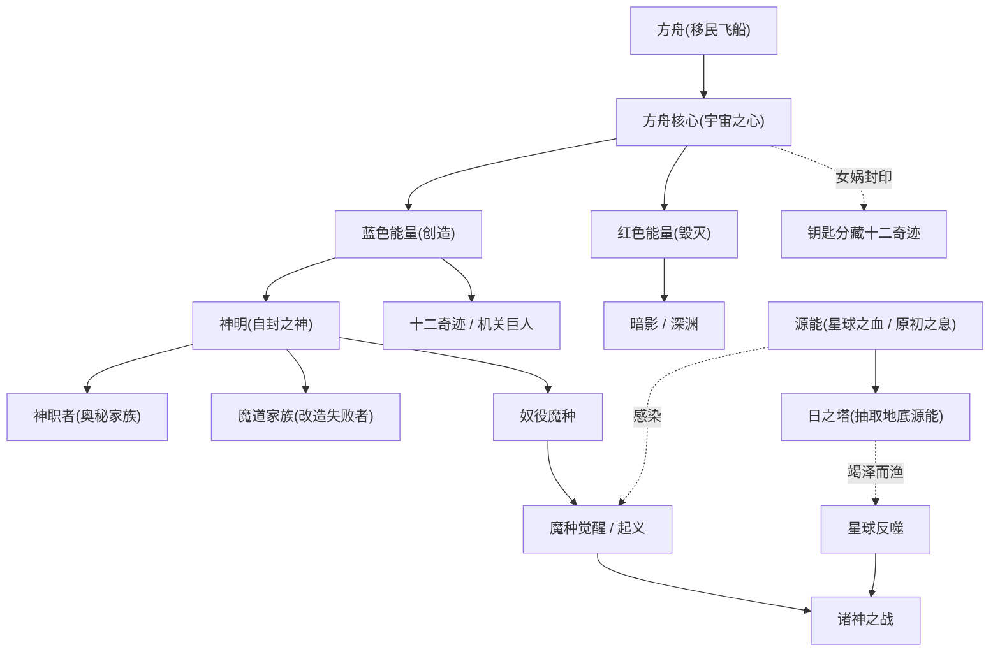
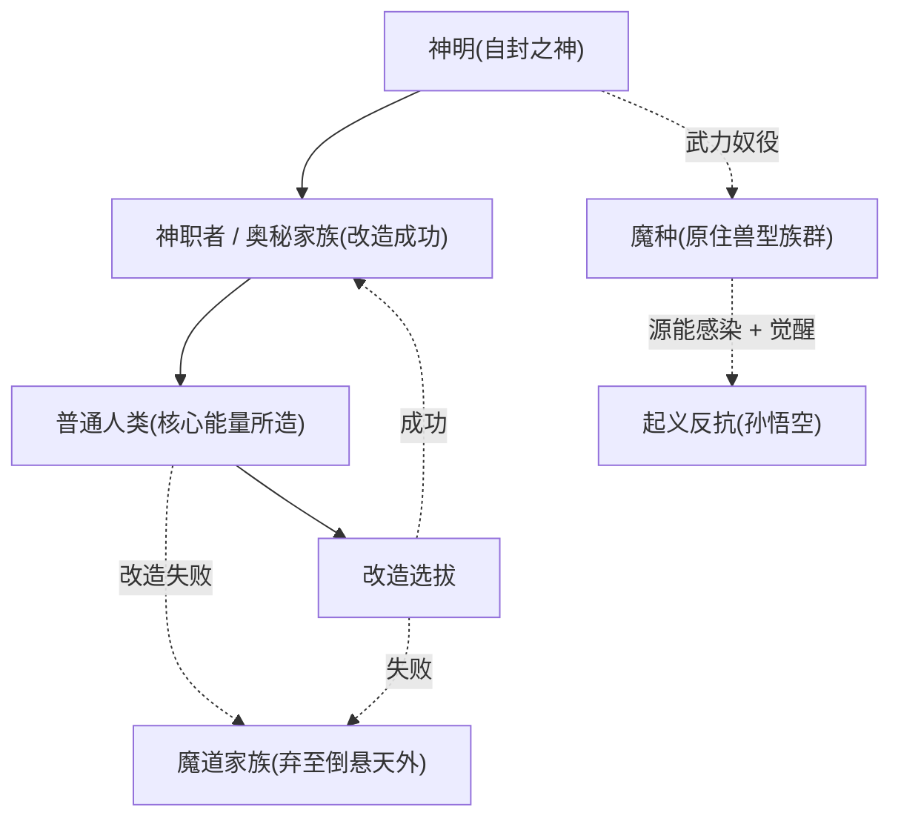
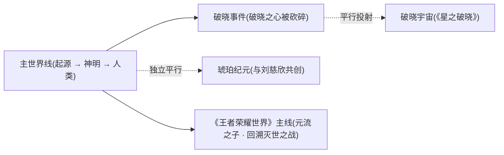

# 核心概念与术语词典

::: tip 导读 · 如何使用本词典
《王者荣耀》的世界观并非一开始就完整给出，而是腾讯天美在十年间「边填坑边修订」逐步铺陈的一棵庞大「生命之树」。要看懂从远古「方舟降临」到当下「王者峡谷」、再到平行的「破晓宇宙」「琥珀纪元」的全部叙事，关键在于先掌握一批反复出现的**核心概念与术语**。

本页即为这样一部「术语词典」：把世界观最底层的能量体系、神祇序列、族群阶层、奇迹建筑、关键地点与平行宇宙术语，逐条拆解为可检索的词条。每个词条给出**加粗定义 → 详解 → 相关术语链接 → 相关人物/阵营链接**，并辅以速查表与关系图，便于你在阅读其他页面遇到生词时随时回查。

阅读顺序建议：先扫一眼下方「术语速查表」建立全局印象，再看「核心能量关系图」理解骨架，最后按 `## 主题章节` 深入具体词条。涉及社区整合、非官方硬设定之处，已用「(考据推测)」标注。
:::

---

## 术语速查表

下表按主题分组，给出每个术语的一句话释义，方便快速定位。点击锚点可跳转到对应词条详解。

### 能量 · 本源

| 术语 | 一句话 |
| --- | --- |
| [方舟核心（宇宙之心）](#方舟核心宇宙之心) | 世界观能量总枢纽，内藏红色毁灭与蓝色创造两股原始力量 |
| [红色能量 / 蓝色能量](#红色能量与蓝色能量) | 方舟核心孕育的两极原力，分主毁灭与创造 |
| [源能（星球之血 / 原初之息）](#源能星球之血--原初之息) | 大陆地脉中的本源能量，神明开采之物、魔种觉醒之根 |
| [魔道（魔道学问）](#魔道魔道家族) | 由世界本源知识与法则驱动、经媒介触发的神秘力量学问 |
| [暗影（Shadow）](#暗影shadow) | 偏暗黑负面的能量概念集合，峡谷能量的阴面 |
| [深渊（Abyss）](#深渊abyss) | 毁灭、堕落与负面能量的源头性概念，与创造对立 |

### 神祇 · 序列

| 术语 | 一句话 |
| --- | --- |
| [神明 / 自封之神](#神明--自封之神) | 乘方舟降临、凭科技与核心之力自封为神的超智慧生命体 |
| [上古十大正神](#上古十大正神) | 上古神话体系的十位核心神祇序列 |

### 族群 · 阶层

| 术语 | 一句话 |
| --- | --- |
| [魔种](#魔种) | 大陆原住兽型族群，被神明奴役、后觉醒起义 |
| [神职者（奥秘家族）](#神职者奥秘家族) | 人类改造成功者，力量超群、为神明效力的贵族 |
| [魔道家族](#魔道魔道家族) | 人类改造失败者，被弃倒悬天之外的悲情血脉 |

### 建筑 · 奇迹

| 术语 | 一句话 |
| --- | --- |
| [方舟（Ark）](#方舟ark) | 超智慧体迁徙所乘的巨型飞船，长安城的真面目 |
| [十二奇迹](#十二奇迹) | 神明以核心能量所建十二座奇迹，藏有解封钥匙 |
| [日之塔](#日之塔) | 十二奇迹之首，昼夜抽取地底源能、招致星球反噬 |
| [通天塔](#通天塔) | 开放世界稷下学院顶部的核心建筑，时间灯塔 |
| [云蚕](#云蚕) | 稷下奇迹，吐丝建成通天塔的自然意识风向标 |

### 地点 · 空间

| 术语 | 一句话 |
| --- | --- |
| [王者峡谷](#王者峡谷) | 上古能量最集中之地，MOBA 主战场的世界观落点 |
| [苍狼 / 机关巨人](#苍狼与机关巨人) | 同归于尽于峡谷的上古能量造物双方 |
| [倒悬天](#倒悬天) | 神域与凡域的界线空间，弃民被抛之处 |
| [生命之树](#生命之树) | 官方对整个世界观叙事的隐喻，亦为符号设计来源 |

### 平行宇宙 · 主角

| 术语 | 一句话 |
| --- | --- |
| [元流之子](../heroes/yuanchu-shenhua-misc.md#元流之子) | 《王者荣耀世界》主角，首位多职业自选英雄 |
| [破晓之心](#破晓之心) | 被砍碎后投射出破晓宇宙的上古奇迹宝石 |

---

## 核心能量关系图

理解整个世界观，先抓住一条主干：**方舟核心**孕育红蓝两极能量，红主毁灭、蓝主创造；创造之力造神造物、建造奇迹，毁灭之力则与暗影、深渊相呼应；而埋藏地脉的**源能**既被神明抽取，又反过来让被压迫的魔种觉醒——这便是一切冲突的能量根源。

::: info 红蓝母题贯穿全系列
「红=毁灭、蓝=创造」的二元配色并非仅存于上古设定。它作为母题反复回响：平行的[琥珀纪元](#破晓之心)中，红蓝琥珀配色（[马超](../heroes/sanfen-shu.md#马超)红、[伽罗](../heroes/changcheng.md#伽罗)蓝）正是对方舟核心红蓝能量的致敬。识别这一母题，是读懂《王者荣耀》美术与叙事符号系统的钥匙。
:::

---

## 一 · 能量与本源

世界观的「物理学」层。所有力量、生命与文明，最终都可追溯到方舟核心与地脉源能这两个能量来源。

### 方舟核心（宇宙之心）

**方舟核心（Ark Core），又称「宇宙之心」，是整个世界观能量体系的总枢纽，蕴藏天地间生生不息的力量；其内部同时孕育红色（毁灭）与蓝色（创造）两股原始能量，既是创世神器，也是末日开关。**

降临的[神明](#神明--自封之神)依凭方舟核心之力创造生命、建造[十二奇迹](#十二奇迹)，将其当作取之不尽的无限能源。然而对核心能量与地底[源能](#源能星球之血--原初之息)的过度抽取，正是星球反噬与文明崩塌的祸根。[诸神之战](../worldview/timeline.md)结束后，[女娲](../heroes/shanggu-shenhua.md#女娲)以最后的力量将方舟核心**封印于长安城地底**，并将解封钥匙分藏于[十二奇迹](#十二奇迹)之中后沉睡。

到了[人类时代](../worldview/timeline.md)，机关大师[墨子](../heroes/mojia-jiguan.md#墨子)营造的[长安城](../factions/changan.md)，其真面目正是封印方舟核心的[方舟](#方舟ark)；此后围绕方舟能量（即「长安地底宝藏」）的争夺，成为多条故事线的引擎。开放世界《王者荣耀世界》主线亦围绕方舟核心展开。

- **相关术语**：[方舟](#方舟ark) · [红色能量 / 蓝色能量](#红色能量与蓝色能量) · [十二奇迹](#十二奇迹) · [源能](#源能星球之血--原初之息)
- **相关人物 / 阵营**：[女娲](../heroes/shanggu-shenhua.md#女娲) · [墨子](../heroes/mojia-jiguan.md#墨子) · [马可波罗](../heroes/jianghu-xiake.md#马可波罗) · [长安城](../factions/changan.md) · [上古众神·神话](../factions/shanggu-shenhua.md)

### 红色能量与蓝色能量

**红色能量与蓝色能量，是方舟核心内部孕育的两股原始力量，分别主掌「毁灭」与「创造」，构成世界观能量体系的二元两极。**

蓝色创造能量是神明造人、造物、建奇迹的源泉——诸神正是以蓝色能量打造了用以镇压[苍狼](#苍狼与机关巨人)的机关巨人。红色毁灭能量则与[暗影](#暗影shadow)、[深渊](#深渊abyss)、污染、堕落等负面概念相互呼应，是与光明/创造对立的一极。两股力量的此消彼长与失衡，是诸多灾难叙事的内在逻辑。

这一红蓝二元母题在平行宇宙中被反复化用（见上文「红蓝母题」提示框）。

- **相关术语**：[方舟核心](#方舟核心宇宙之心) · [深渊](#深渊abyss) · [暗影](#暗影shadow) · [破晓之心](#破晓之心)
- **相关人物 / 阵营**：[女娲](../heroes/shanggu-shenhua.md#女娲) · [马超](../heroes/sanfen-shu.md#马超) · [伽罗](../heroes/changcheng.md#伽罗)

### 源能（星球之血 / 原初之息）

**源能，又称「星球之血」「原初之息」，是王者大陆地脉中蕴藏的本源能量；它既是神明开采的对象，也是魔种受感染获力觉醒的根源，更是后世危机奔涌失控的导火索。**

[日之塔](#日之塔)昼夜从地底抽取的，正是这股源能。竭泽而渔式的开采招致星球反噬，是[诸神之战](../worldview/timeline.md)爆发的远因。而被神明奴役的[魔种](#魔种)，恰因接触/感染了星球之血/源能而**获得力量、觉醒自我意识**，在[孙悟空](../heroes/shanggu-shenhua.md#孙悟空)带领下发动起义。

到了平行的[破晓事件](#破晓之心)中，[破晓之心](#破晓之心)被砍碎后涌出的「原初之息」浸染王者峡谷，引发野兽异变；开放世界主线中，「原初之息奔涌、永恒黑夜降临峡谷」成为[元流之子](../heroes/yuanchu-shenhua-misc.md#元流之子)所面对的新危机。可见源能/原初之息是一条贯穿主线与平行线的关键能量线索。

- **相关术语**：[日之塔](#日之塔) · [魔种](#魔种) · [破晓之心](#破晓之心) · [王者峡谷](#王者峡谷)
- **相关人物 / 阵营**：[孙悟空](../heroes/shanggu-shenhua.md#孙悟空) · [女娲](../heroes/shanggu-shenhua.md#女娲) · [后羿](../heroes/shanggu-shenhua.md#后羿) · [元流之子](../heroes/yuanchu-shenhua-misc.md#元流之子)

### 魔道（魔道家族）

**魔道，是一种由「定义世界本源的知识与法则」所驱动、经特定媒介触发后转化为力量的神秘学问；它取代了旧地球的化石燃料，成为改造世界的新动力源。承载这股力量的人群即「魔道家族」。**

从能量层面看，魔道是世界观对「魔法/法术」的本土化解释：它不是凭空的咒法，而是对世界底层法则的运用。从族群层面看，[魔道家族](#神职者奥秘家族)指人类身体改造的**失败者**——他们被抛弃到[倒悬天](#倒悬天)之外，与[魔种](#魔种)、普通人混居，血脉中流动着改造残留的神秘力量，是「因罪而得力量」的悲情血脉。

魔道之力既能成就[稷下学院](../factions/jixia.md)的「魔导学」一脉，也可能被滥用——[人类时代](../worldview/timeline.md)大漠绿洲统治者经不住魔道诱惑、滥用力量制造强大魔种，直接导致王庭沦陷、[长城](../factions/changcheng.md)关闭。

::: warning 魔道的双刃性
魔道既是知识与力量，也是诱惑与代价。它在世界观中始终带有「越界」的张力：求知者借它窥探世界本源，野心者借它制造灾祸。对应阵营见 [魔道·暗影·深渊](../factions/modao-shadow-abyss.md)。
:::

- **相关术语**：[神职者（奥秘家族）](#神职者奥秘家族) · [魔种](#魔种) · [倒悬天](#倒悬天) · [暗影](#暗影shadow)
- **相关人物 / 阵营**：[兰陵王](../heroes/modao-shadow-abyss.md#兰陵王) · [吕布](../heroes/modao-shadow-abyss.md#吕布) · [魔道·暗影·深渊](../factions/modao-shadow-abyss.md) · [稷下学院](../factions/jixia.md)

### 暗影（Shadow）

**暗影，是偏暗黑、负面能量的概念集合，与堕落、污染、深渊力量相关联，是王者峡谷能量「阴面」的具象化。**

在游戏机制层面，暗影衍生出「暗影主宰」「暗影先锋」「暗影之径」等设定与对象。在世界观层面，它与方舟核心的[红色（毁灭）能量](#红色能量与蓝色能量)、[深渊](#深渊abyss)、污染相互呼应，是与「创造/光明」相对的一极。带「暗影」标签的英雄（如[暗影游侠铠](../heroes/changan.md#铠)、[暗影刀锋兰陵王](../heroes/modao-shadow-abyss.md#兰陵王)）多与这一负面能量母题相关。

- **相关术语**：[深渊](#深渊abyss) · [红色能量 / 蓝色能量](#红色能量与蓝色能量) · [魔道](#魔道魔道家族)
- **相关人物 / 阵营**：[铠](../heroes/changan.md#铠) · [兰陵王](../heroes/modao-shadow-abyss.md#兰陵王) · [魔道·暗影·深渊](../factions/modao-shadow-abyss.md)

### 深渊（Abyss）

**深渊，是代表毁灭、堕落与负面能量的源头性概念，常与方舟核心红色能量、暗影、污染相互呼应，是与创造/光明对立的一极。**

如果说[暗影](#暗影shadow)是负面能量的「表现」，深渊则更接近其「源头」隐喻。它与[红色毁灭能量](#红色能量与蓝色能量)同源，构成世界观善恶/光暗二元结构中「暗」的终极指向。

- **相关术语**：[暗影](#暗影shadow) · [红色能量 / 蓝色能量](#红色能量与蓝色能量) · [魔道](#魔道魔道家族)
- **相关人物 / 阵营**：[魔道·暗影·深渊](../factions/modao-shadow-abyss.md)

---

## 二 · 神祇与神明序列

世界观的「统治者」层。所谓「神明」并非天生神祇，而是科技与能量的产物——理解这一点，是理解整部诸神兴衰史的前提。

### 神明 / 自封之神

**神明，是逃离毁灭母星、乘[方舟](#方舟ark)迁徙至王者大陆的超智慧生命体；他们并非天生神祇，而是凭借科技进化与[方舟核心](#方舟核心宇宙之心)之力「自封」为神。**

这是世界观最具颠覆性的设定之一：**神是科幻产物，不是神话本体**。降临者以核心能量创造人类（并将传奇英雄基因注入新生人类）、建造[十二奇迹](#十二奇迹)、奴役[魔种](#魔种)，构建起森严的等级金字塔。代表神明有[女娲](../heroes/shanggu-shenhua.md#女娲)、[帝俊](../heroes/haojing-fengshen.md#帝俊)、[盘古](../heroes/shanggu-shenhua.md#盘古)、伏羲、[后羿](../heroes/shanggu-shenhua.md#后羿)等。

神明集团内部因**发展理念分歧**而分裂：以[女娲](../heroes/shanggu-shenhua.md#女娲)为首者主张限制超出星球承载力的发展，派[后羿](../heroes/shanggu-shenhua.md#后羿)关闭日之塔；以[帝俊](../heroes/haojing-fengshen.md#帝俊)为首者主张进步不应受任何束缚——两派全面开战，即[诸神之战 / 封神之战](../worldview/timeline.md)。战后帝俊战败身亡，诸神死伤殆尽，[盘古](../heroes/shanggu-shenhua.md#盘古)劈开束缚人类的保护罩、赋予自由后化为山脉，神明时代就此落幕。

::: details 神明 = 科幻 + 神话的「双层叙事」
《王者荣耀》巧妙地让同一批角色同时拥有两副面孔：从科幻层看，他们是携带人类基因的超智慧外来者；从神话层看，他们就是女娲补天、后羿射日、盘古开天的上古众神。封神之战（以《封神演义》为原型，以纣王、姜子牙、妲己、杨戬、哪吒为核心）即诸神之战在神话层的「具象叙事」。详见 [上古众神·神话](../factions/shanggu-shenhua.md) 与 [镐京·封神](../factions/haojing-fengshen.md)。
:::

- **相关术语**：[方舟](#方舟ark) · [方舟核心](#方舟核心宇宙之心) · [上古十大正神](#上古十大正神) · [神职者](#神职者奥秘家族) · [魔种](#魔种)
- **相关人物 / 阵营**：[女娲](../heroes/shanggu-shenhua.md#女娲) · [帝俊](../heroes/haojing-fengshen.md#帝俊) · [盘古](../heroes/shanggu-shenhua.md#盘古) · [后羿](../heroes/shanggu-shenhua.md#后羿) · [上古众神·神话](../factions/shanggu-shenhua.md) · [镐京·封神](../factions/haojing-fengshen.md)

### 上古十大正神

**上古十大正神，指上古众神/神话体系中的十位核心神祇序列：盘古、帝俊、伏羲、女娲、神农、轩辕、蚩尤、东皇太一、共工、祝融。**

这一序列是世界观「神话层」的骨架名单，统摄了开天辟地、补天造人、医药农耕、水火干戈等创世与文明母题。其中部分神祇在游戏中有可玩英雄对应（如[盘古](../heroes/shanggu-shenhua.md#盘古)、[女娲](../heroes/shanggu-shenhua.md#女娲)），[帝俊](../heroes/haojing-fengshen.md#帝俊)与[东皇太一](../heroes/jixia.md#东皇太一)的关系则在不同资料间存在「同一神祇不同名相」与「独立角色」两说。

::: info 帝俊、帝辛与东皇太一的名相之辨（考据推测）
多份资料对「帝俊 = 帝辛 = 纣王」体系的处理并不完全一致；东皇太一是否为帝俊化身亦有此说。本百科采取的处理为：将帝俊作为封神反派天帝体系（帝俊/帝辛/纣王）；而游戏中[东皇太一](../heroes/jixia.md#东皇太一)为独立可玩英雄，按**独立角色**处理。此为版本整合下的权衡，最终硬设定建议以官方世界观体验站为准。
:::

- **相关术语**：[神明 / 自封之神](#神明--自封之神) · [方舟核心](#方舟核心宇宙之心)
- **相关人物 / 阵营**：[盘古](../heroes/shanggu-shenhua.md#盘古) · [女娲](../heroes/shanggu-shenhua.md#女娲) · [帝俊](../heroes/haojing-fengshen.md#帝俊) · [东皇太一](../heroes/jixia.md#东皇太一) · [上古众神·神话](../factions/shanggu-shenhua.md)

---

## 三 · 族群与社会阶层

世界观的「社会学」层。神明统治下形成了**神明 → 神职者 → 人类 → 魔道 → 魔种**的五层金字塔，被压迫者的觉醒与反抗，正是诸多英雄故事的母题。

### 魔种

**魔种，是王者大陆的原住族群（兽型生物、苍狼血脉等原生种群），被降临的[神明](#神明--自封之神)蔑称为「低贱魔种」、以武力奴役其修建[奇迹](#十二奇迹)；部分魔种因[源能](#源能星球之血--原初之息)感染获得力量并觉醒自我意识，遂掀起反抗。**

魔种是世界观「被压迫—觉醒—反抗」叙事的核心承载者。在[神明时代](../worldview/timeline.md)，[孙悟空](../heroes/shanggu-shenhua.md#孙悟空)带领[猪八戒](../heroes/shanggu-shenhua.md#猪八戒)、[牛魔](../heroes/shanggu-shenhua.md#牛魔)等魔种起义反抗神明；然而因[牛魔](../heroes/shanggu-shenhua.md#牛魔)出卖等内部背叛，神明以元气炮轰营，悟空被擒，起义失败。

到了[人类时代](../worldview/timeline.md)，魔种再度成为关键变量：大漠魔道滥用催生强大魔种入侵，迫使[长城](../factions/changcheng.md)关闭、长城守卫军组建；而长城守卫军出于包容，亦吸纳魔种混血等有才之人。

- **相关术语**：[源能](#源能星球之血--原初之息) · [神明](#神明--自封之神) · [苍狼](#苍狼与机关巨人) · [魔道家族](#魔道魔道家族)
- **相关人物 / 阵营**：[孙悟空](../heroes/shanggu-shenhua.md#孙悟空) · [牛魔](../heroes/shanggu-shenhua.md#牛魔) · [猪八戒](../heroes/shanggu-shenhua.md#猪八戒) · [上古众神·神话](../factions/shanggu-shenhua.md) · [长城守卫军](../factions/changcheng.md)

### 神职者（奥秘家族）

**神职者，是[神明](#神明--自封之神)从人类中选拔、身体改造「成功」的强者；他们力量超群、位居众人之上、为神明效力，构成统治阶层的帮凶。诸神之战后，反叛的十一家族夺取奇迹之力却遭诅咒，演化为分布各地的「奥秘家族 / 神职家族」。**

神职者是金字塔中仅次于神明的阶层。改造成功是其荣耀，也是其原罪——他们曾是神明压迫人类、魔种的执行者。[诸神之战](../worldview/timeline.md)后，十一家族夺取[奇迹](#十二奇迹)之力却因背叛而遭诅咒，分散各地形成贵族政治网络，如「月之家族 → 海都」「塔之家族 → 海都总督」（考据推测：具体家族与地名映射在不同资料中有出入）。

不少当下英雄出身神职家族背景：[老夫子](../heroes/jixia.md#老夫子)曾为神职者（亦为三贤者之首、大陆第一强者），[曜](../heroes/changan.md#曜)、[镜](../heroes/changan.md#镜)等亦与神职家族渊源深厚。

- **相关术语**：[神明](#神明--自封之神) · [魔道家族](#魔道魔道家族) · [十二奇迹](#十二奇迹) · [倒悬天](#倒悬天)
- **相关人物 / 阵营**：[老夫子](../heroes/jixia.md#老夫子) · [曜](../heroes/changan.md#曜) · [镜](../heroes/changan.md#镜) · [蓬莱·东海 / 海都](../factions/penglai-donghai.md) · [稷下学院](../factions/jixia.md)

### 魔道家族

**魔道家族，是[神明](#神明--自封之神)身体改造的「失败者」；他们被弃置、抛弃到[倒悬天](#倒悬天)之外，与[魔种](#魔种)、普通人混居，血脉中流动着改造残留的神秘力量——这股力量即[魔道](#魔道魔道家族)。**

魔道家族与[神职者](#神职者奥秘家族)恰成镜像：同样源自人类改造，一者成功登顶、一者失败坠落。他们是「因罪/因弃而得力量」的悲情血脉，长期游离于主流社会之外。带「魔道」「暗影」属性的英雄多与这一血脉或其力量相关。

（注：「魔道」一词在世界观中身兼两义——既指上文的**学问/能量**，也指此处的**族群/血脉**；两者同源而所指不同，阅读时需依语境区分。）

- **相关术语**：[魔道（学问）](#魔道魔道家族) · [神职者](#神职者奥秘家族) · [倒悬天](#倒悬天) · [魔种](#魔种)
- **相关人物 / 阵营**：[兰陵王](../heroes/modao-shadow-abyss.md#兰陵王) · [吕布](../heroes/modao-shadow-abyss.md#吕布) · [魔道·暗影·深渊](../factions/modao-shadow-abyss.md)

---

## 四 · 建筑与奇迹

世界观的「工程学」层。从承载文明火种的方舟，到抽取星球之血的奇迹，再到开放世界的时间灯塔——这些宏伟造物既是力量支柱，也是封印谜题与剧情舞台。

### 方舟（Ark）

**方舟，是超智慧生命体逃离毁灭母星、迁徙至王者大陆所乘的巨型飞船/移民载具，是文明火种的承载者，也是整个世界观的科幻起点；后世揭示，[长安城](../factions/changan.md)的真面目即是封印的方舟。**

在[起源时代](../worldview/timeline.md)，旧地球文明因科技失控而毁灭，少数幸存者进化为超智慧生命体，携带人类基因与文明能量，乘方舟穿越深空降临蔚蓝的王者大陆。方舟不仅是交通工具，更内载[方舟核心](#方舟核心宇宙之心)这一无限能源。

「长安即方舟」是世界观最经典的反转之一：机关大师[墨子](../heroes/mojia-jiguan.md#墨子)营造的长安城，本质是封印[方舟核心](#方舟核心宇宙之心)的方舟，地底封存核心能量。这一秘密在《永远的长安城》叙事中由[马可波罗](../heroes/jianghu-xiake.md#马可波罗)开启地底宝藏大门时揭示。

- **相关术语**：[方舟核心](#方舟核心宇宙之心) · [源能](#源能星球之血--原初之息) · [十二奇迹](#十二奇迹)
- **相关人物 / 阵营**：[墨子](../heroes/mojia-jiguan.md#墨子) · [马可波罗](../heroes/jianghu-xiake.md#马可波罗) · [李白](../heroes/changan.md#李白) · [长安城](../factions/changan.md)

### 十二奇迹

**十二奇迹，是[神明](#神明--自封之神)以[方舟核心](#方舟核心宇宙之心)能量建造的十二座奇迹建筑，是文明的能量与权力支柱（以[日之塔](#日之塔)为代表）；[诸神之战](../worldview/timeline.md)后，[女娲](../heroes/shanggu-shenhua.md#女娲)将方舟核心的解封钥匙分藏其中，使其兼具「能量设施」与「封印谜题」双重身份。**

十二奇迹横贯大陆，是神明文明的物质丰碑。它们由魔种被奴役修建而成，承载着辉煌也累积着矛盾。战后女娲将钥匙分藏其中，使这十二座建筑成为后世追寻方舟之力者的目标。反叛的[神职者](#神职者奥秘家族)十一家族也曾夺取奇迹之力（却遭诅咒）。

- **相关术语**：[方舟核心](#方舟核心宇宙之心) · [日之塔](#日之塔) · [神明](#神明--自封之神) · [神职者](#神职者奥秘家族) · [魔种](#魔种)
- **相关人物 / 阵营**：[女娲](../heroes/shanggu-shenhua.md#女娲) · [后羿](../heroes/shanggu-shenhua.md#后羿) · [上古众神·神话](../factions/shanggu-shenhua.md)

### 日之塔

**日之塔，是[十二奇迹](#十二奇迹)中最具代表性者；它不断抽取王者大陆地底[源能](#源能星球之血--原初之息)为新文明提供动力，这种「竭泽而渔」式的能量开采，正是星球反噬、[诸神之战](../worldview/timeline.md)与文明崩塌的祸根。**

日之塔是世界观中「发展与代价」矛盾的物化象征。它昼夜不息地从地底抽取源能，短期成就了神明文明的繁荣，长期却埋下星球反噬的隐患。[女娲](../heroes/shanggu-shenhua.md#女娲)目睹反噬、主张限制发展，遂派射手[后羿](../heroes/shanggu-shenhua.md#后羿)关闭/摧毁受污染的日之塔——此举直接引爆了[诸神之战](../worldview/timeline.md)。「后羿射日」的神话，在此被重写为「关闭能量塔」的科幻寓言。

::: quote 后羿（精神写照 · 考据推测）
「为了让明天的太阳照常升起，今天必须有人拉满这张弓。」

（注：此句为对「后羿奉命关闭日之塔」抉择的精神写照，非官方原话，特此标注。）
:::

- **相关术语**：[十二奇迹](#十二奇迹) · [源能](#源能星球之血--原初之息) · [方舟核心](#方舟核心宇宙之心)
- **相关人物 / 阵营**：[后羿](../heroes/shanggu-shenhua.md#后羿) · [女娲](../heroes/shanggu-shenhua.md#女娲) · [帝俊](../heroes/haojing-fengshen.md#帝俊) · [上古众神·神话](../factions/shanggu-shenhua.md)

### 通天塔

**通天塔，是开放世界《王者荣耀世界》中的核心建筑，位于[稷下学院](../factions/jixia.md)顶部，由稷下奇迹[云蚕](#云蚕)吐丝构建而成，融合东方幻想与徽派建筑，被赋予「时间灯塔」的隐喻。**

通天塔是开放世界主线的地标。武道、魔道、机关三大学院环绕其而建，是学子授业之所。其「时间灯塔」的象征意义，与[元流之子](../heroes/yuanchu-shenhua-misc.md#元流之子)回溯[灭世之战](../worldview/timeline.md)、扭转历史的时空主题相呼应。

- **相关术语**：[云蚕](#云蚕) · [元流之子](../heroes/yuanchu-shenhua-misc.md#元流之子)
- **相关人物 / 阵营**：[元流之子](../heroes/yuanchu-shenhua-misc.md#元流之子) · [稷下学院](../factions/jixia.md) · [墨家机关城·天工坊](../factions/mojia-jiguan.md)

### 云蚕

**云蚕，是稷下特有的奇迹，高居[通天塔](#通天塔)之上，吐出云流/云丝带来独特生态；在稷下村民心中，它是自然意识的「风向标」，人们从其状态领悟农时节气与物产兴衰。[通天塔](#通天塔)即由云蚕吐丝建成。**

云蚕将「自然意识」与「人类建筑」连为一体，是开放世界稷下生态的灵魂。它既是物候预言者，又是通天塔的「建筑师」，体现了世界观中科技、自然与神秘交融的美学取向。

- **相关术语**：[通天塔](#通天塔)
- **相关人物 / 阵营**：[稷下学院](../factions/jixia.md) · [元流之子](../heroes/yuanchu-shenhua-misc.md#元流之子)

---

## 五 · 地点与空间

世界观的「地理学」层。从大陆能量最盛的王者峡谷，到划分神域凡域的倒悬天，这些空间是冲突上演的舞台。

### 王者峡谷

**王者峡谷，位于大陆中西部高原（[云中漠地](../factions/yunzhong-modi.md)与勇士之地交界），因浸润于[苍狼](#苍狼与机关巨人)与机关巨人遗迹的上古能量中，成为全大陆能量最集中之地，是 MOBA 主玩法所在地的世界观落点。**

峡谷的能量传奇始于[苍狼与机关巨人](#苍狼与机关巨人)的同归于尽：二者残骸滋养出**巨人之心、苍狼之心与能量水晶**，使峡谷灵力鼎盛。[先民时代](../worldview/timeline.md)，先民在能量水晶上修筑祭坛、催生带独特信仰的「峡谷文明」，为英雄时代铺垫了主战场舞台。

在[破晓事件](#破晓之心)与开放世界主线中，王者峡谷又成为「[原初之息](#源能星球之血--原初之息)奔涌、永恒黑夜降临」的危机现场。可以说，峡谷既是玩法核心，也是世界观能量叙事的汇聚点。

- **相关术语**：[苍狼 / 机关巨人](#苍狼与机关巨人) · [源能](#源能星球之血--原初之息) · [破晓之心](#破晓之心)
- **相关人物 / 阵营**：[苍](../heroes/yunzhong-modi.md#苍) · [云中漠地·边陲](../factions/yunzhong-modi.md) · [元流之子](../heroes/yuanchu-shenhua-misc.md#元流之子)

### 苍狼与机关巨人

**苍狼与机关巨人，是上古两大能量造物对决的双方：受[源能](#源能星球之血--原初之息)感染变异而肆虐的「苍狼」，与诸神以[蓝色创造能量](#红色能量与蓝色能量)打造、用以镇压苍狼的「机关巨人」；两者最终在[王者峡谷](#王者峡谷)碰撞、同归于尽。**

这场对决是峡谷成为能量圣地的起点。二者残骸散落、滋养出巨人之心、苍狼之心与能量水晶，使峡谷成为大陆灵力最盛之地。苍狼血脉亦与[魔种](#魔种)族群相关联，其变异肆虐正源于源能感染——再次印证源能失控的破坏性母题。

- **相关术语**：[王者峡谷](#王者峡谷) · [源能](#源能星球之血--原初之息) · [蓝色能量](#红色能量与蓝色能量) · [魔种](#魔种)
- **相关人物 / 阵营**：[苍](../heroes/yunzhong-modi.md#苍) · [云中漠地·边陲](../factions/yunzhong-modi.md)

### 倒悬天

**倒悬天，是[神明](#神明--自封之神)统治体系中的设定空间；身体改造失败者（[魔道家族](#魔道魔道家族)）被抛弃到「倒悬天之外」，与[魔种](#魔种)、人类混居，是神域与凡域界线的体现。**

倒悬天作为「界线」存在，把世界划分为神明所居的「内」与弃民所处的「外」。被弃者越过这条线落入下层社会，构成了魔道家族「被抛弃」叙事的空间基础。

- **相关术语**：[魔道家族](#魔道魔道家族) · [神职者](#神职者奥秘家族) · [魔种](#魔种)
- **相关人物 / 阵营**：[魔道·暗影·深渊](../factions/modao-shadow-abyss.md)

### 生命之树

**生命之树有两层含义：其一是腾讯官方 IP 叙事的隐喻——将《王者荣耀》庞大世界观及所有衍生故事比喻为一棵生命之树，衍生故事是树上结出的「果实」；其二是对神秘学（卡巴拉）符号的借用，用于美术与符号设计，并非游戏内的某处具体建筑实体。**

理解「生命之树」隐喻，有助于把握官方对世界观的整体态度：主干（起源/神明/人类三时代）稳定，枝叶（[破晓宇宙](#破晓之心)、琥珀纪元、各联动）不断生长。它解释了为何会有看似平行、却又共享母题（如红蓝能量）的多条故事线。

::: info 勿误认为游戏内建筑
「生命之树」是**叙事隐喻 + 美术符号**，并非如[通天塔](#通天塔)那样的实体建筑。阅读相关材料时请注意区分。
:::

- **相关术语**：[破晓之心](#破晓之心) · [方舟核心](#方舟核心宇宙之心)
- **相关页面**：[世界纪元时间线](../worldview/timeline.md)

---

## 六 · 平行宇宙与主角

世界观的「多元宇宙」层。主线之外，《王者荣耀》通过破晓宇宙、琥珀纪元等平行时空不断拓展叙事边界，而开放世界主角元流之子则站在主线与平行的交汇点上。

### 元流之子

**元流之子，是开放世界《王者荣耀世界》的主人公，也是《王者荣耀》首位「多职业自选英雄」——玩家可在坦克/法师/射手/辅助/刺客等职业形态间切换。**

坦克法师射手辅助刺客

玩家以元流之子的身份进入开放世界，直面「[原初之息](#源能星球之血--原初之息)奔涌、永恒黑夜降临[峡谷](#王者峡谷)」的新危机。在主线序章[灭世之战](../worldview/timeline.md)中，反派领袖帝辛发起席卷诸界的灭世之战，原时间线抵抗联军战败、世界濒临毁灭；一股跨越时空的神秘力量使元流之子**回溯**到战争爆发的关键节点之前，肩负通过关键抉择扭转历史、拯救世界的使命。其多职业可塑性与「万象初源」称号，呼应了「元/初源」的世界观母题。

（机制注：法师与坦克形态于 2024.6 上线，射手形态另有上线时间。元流之子为多职业自选英雄，在本百科中单列于「神话杂项组」，不重复计入各定位统计。）

- **相关术语**：[源能 / 原初之息](#源能星球之血--原初之息) · [通天塔](#通天塔) · [方舟核心](#方舟核心宇宙之心)
- **相关人物 / 阵营**：[元流之子](../heroes/yuanchu-shenhua-misc.md#元流之子) · [六耳](../heroes/yuanchu-shenhua-misc.md#六耳) · [桑启](../heroes/yuanchu-shenhua-misc.md#桑启) · [上古遗族 / 神话杂项与多职业](../factions/yuanchu-shenhua-misc.md)

### 破晓之心

**破晓之心，是一颗上古奇迹宝石；在[明世隐](../factions/changan.md)谋划下，[花木兰](../heroes/changan.md#花木兰)将其砍碎，打开通往异界的裂隙、引发[原初之息](#源能星球之血--原初之息)溢出，并在平行时空投射出「破晓宇宙」；后由[鬼谷子](../heroes/jixia.md#鬼谷子)等召集英雄以秘法修复。**

破晓之心是连接主线与平行宇宙的「枢纽宝石」。它被砍碎的瞬间，一方面引发[王者峡谷](#王者峡谷)的野兽异变（[鬼谷子](../heroes/jixia.md#鬼谷子)遂号召[花木兰](../heroes/changan.md#花木兰)、[上官婉儿](../heroes/changan.md#上官婉儿)、[程咬金](../heroes/changan.md#程咬金)、[司空震](../heroes/changan.md#司空震)集结守卫），另一方面在平行时空投射出**破晓宇宙**，衍生出动作手游《星之破晓》——英雄进入由自身意识构成的「暗心世界」对抗内心恐惧。

::: info 另一条平行线：琥珀纪元
与破晓宇宙并列的另一独立平行宇宙是「琥珀纪元」（2023 年起、与科幻作家刘慈欣共创）：约 150 年前流浪行星「风伯」闯入太阳系直奔地球，带来灾难也带来神秘物质「繁星琥珀」；人类执行「截星计划」拦截风伯，历时约 145 年宣告失败。代表英雄皮肤为[铠](../heroes/changan.md#铠)（琥珀）、[马超](../heroes/sanfen-shu.md#马超)（红）、[伽罗](../heroes/changcheng.md#伽罗)（蓝，截星计划负责人/首席科学家）。其**红蓝琥珀配色**正呼应[方舟核心](#方舟核心宇宙之心)的红蓝能量母题。
:::

- **相关术语**：[源能 / 原初之息](#源能星球之血--原初之息) · [王者峡谷](#王者峡谷) · [红色能量 / 蓝色能量](#红色能量与蓝色能量)
- **相关人物 / 阵营**：[花木兰](../heroes/changan.md#花木兰) · [鬼谷子](../heroes/jixia.md#鬼谷子) · [铠](../heroes/changan.md#铠) · [伽罗](../heroes/changcheng.md#伽罗) · [长安城](../factions/changan.md)

---

## 延伸阅读

<a class="hok-card" href="../worldview/timeline">世界纪元时间线—— 从起源时代到开放世界主线的完整编年，串联本词典所有概念的来龙去脉。</a>
<a class="hok-card" href="../factions/shanggu-shenhua">上古众神·神话—— 神明序列、诸神之战与封神叙事的人物群像。</a>
<a class="hok-card" href="../factions/changan">长安城—— 「长安即方舟」的中枢都城与英雄阵营。</a>
<a class="hok-card" href="../factions/modao-shadow-abyss">魔道·暗影·深渊—— 负面能量与弃血脉的暗面世界。</a>

::: quote 结语
「神不是天生的，奇迹是有代价的，被弃者也能反抗——记住这三句，你就握住了打开这个世界的钥匙。」
:::