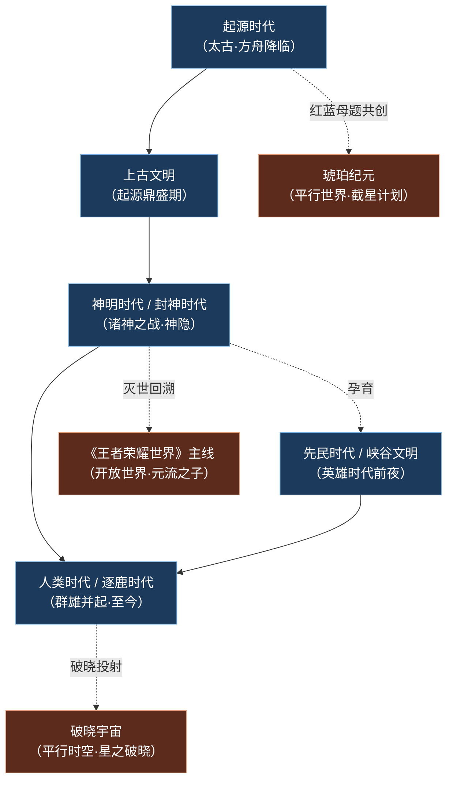
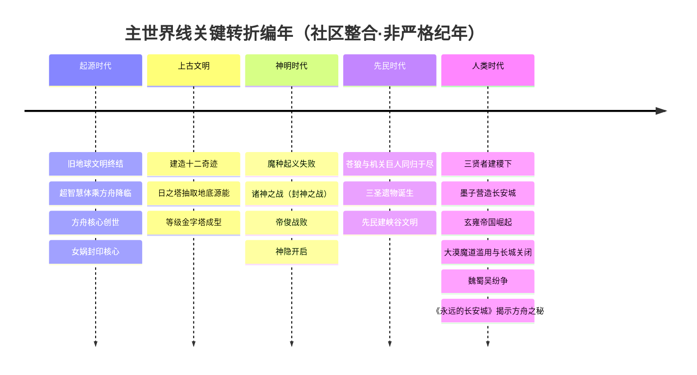
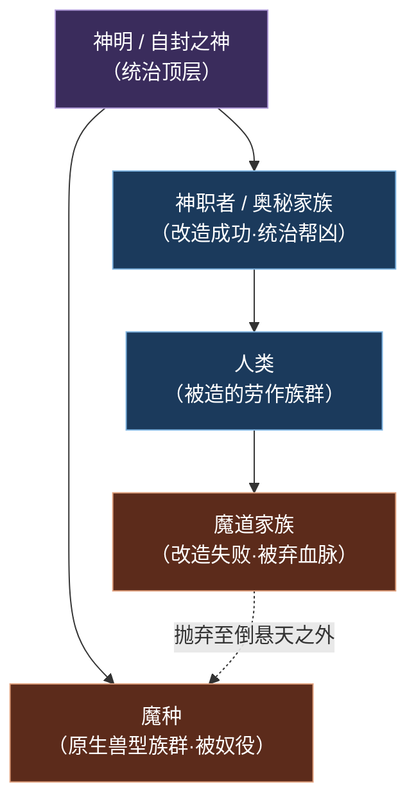
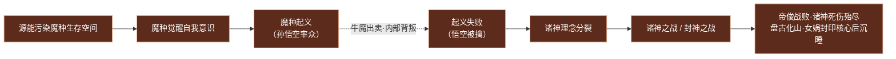
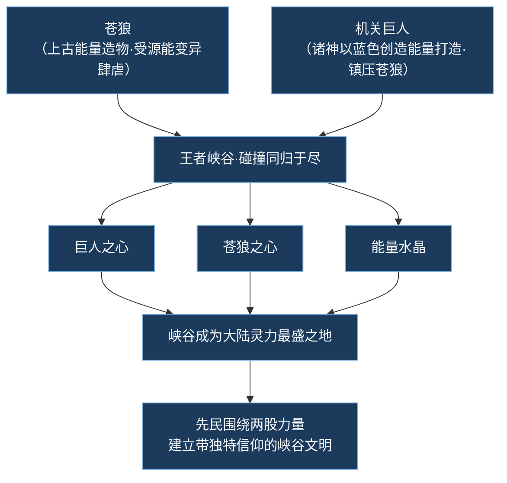
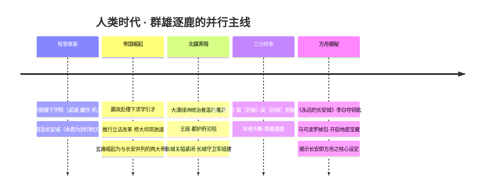

# 纪元编年

> 「方舟降临，自封为神；日塔抽血，星球反噬；诸神相残，神隐人间。三千年后，群雄逐鹿，魔种叩关——这便是王者大陆从鸿蒙到当下的漫长脉络。」

《王者荣耀》的世界观并非一蹴而就，而是腾讯天美在十年间「边填坑、边修订」逐步铺陈的庞大叙事。其底层逻辑是一条「**科幻起点 → 神话外衣 → 历史群像**」的纵贯线：遥远未来毁灭的旧地球文明，化作王者大陆神话中「自封为神」的降临者；神明的傲慢与分裂，演为东方封神神话；神明退场后，人类自主发展的纪元则以三国、战国、隋唐等历史母题为壳层层展开。

本页基于世界观骨架的 `eras` 数组，逐个纪元详写其概述、关键事件、登场阵营人物与对后世的影响。

::: info 阅读须知 · 主世界线 vs 平行时空
本页将纪元分为两类：

- **主世界线（纵贯主干）**：起源时代 → 上古文明 → 神明/封神时代 → 人类/逐鹿时代 → 先民/峡谷文明。这是一条大致线性、彼此承接的历史长河。
- **平行时空（分叉投影）**：破晓宇宙、琥珀纪元、《王者荣耀世界》主线。它们与主世界线并非严格线性承接，而是从主世界母题中分叉、投射或回溯出的独立叙事，下文一律以 `!!! info` 标注。

另需说明：官方长期边填坑边修订，「起源/神明/人类」三时代为主干骨架，「封神时代 / 帝国时代 / 英雄逐鹿时代」是不同来源的细分叫法；「神战约三千年」等具体年数为社区整合而非严格官方纪年，凡此类数字均属「(考据推测)」范畴。
:::

---

## 纪元总览图

下图概览主世界线五大纪元的承接顺序，以及三条平行时空分支的投射关系。

若以时间轴视角观察主世界线的关键转折，则如下：

---

## 起源时代（太古时代）

主世界线 · 创世

**纪元定位**：鸿蒙初辟 · 方舟降临 —— 世界观最底层的史前史与神话开端的交汇处。

### 概述

这是整个王者宇宙的「科幻起点」。在遥远的未来，**旧地球文明**因科技失控而毁灭。少数幸存者并未消亡，而是进化为**超智慧生命体**——他们携带着人类基因与文明能量，乘坐巨型移民载具[方舟（Ark）](../worldview/concepts.md#方舟ark)穿越深空，最终降临于一颗蔚蓝的星球：**王者大陆**。

降临者凭借远超原住民的力量，**自封为神明**。他们启用方舟的动力枢纽——**方舟核心（宇宙之心）**作为无限能源。这枚核心内部蕴藏着两股原始力量：**红色能量（毁灭）**与**蓝色能量（创造）**。神明依此创世造物，并建造起横贯大陆的**十二奇迹**，其中以**日之塔**为代表。

::: warning 祸根埋下 · 竭泽而渔的日之塔
日之塔昼夜不息地抽取王者大陆**地底源能（星球之血）**，为新文明提供动力。这种「竭泽而渔」式的能量开采，从一开始就埋下了星球反噬的祸根——它将在数个纪元后引爆诸神之战，并在更遥远的未来化作「永恒黑夜」的危机。
:::

起源时代的末期，方舟核心被神明中的[女娲](../heroes/shanggu-shenhua.md#女娲)**封印于长安城地底**。这一封印动作的真正意义，要到「人类时代」末期的《永远的长安城》事件才被层层揭开——后世繁华的长安城，其真面目竟是当年那艘封印的方舟。

### 关键事件

| 事件 | 内涵 |
| --- | --- |
| 旧地球文明终结 | 科技失控导致母星毁灭，文明火种危在旦夕 |
| 超智慧体乘方舟降临 | 幸存者进化为超智慧生命，携人类基因与文明能量迁徙至王者大陆 |
| 方舟核心创世·自封为神 | 启用宇宙之心（红蓝双能）作无限能源，创造生命、自封神明 |
| 十二奇迹奠基 | 以日之塔为代表的奇迹建筑开始建造，抽取地底源能 |
| 方舟核心封印 | 起源末期，女娲将核心封印于（后世的）长安城地底 |

### 登场 / 关联阵营与人物

- **降临者 / 自封之神**：以[上古众神·神话](../factions/shanggu-shenhua.md)阵营为代表，包括[女娲](../heroes/shanggu-shenhua.md#女娲)、[盘古](../heroes/shanggu-shenhua.md#盘古)、[后羿](../heroes/shanggu-shenhua.md#后羿)等。他们并非天生神祇，而是「凭科技进化与方舟核心之力自封为神」。
- **能量核心**：方舟核心（宇宙之心）的红蓝双能，是后续所有纪元能量体系的总源头。

::: quote 盘古 · 开天
「天地玄黄，宇宙洪荒——我以一斧，劈开混沌。」
（盘古「开天」的称号，正呼应起源时代神明以力量重塑大陆的创世意象。）
:::

### 对后世的影响

- **能量基底**：红色（毁灭）与蓝色（创造）能量的二元母题，贯穿后世所有纪元，乃至延伸到平行的[琥珀纪元](#琥珀纪元)的「红蓝琥珀」配色。
- **封印谜题**：方舟核心的封印与长安城的真相，成为「人类时代」群雄争夺的终极焦点。
- **原罪伏笔**：日之塔抽取源能的「原罪」，是星球反噬与文明崩塌的根本因果链起点。

---

## 上古文明 / 起源鼎盛期

主世界线 · 鼎盛

**纪元定位**：诸神统治鼎盛期 —— 辉煌的金字塔，与积累于塔尖的裂痕。

### 概述

这是神明文明的辉煌阶段。诸神以方舟核心创造了**人类**，并从人类中选拔进行**身体改造**，由此分化出森严的社会等级：

- **改造成功者** → 成为[神职者（奥秘家族）](../worldview/concepts.md#神职者奥秘家族)，力量强大、位居众人之上，是神明的统治帮凶。
- **改造失败者** → 沦为**魔道家族**，被弃血脉，抛弃至**倒悬天之外**，与魔种、普通人混居。
- **原生兽型族群** → 即**魔种**，是王者大陆的真正原住民，却被神明蔑称为「低贱者」，以武力奴役，强迫其修建奇迹。

至此，**神明—神职者—人类—魔道—魔种**的森严金字塔彻底成型。辉煌之下，矛盾正悄然在日之塔的阴影中积累。

::: info 考据 · 神职者的后世演化
神职者并非昙花一现。世界观骨架揭示，诸神之战后，反叛的**11家族**夺取奇迹之力却遭诅咒，演化为分布各地的**奥秘 / 神职家族**（如月之家族→海都、塔之家族→海都总督），在「人类时代」构成了庞大的贵族政治网络。曜、镜等英雄即出身神职家族。
:::

### 关键事件

| 事件 | 内涵 |
| --- | --- |
| 神明造人 | 以方舟核心创造人类，为文明提供劳作与改造素材 |
| 身体改造分化 | 成功者→神职者；失败者→魔道家族（弃于倒悬天外） |
| 奴役魔种修建奇迹 | 原生魔种被武力驱使，建造十二奇迹 |
| 等级金字塔成型 | 神明—神职者—人类—魔道—魔种五级体系固化 |
| 矛盾积累 | 日之塔的能量开采与等级压迫，为下一纪元的总爆发蓄势 |

### 登场 / 关联阵营与人物

- **统治阶层**：[上古众神·神话](../factions/shanggu-shenhua.md)的诸神。
- **被压迫者**：[魔种](../factions/shanggu-shenhua.md)（[孙悟空](../heroes/shanggu-shenhua.md#孙悟空)、[牛魔](../heroes/shanggu-shenhua.md#牛魔)、[猪八戒](../heroes/shanggu-shenhua.md#猪八戒)的族群源头）；魔道家族（后世演化出[魔道·暗影·深渊](../factions/modao-shadow-abyss.md)）。
- **神职后裔**：奥秘家族网络，关联[蓬莱·东海 / 海都](../factions/penglai-donghai.md)（月之家族、塔之家族）。

### 对后世的影响

- **阶级原罪**：金字塔体系是「魔种起义」与「诸神之战」的社会根源——被压迫者的觉醒与统治者的分裂，皆源于此。
- **家族网络**：神职者→奥秘家族的演化，奠定了后世海都、玄雍等地的贵族政治底色。
- **魔道血脉**：被弃的魔道家族，成为后世「因罪而得力量」的悲情血脉（如[吕布](../heroes/modao-shadow-abyss.md#吕布)、[兰陵王](../heroes/modao-shadow-abyss.md#兰陵王)）。

---

## 神明时代 / 封神时代

主世界线 · 总爆发

**纪元定位**：诸神之战 · 神隐 —— 矛盾总爆发、神明退场的关键转折纪元。

### 概述

这是整个主世界线最剧烈的转折点。积累已久的矛盾在此总爆发，并最终导致神明集体退场（「神隐」），为人类自主发展腾出了舞台。

整个纪元由**两场大战**构成因果递进：

**第一场 · 魔种起义**：受星球之血 / 源能感染的魔种觉醒了自我意识。在[孙悟空](../heroes/shanggu-shenhua.md#孙悟空)的带领下，[猪八戒](../heroes/shanggu-shenhua.md#猪八戒)、[牛魔](../heroes/shanggu-shenhua.md#牛魔)等魔种发动起义反抗神明。然而因牛魔出卖等内部背叛，神明以「元气炮」轰营，悟空被擒，起义失败。

**第二场 · 诸神之战（封神之战）**：[女娲](../heroes/shanggu-shenhua.md#女娲)目睹星球反噬之兆，主张限制超出星球承载力的发展，派[后羿](../heroes/shanggu-shenhua.md#后羿)关闭 / 摧毁受污染的日之塔；而以**帝俊（帝辛 / 纣王体系）**为首的一派则主张「进步不应受任何束缚」。由此，理念之争升级为全面战争。

::: warning 重大转折 · 诸神之战的结局
- **帝俊战败身亡**，诸神死伤殆尽。
- [盘古](../heroes/shanggu-shenhua.md#盘古)对人类生情，**劈开束缚人类的保护罩**赋予自由，随后化为山脉。
- [女娲](../heroes/shanggu-shenhua.md#女娲)以最后的力量**封印方舟核心**，将解封钥匙分藏于十二奇迹之中，而后沉睡。

这便是「神隐」——神明从历史舞台集体退场。此后约三千年（考据推测），王者大陆进入无神的「人类时代」。
:::

::: quote 女娲 · 补天之神
「我看见星球的伤口，在日之塔下汩汩流血。若进步以毁灭为代价，那我宁愿封印这一切，沉睡千年。」
（女娲「补天之神」的称号，呼应其封印核心、限制发展、守护星球的抉择。）
:::

### 封神之战 —— 神话的具象叙事

值得注意的是，「诸神之战」在游戏叙事中以《封神演义》为原型进行了**具象化**——抽象的「神明理念之争」被转译为我们熟悉的封神故事（这一神话外衣的拆解，详见 [专题 · 封神演义在王者](../topics/fengshen.md)；而其背后「神 vs 魔」的阶级对立母题，则见 [专题 · 神魔之争](../topics/gods-vs-demons.md)）。其核心角色集中于[镐京·封神](../factions/haojing-fengshen.md)阵营：

<a class="hok-card" href="../heroes/haojing-fengshen#帝俊">天帝反派（东皇之主，即帝辛 / 纣王体系）——主张「进步无束缚」的一派领袖。</a>
<a class="hok-card" href="../heroes/haojing-fengshen#妲己">倾国祸水（魅力之狐）——封神叙事中的关键狐妖。</a>
<a class="hok-card" href="../heroes/haojing-fengshen#太乙真人">封神执行者（太公望）、（二郎显圣真君）、（三坛海会大神）、（老顽童）。</a>
<a class="hok-card" href="../heroes/haojing-fengshen#大司命">战国张力、、、——封神时代张力最强的一组。</a>

::: info 考据存疑 · 帝俊与帝辛 / 纣王的关系
各来源对「帝俊」与「纣王 / 帝辛」的关系表述不一（同一神祇的不同名相 vs 不同角色）。本骨架按 **帝俊 = 帝辛 = 纣王体系** 处理，作为封神反派天帝。另需注意：游戏中[东皇太一](../heroes/jixia.md#东皇太一)为独立可玩英雄（归[稷下学院](../factions/jixia.md)），虽有「东皇太一是否为帝俊化身」之说，但按独立角色处理。
:::

### 关键事件

| 事件 | 阵营涉及 | 内涵 |
| --- | --- | --- |
| 魔种觉醒起义 | 魔种（孙悟空、牛魔、猪八戒） | 源能感染→觉醒→反抗，因背叛失败 |
| 后羿奉命关闭日之塔 | 女娲派（后羿） | 限制发展、堵住源能泄漏的祸根 |
| 诸神之战爆发 | 女娲派 vs 帝俊派 | 理念分裂升级为全面战争 |
| 帝俊战败身亡 | 帝俊（镐京·封神） | 主战派领袖陨落 |
| 盘古劈罩化山 | 盘古 | 赋予人类自由，自身化为山脉 |
| 女娲封印核心后沉睡 | 女娲 | 钥匙分藏十二奇迹，神隐由此开始 |

### 对后世的影响

- **神隐与人类纪元**：诸神退场，直接开启了人类自主发展的「逐鹿时代」。
- **封印钥匙散落**：解封方舟核心的钥匙分藏十二奇迹，使奇迹兼具「能量设施」与「封印谜题」双重身份，成为后世争夺焦点。
- **盘古化山的自由**：人类摆脱保护罩束缚而获自由，是「人类时代」群雄并起的精神前提。
- **封神角色入世**：封神时代的诸神 / 英雄，部分以传说或转世形式延续至后世叙事。

---

## 先民时代 / 峡谷文明

主世界线 · 平行铺垫

**纪元定位**：英雄时代前夜 —— MOBA 主战场「王者峡谷」的世界观由来。

::: info 时序说明 · 与神明 / 人类时代的关系
先民时代并非简单接在神明时代之后的「第五个」线性纪元。它聚焦于一个特定地理舞台——**王者峡谷**——的形成与文明诞生，时间上跨越神明时代余波直至人类「英雄时代」的前夜。本页将其单列，是为了凸显 MOBA 主玩法地图的世界观落点。
:::

### 概述

这是聚焦**王者峡谷**起源的纪元。在上古的某个时刻，两股巨力在此碰撞：

- **苍狼**：上古能量造物，受源能变异而肆虐。
- **机关巨人**：诸神以方舟核心的**蓝色创造能量**打造，用以镇压苍狼。

两者最终在王者峡谷碰撞、**同归于尽**。残骸散落，孕育出**巨人之心、苍狼之心与能量水晶**，使峡谷成为整个大陆**灵力最盛之地**。

后来的**先民**发现了这两股力量，在能量水晶上修筑祭坛，围绕其建立起带有独特信仰的**峡谷文明**——这便是 MOBA 主战场「王者峡谷」的世界观由来（峡谷地形、buff 资源与上古遗迹的对应关系，详见 [专题 · 王者峡谷的由来](../topics/canyon.md)与 [核心概念 · 王者峡谷](../worldview/concepts.md#王者峡谷)）。

::: tip 地理坐标 · 王者峡谷的位置
据世界观骨架，王者峡谷位于大陆中西部高原（**云中漠地**与**勇士之地**交界），因浸润于苍狼与机关巨人遗迹的上古能量中，成为大陆能量最集中之地。它正是玩家最熟悉的「召唤师峡谷式」对战地图的叙事根基。
:::

### 关键事件

| 事件 | 内涵 |
| --- | --- |
| 苍狼受源能变异 | 上古能量造物失控，肆虐大陆 |
| 诸神造机关巨人镇压 | 以蓝色创造能量打造巨人对抗苍狼 |
| 两者同归于尽 | 在峡谷碰撞，双双毁灭 |
| 残骸孕育三宝 | 巨人之心、苍狼之心、能量水晶散落峡谷 |
| 先民建立峡谷文明 | 围绕能量修筑祭坛、形成独特信仰 |

### 登场 / 关联阵营与人物

- **能量造物**：苍狼（源能变异）与机关巨人（蓝色创造能量），是峡谷能量的源头。
- **地理关联阵营**：[云中漠地·边陲](../factions/yunzhong-modi.md)——其中[苍](../heroes/yunzhong-modi.md#苍)（草原之狼）的「狼」意象，与苍狼母题遥相呼应（考据推测）。
- **峡谷文明继承者**：广义上，所有在峡谷中对战的英雄都是这一文明能量的「使用者」。

### 对后世的影响

- **MOBA 落点**：王者峡谷成为对战主玩法的世界观舞台，「能量水晶 / 祭坛」呼应游戏机制中的水晶、buff 怪等。
- **能量阴阳**：苍狼（源能变异 / 阴面）与机关巨人（蓝色创造 / 阳面）的对立，延续了红蓝双能的母题，也为后世「暗影 / 深渊」与「创造 / 光明」的对立埋下伏笔。

---

## 人类时代 / 英雄·逐鹿时代

主世界线 · 当下

**纪元定位**：神战约三千年后至今 —— 玩家最熟悉的「当下」叙事层。

### 概述

神明陨落退场后，人类摆脱了束缚，进入**自主发展文明、群雄并起**的纪元。这是 MOBA 主体英雄登场、各方势力激烈角力的「当下」舞台，其历史壳层融合了战国、隋唐、三国等多重母题。

这一纪元头绪繁多，可大致梳理为以下几条主线并行展开：

### 关键事件详述

#### 三贤者共建稷下学院

[老夫子](../heroes/jixia.md#老夫子)（曾为神职者、三贤者之首、大陆第一强者）、[墨子](../heroes/mojia-jiguan.md#墨子)、[庄周](../heroes/penglai-donghai.md#庄周)三位大师，于逐鹿地区共建[稷下学院](../factions/jixia.md)，分授**武道学、魔导学、机关学**，使其成为大陆智慧与人才的中心。

#### 长安城建立

机关大师[墨子](../heroes/mojia-jiguan.md#墨子)营造[长安城](../factions/changan.md)。

::: warning 核心秘密 · 长安城即封印的方舟
长安城的本质，是起源时代被封印的**方舟**！其地底封存着方舟核心的能量。长安成为帝国核心都城，也成为后世围绕方舟能量争夺的终极焦点。这一秘密在《永远的长安城》事件中被正式揭开。
:::

#### 玄雍崛起为帝国

少年君主[嬴政](../heroes/changan.md#嬴政)（政）赴稷下求学引才，推行立法改革与军事整顿，修大坝、筑驰道、设六曲制度，将贫瘠的**玄雍**发展为与长安并列的两大帝国之一。

::: info 考据 · 玄雍阵营的处理
世界观骨架未单建「玄雍」faction——其代表英雄[嬴政](../heroes/changan.md#嬴政)、[白起](../heroes/jixia.md#白起)在叙事中深度绑定长安 / 稷下 / 封神（嬴政归[长安城](../factions/changan.md)，白起归[稷下学院](../factions/jixia.md)），但玄雍作为「秦地原型」的帝国背景，在本编年中予以保留。
:::

#### 大漠魔道滥用 → 长城关闭

::: warning 黑暗时代 · 魔种入侵与长城关闭
大漠绿洲的统治者经不住**魔道诱惑**，滥用力量制造强大魔种，导致**王庭、都护府沦陷**，唐国军队退却，**长城关隘紧闭**。这是人类时代的「黑暗时代」转折点。

帝国出于包容，[长城守卫军](../factions/changcheng.md)吸纳了魔种混血、异乡人、屯田军后裔乃至女性等一切有才之人，历任统帅为[苏烈](../heroes/changcheng.md#苏烈)、[李信](../heroes/changan.md#李信)。
:::

长城守卫军是「不问出身、唯才是举」的边陲军团，代表英雄包括[百里守约](../heroes/changcheng.md#百里守约)、[百里玄策](../heroes/changcheng.md#百里玄策)、[伽罗](../heroes/changcheng.md#伽罗)、[戈娅](../heroes/changcheng.md#戈娅)、[盾山](../heroes/changcheng.md#盾山)。

#### 魏蜀吴三分之地纷争

[魏国](../factions/sanfen-wei.md)（魏都 / [曹操](../heroes/sanfen-wei.md#曹操)）、[蜀国](../factions/sanfen-shu.md)（益城 / [刘备](../heroes/sanfen-shu.md#刘备)）、[吴国](../factions/sanfen-wu.md)（江郡 / 孙权 [孙策](../heroes/sanfen-wu.md#孙策)）三国割据**三分之地**、攻伐不断，构成群雄逐鹿的重要篇章（其与《三国演义》史实母题的对照，详见 [专题 · 三分之地与三国演义](../topics/three-kingdoms.md)）。其中**蜀国是三分之地里英雄数量最多的一国**（蜀 9 > 魏 6 > 吴 5）；若以全大陆论，则[长安城](../factions/changan.md)以二十余名英雄高居各阵营之首。

#### 《永远的长安城》揭示方舟之秘

::: quote 李白 · 青莲剑仙
「十步杀一人，千里不留行。事了拂衣去，深藏身与名。」
:::

[李白](../heroes/changan.md#李白)击杀守护者[钟馗](../heroes/changan.md#钟馗)夺取宝藏钥匙，遭遇[李元芳](../heroes/changan.md#李元芳)与[狄仁杰](../heroes/changan.md#狄仁杰)；混战中钥匙被[马可波罗](../heroes/jianghu-xiake.md#马可波罗)掉包，马可波罗开启长安地底宝藏大门，**揭示「长安城即方舟、方舟能量即地底宝藏」的核心设定**。此事件是连接「人类时代」与「破晓事件」的关键枢纽（这把「宝藏钥匙」即[方舟核心](../worldview/concepts.md#方舟核心宇宙之心)的解封钥匙之一，与其他神兵信物的渊源详见 [专题 · 神兵 · 名剑 · 信物](../topics/artifacts.md)）。

### 登场 / 关联阵营与人物

本纪元几乎囊括了全部当下阵营，是英雄登场最密集的舞台：

| 区域 | 阵营 | 代表人物 |
| --- | --- | --- |
| 中枢 | [长安城](../factions/changan.md) | [李白](../heroes/changan.md#李白)、[铠](../heroes/changan.md#铠)、[嬴政](../heroes/changan.md#嬴政)、[花木兰](../heroes/changan.md#花木兰) |
| 学院 | [稷下学院](../factions/jixia.md) | [老夫子](../heroes/jixia.md#老夫子)、[鬼谷子](../heroes/jixia.md#鬼谷子)、[白起](../heroes/jixia.md#白起) |
| 机关 | [墨家机关城·天工坊](../factions/mojia-jiguan.md) | [墨子](../heroes/mojia-jiguan.md#墨子)、[鲁班七号](../heroes/mojia-jiguan.md#鲁班七号) |
| 三分之地 | [魏](../factions/sanfen-wei.md) / [蜀](../factions/sanfen-shu.md) / [吴](../factions/sanfen-wu.md) | [曹操](../heroes/sanfen-wei.md#曹操)、[刘备](../heroes/sanfen-shu.md#刘备)、[孙策](../heroes/sanfen-wu.md#孙策) |
| 北疆 | [长城守卫军](../factions/changcheng.md) / [云中漠地](../factions/yunzhong-modi.md) | [苏烈](../heroes/changcheng.md#苏烈)、[蒙恬](../heroes/yunzhong-modi.md#蒙恬) |
| 海外 | [蓬莱·东海 / 海都](../factions/penglai-donghai.md) / [扶桑 / 血族之地](../factions/fusang-xuezu.md) | [庄周](../heroes/penglai-donghai.md#庄周)、[不知火舞](../heroes/fusang-xuezu.md#不知火舞) |
| 江湖 | [江湖侠客](../factions/jianghu-xiake.md) / [百越 / 建木](../factions/baiyue.md) | [韩信](../heroes/jianghu-xiake.md#韩信)、[裴擒虎](../heroes/baiyue.md#裴擒虎) |
| 暗面 | [魔道·暗影·深渊](../factions/modao-shadow-abyss.md) | [兰陵王](../heroes/modao-shadow-abyss.md#兰陵王)、[吕布](../heroes/modao-shadow-abyss.md#吕布) |

### 对后世的影响

- **直通平行时空**：长安城方舟之秘的揭示，直接引向「破晓事件」与平行的破晓宇宙。
- **危机伏笔**：魔种入侵、长城关闭，预示着源能失控（原初之息奔涌）将带来更大的危机。
- **群像基石**：这是绝大多数可玩英雄的「当下」归属舞台，是关系网与故事的主体。

---

## 破晓事件 / 破晓宇宙

平行时空 · 投影

**纪元定位**：平行时空 —— 主线之外的分叉叙事。

::: info 平行时空标注 · 破晓宇宙
破晓事件**发生于主世界线（人类时代）的峡谷**，但「破晓之心被砍碎」的瞬间在**平行时空投射出了一个新宇宙——破晓宇宙**。前者属主线事件，后者（破晓宇宙）则是分叉出的平行叙事，动作手游《星之破晓》即取材于此。本节将二者一并叙述，但请读者注意区分「主线事件」与「平行投影」。
:::

### 概述

在[明世隐](../factions/changan.md)（尧天创立者，详见长安城阵营）的谋划下，[花木兰](../heroes/changan.md#花木兰)砍碎了上古奇迹宝石[破晓之心](../worldview/concepts.md#破晓之心)，通往异界的裂隙就此打开。**原初之息**汹涌涌出，浸染王者峡谷，引发野兽异变。

[鬼谷子](../heroes/jixia.md#鬼谷子)号召英雄集结守卫并修复破晓之心。据世界观骨架，集结的守卫者包括[花木兰](../heroes/changan.md#花木兰)、[上官婉儿](../heroes/changan.md#上官婉儿)、[程咬金](../heroes/changan.md#程咬金)、[司空震](../heroes/changan.md#司空震)，新英雄降临以秘法修复破晓之心。

::: warning 转折点 · 原初之息溢出
破晓之心被砍碎的瞬间，是源能 / 原初之息「失控奔涌」的标志性事件之一。这股本源能量的泄漏，与后世「永恒黑夜降临峡谷」的危机一脉相承——它提醒我们，神明时代封印的祸根从未真正消失。
:::

### 破晓宇宙 —— 平行投影

砍碎的刹那，原初之息使王者大陆在平行时空投射出**破晓宇宙**。动作手游《星之破晓》取材于此：英雄进入由**自身意识构成的「暗心世界」**，对抗内心的恐惧。这是一条「属主线之外」的平行叙事支线。

### 关键事件

| 事件 | 内涵 |
| --- | --- |
| 明世隐谋划 | 幕后推动花木兰砍碎破晓之心 |
| 花木兰砍碎破晓之心 | 上古奇迹宝石被毁，裂隙打开 |
| 原初之息溢出 | 浸染峡谷、引发野兽异变 |
| 鬼谷子号召集结 | 英雄守卫峡谷、以秘法修复破晓之心 |
| 破晓宇宙投射 | 平行时空诞生新宇宙，衍生《星之破晓》 |

### 登场 / 关联阵营与人物

- **关键推手**：[明世隐](../factions/changan.md)（幕后谋划者，长安尧天创立者）、[花木兰](../heroes/changan.md#花木兰)（砍碎者）。
- **守卫者**：[鬼谷子](../heroes/jixia.md#鬼谷子)、[上官婉儿](../heroes/changan.md#上官婉儿)、[程咬金](../heroes/changan.md#程咬金)、[司空震](../heroes/changan.md#司空震)。

### 对后世 / 对主线的关系

- **能量母题延续**：原初之息（即源能 / 星球之血）的失控，是贯穿全世界观的核心危机线索。
- **平行分叉**：破晓宇宙作为独立的动作游戏舞台，与主世界线非线性承接，详见 [../topics/parallel-worlds.md](../topics/parallel-worlds.md)。

---

## 琥珀纪元

平行时空 · 独立宇宙

**纪元定位**：平行世界（2023 年起推出，与科幻作家刘慈欣深度共创）。

::: info 平行时空标注 · 琥珀纪元
琥珀纪元是《王者荣耀》**首个平行世界系列皮肤世界观**，是一个**独立的平行宇宙**，与主世界线非严格线性承接。它以科幻硬核的笔触，探讨「熵增宇宙中文明作为熵减过程的意义」这一深邃主题。
:::

### 概述

约**150 年前**，流浪行星**风伯**闯入太阳系，直奔地球而来，**取代了月球的位置**，带来灾难——但同时也带来了神秘物质**繁星琥珀**，引发跨时代的科技突破。

为应对危机，人类制定并执行了**截星计划**，意图拦截风伯。然而，历时约 **145 年**，截星计划最终**宣告失败**。如今双星再次交汇，[伽罗](../heroes/changcheng.md#伽罗)（截星计划负责人 / 首席科学家）冒险前往救援。

::: info 母题呼应 · 红蓝琥珀
琥珀纪元的代表英雄皮肤为：

| 皮肤 | 英雄 | 配色 / 身份 |
| --- | --- | --- |
| 琥珀 | [铠](../heroes/changan.md#铠) | —— |
| 红 | [马超](../heroes/sanfen-shu.md#马超) | 红色琥珀 |
| 蓝 | [伽罗](../heroes/changcheng.md#伽罗) | 蓝色琥珀（截星计划负责人 / 首席科学家） |

「红蓝琥珀」的配色，正巧妙呼应了起源时代**方舟核心红蓝能量**的母题——这是平行宇宙与主世界母题之间的美学暗线（考据推测：此为系列美术语言的有意延续）。
:::

### 关键事件

| 事件 | 时间（相对） | 内涵 |
| --- | --- | --- |
| 风伯闯入太阳系 | 约 150 年前 | 流浪行星取代月球位置，带来灾难与繁星琥珀 |
| 繁星琥珀推动科技 | —— | 神秘物质引发跨时代科技突破 |
| 截星计划执行 | 历时约 145 年 | 人类倾力拦截风伯 |
| 截星计划失败 | 2023 推出节点 | 计划宣告失败，双星再度交汇 |
| 伽罗驰援 | —— | 截星计划负责人冒险前往救援 |

### 登场 / 关联阵营与人物

- **科幻框架**：与科幻作家**刘慈欣**深度共创，主题为熵增宇宙中文明的意义。
- **代表人物**：[伽罗](../heroes/changcheng.md#伽罗)（蓝 / 首席科学家）、[马超](../heroes/sanfen-shu.md#马超)（红）、[铠](../heroes/changan.md#铠)（琥珀）。

### 对后世 / 对主线的关系

- **独立宇宙**：琥珀纪元是与主世界线并列的独立平行宇宙，不参与主线因果。
- **母题共振**：通过「红蓝」「能量物质」「文明存续」等母题，与主世界遥相呼应。详见 [../topics/parallel-worlds.md](../topics/parallel-worlds.md)。

---

## 《王者荣耀世界》主线

平行 / 回溯 · 开放世界

**纪元定位**：开放世界主线（2026 年 4 月公测）。

::: info 平行 / 回溯标注 · 《王者荣耀世界》
《王者荣耀世界》是开放世界游戏的主线叙事。它**深植于主世界线的核心设定**（方舟核心、魔种入侵、帝辛 / 帝俊体系），但其叙事核心是一次**跨越时空的「回溯」**——主人公回到原时间线的关键节点之前，以扭转历史。这种「时空回溯」的机制，使其在严格意义上构成了一条与「原时间线」分叉的叙事支线，故归于平行 / 回溯类。

（写作日期 2026-05-29，已处公测之后，但主线剧情仍在持续展开，部分设定属「(考据推测)」。）
:::

### 概述

主人公为首位**多职业自选英雄**[元流之子](../heroes/yuanchu-shenhua-misc.md#元流之子)（万象初源），可在坦克 / 法师 / 射手 / 辅助 / 刺客等职业间切换。玩家以其身份进入开放世界。

**序章 · 灭世之战**：反派领袖**帝辛**发起席卷诸界的灭世之战。在**原时间线**中，抵抗联军战败、世界濒临毁灭。

::: warning 核心机制 · 时空回溯
一股**跨越时空的神秘力量**，使[元流之子](../heroes/yuanchu-shenhua-misc.md#元流之子)**回溯到战争爆发的关键节点之前**，肩负通过关键抉择**扭转历史、拯救世界**的使命。这正是「回溯改写时间线」的叙事母题，也是其区别于纯主线的关键。
:::

主线围绕**方舟核心、魔种入侵**等核心设定逐步展开，包含「序章—灭世之战」「稷下幕间—最高学堂」等章节。

::: tip 标志建筑 · 通天塔
《王者荣耀世界》的核心建筑**通天塔**，位于[稷下学院](../factions/jixia.md)顶部，由稷下特有的奇迹**云蚕吐丝**构建而成，融合东方幻想与徽派建筑。武道、魔道、机关三大学院环绕其而建，是学子授业之所，在象征意义上被赋予「时间灯塔」的隐喻——这与「时空回溯」的主题形成精妙互文。
:::

### 关键事件

| 事件 | 内涵 |
| --- | --- |
| 帝辛发起灭世之战 | 反派领袖席卷诸界，企图毁灭世界 |
| 原时间线联军战败 | 抵抗联军失利，世界濒临毁灭 |
| 元流之子时空回溯 | 跨时空力量使其回到战争爆发前 |
| 关键抉择扭转历史 | 主人公通过选择改写命运、拯救世界 |
| 揭示方舟核心 / 魔种入侵 | 主线逐步揭开宏大设定的全貌 |

### 登场 / 关联阵营与人物

- **主人公**：[元流之子](../heroes/yuanchu-shenhua-misc.md#元流之子)（多职业自选，单列于神话杂项组）。
- **反派**：帝辛（呼应主线的帝俊 / 纣王体系）。
- **舞台**：[稷下学院](../factions/jixia.md)（通天塔、最高学堂）及其武道 / 魔道 / 机关三院。
- **关联角色**：[六耳](../heroes/yuanchu-shenhua-misc.md#六耳)、[桑启](../heroes/yuanchu-shenhua-misc.md#桑启)等神话杂项组英雄。

### 对后世 / 对主线的关系

- **设定集大成**：开放世界主线是方舟核心、魔种、帝辛体系等核心设定的「集大成」呈现舞台。
- **回溯改写**：通过时空回溯机制，它既根植于主世界线，又在叙事上构成可被改写的分叉。详见 [../topics/parallel-worlds.md](../topics/parallel-worlds.md)。

---

## 纪元对照速查表

| 纪元 | 类别 | 时间定位 | 核心母题 | 标志事件 |
| --- | --- | --- | --- | --- |
| 起源时代 | 主世界线 | 鸿蒙初辟·方舟降临 | 创世·自封为神 | 方舟核心封印于长安地底 |
| 上古文明 | 主世界线 | 诸神统治鼎盛期 | 等级金字塔·改造 | 神职者 / 魔道分化 |
| 神明 / 封神时代 | 主世界线 | 诸神之战·神隐 | 总爆发·神明退场 | 诸神之战·女娲封印核心 |
| 先民 / 峡谷文明 | 主世界线 | 英雄时代前夜 | 峡谷起源 | 苍狼与机关巨人同归于尽 |
| 人类 / 逐鹿时代 | 主世界线 | 神战约三千年后至今 | 群雄并起·当下 | 长城关闭·长安方舟揭秘 |
| 破晓宇宙 | 平行时空 | 主线投影 | 原初之息溢出 | 花木兰砍碎破晓之心 |
| 琥珀纪元 | 平行时空 | 2023 起·独立宇宙 | 熵增·文明存续 | 截星计划失败 |
| 《王者荣耀世界》 | 平行 / 回溯 | 2026.4 公测 | 时空回溯·改写历史 | 帝辛灭世之战·元流之子回溯 |

---

## 延伸阅读

<a class="hok-card" href="../worldview/timeline">完整时间线逐条事件的细致编年与因果链，见 。</a>
<a class="hok-card" href="../worldview/concepts">核心概念词典方舟核心、源能、神职者、魔种等术语的逐条释义，见 。</a>
<a class="hok-card" href="../worldview/map">世界观总览 &amp; 地图一图看懂阵营版图与地理分区，见 与 。</a>
<a class="hok-card" href="../topics/parallel-worlds">平行世界专题破晓宇宙、琥珀纪元、《王者荣耀世界》回溯线的深度解析，见 。</a>
<a class="hok-card" href="../topics/fengshen">神魔之争 &amp; 封神上古阶级对立与封神叙事的母题拆解，见 与 。</a>
<a class="hok-card" href="../topics/canyon">王者峡谷专题MOBA 主战场的世界观由来与机制对应，见 。</a>

::: quote 结语
从旧地球的余烬，到方舟降临的傲慢；从诸神相残的血色，到群雄逐鹿的烽烟——王者大陆的每一个纪元，都在重复同一个命题：**力量的代价，与文明的存续**。而当原初之息再度奔涌、永恒黑夜逼近峡谷之时，故事，仍在书写。
:::
