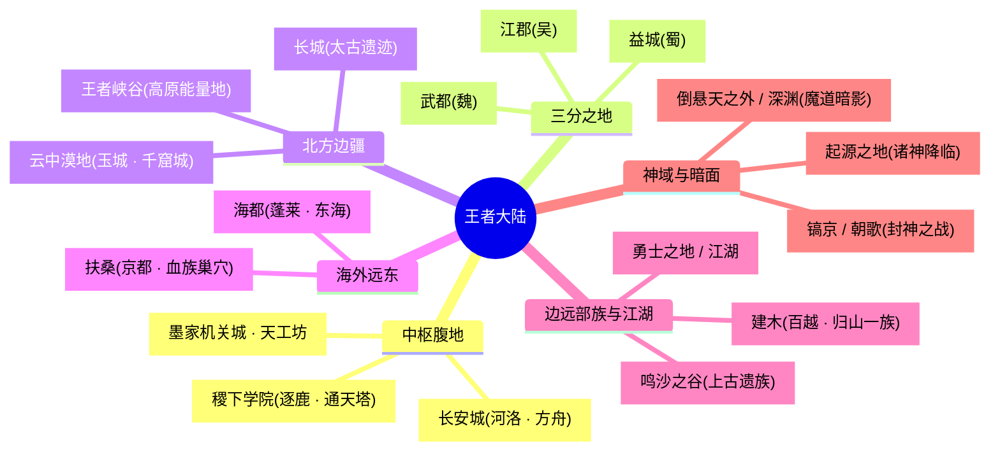
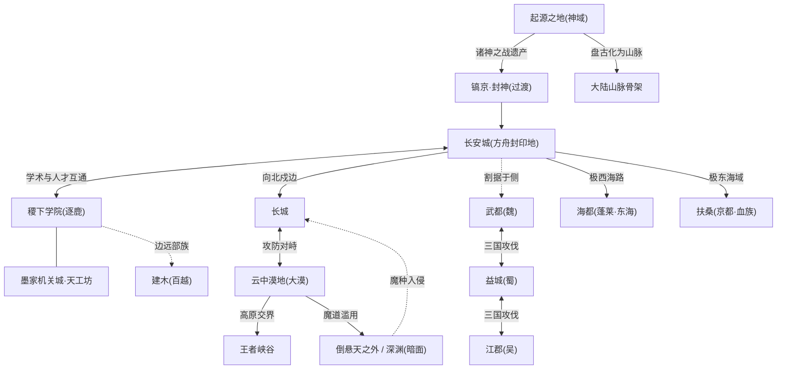
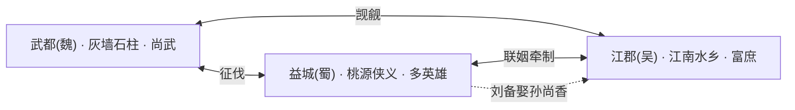
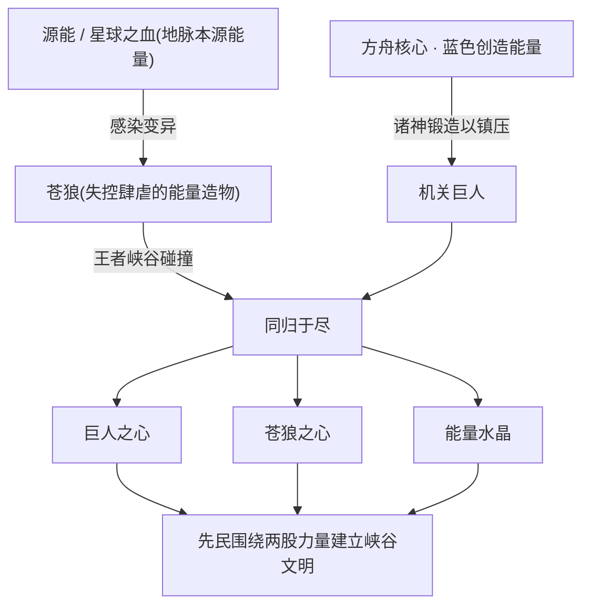
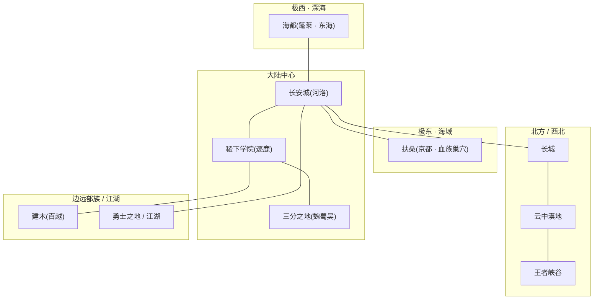

# 王者大陆 · 地理图志

::: quote 卷首语
“大陆之广，神隐其名；山为盘古之脊，海为鲛人之咽，塔为诸神之骨。行走其间者，无人不在踩着上古的灰烬。”
:::

王者大陆（蔚蓝星球）是《王者荣耀》全部叙事的舞台。它既是上古神明乘**方舟**降临的着陆之地，也是人类时代群雄逐鹿的角斗场。本页以 `.build/skeleton.json` 中各阵营的 `location / theme / summary` 为骨，串联起一幅由**中枢都城、学术殿堂、三分之地、北方边疆、海外远东、江湖百越、上古神域**共同拼合的地理长卷。

::: info 阅读说明
- 王者大陆的官方地图历经多次重划（旧版 12 阵营 → 天美重划 12 阵营 → 精简为 10 大阵营 + 9 大地理区域），地名存在迁移与合并（如「东风海域」与「扶桑」、「日落海」与「勇士之地」）。本页采用**兼顾世界观叙事与英雄归属**的实用划分。
- 方位描述（东/西/南/北/中）多为基于碎片化官方设定与社区考据的**相对方位**，并非严格坐标。凡推断性内容均以「(考据推测)」标注。
- 各区域均链接到对应**阵营详情页**，英雄名链接到其所属阵营页的英雄分节。
:::

---

## 区域速查

下表汇总王者大陆各主要地理板块、相对方位、主题风格、代表阵营与一句话定位，便于快速检索。

| 区域 / 地点 | 方位 | 主题风格 | 代表阵营(链接) | 一句话 |
| --- | --- | --- | --- | --- |
| 长安城 / 河洛 | 大陆中心偏东南 | 盛唐都市 + 上古机关浮空城 + 方舟之秘 | [长安城](../factions/changan.md) | 大陆第一雄城，地底封印着方舟核心。 |
| 稷下学院 / 逐鹿 | 大陆中部 | 学术殿堂 + 上古遗迹科技 + 武道魔法并存 | [稷下学院](../factions/jixia.md) | 三贤者创立的最高学堂，通天塔环绕。 |
| 墨家机关城 · 天工坊 | 稷下学院内 | 机关术 + 古代科技 + 防御工事 | [墨家机关城·天工坊](../factions/mojia-jiguan.md) | 长安浮空城与机关人的技术母体。 |
| 三分之地 · 武都(魏) | 中部偏北(考据推测) | 三国争霸 + 尚武枭雄 | [三分之地·魏国](../factions/sanfen-wei.md) | 灰墙石柱、兵强马壮的征伐之邦。 |
| 三分之地 · 益城(蜀) | 中部偏西南(考据推测) | 三国争霸 + 侠义桃源 | [三分之地·蜀国](../factions/sanfen-shu.md) | 山清水秀的桃源，英雄最多之地。 |
| 三分之地 · 江郡(吴) | 中部偏东南(考据推测) | 三国争霸 + 江南水乡 | [三分之地·吴国](../factions/sanfen-wu.md) | 苏徽合璧的富庶水乡，私园林立。 |
| 长城 | 河洛西北 | 边塞军旅 + 对抗暗影魔种 + 多元包容 | [长城守卫军](../factions/changcheng.md) | 太古长城，多元兵团守御北疆。 |
| 云中漠地 / 大漠边陲 | 长城以西、中西部高原 | 丝路绿洲 → 魔种侵蚀的废土 | [云中漠地·边陲](../factions/yunzhong-modi.md) | 曾是丝路明珠，今为沙海废墟。 |
| 蓬莱 · 东海 / 海都 | 大陆极西、深海之畔 | 海洋文明 + 鲛人歌谣 + 奥秘家族阴谋 | [蓬莱·东海 / 海都](../factions/penglai-donghai.md) | 鲛人歌谣与神职家族斗争的海城。 |
| 扶桑 / 血族之地 | 大陆最东端最大岛屿 | 东瀛武士道 + 血族恐怖 + 海域秘辛 | [扶桑 / 血族之地](../factions/fusang-xuezu.md) | 东风海域上的武者与血族之岛。 |
| 建木 / 百越 | 边远部族区域 | 上古部落 + 盘古蚩尤信仰 + 锻造炼器 | [百越 / 建木](../factions/baiyue.md) | 天生巨木拔地，归山一族锻器祈福。 |
| 勇士之地 / 江湖 | 散布大陆各处 | 武林恩怨 + 刺客世家 + 浪客游侠 | [江湖侠客](../factions/jianghu-xiake.md) | 帝国与学院之外的武林与刺客世界。 |
| 倒悬天之外 / 深渊 | 神域界线之外 / 大漠深渊 | 黑暗魔法 + 被奴役者反抗 + 深渊侵蚀 | [魔道·暗影·深渊](../factions/modao-shadow-abyss.md) | 弃血脉与污染力量盘踞的暗面。 |
| 起源之地 / 神域 | 上古神话层(非现世具体方位) | 创世神话 + 科幻方舟双重外壳 | [上古众神·神话](../factions/shanggu-shenhua.md) | 诸神降临与诸神之战的源头。 |
| 镐京 / 朝歌 | 神明—人类过渡时代 | 封神神话 + 神职者与魔道斗争 | [镐京·封神](../factions/haojing-fengshen.md) | 封神之战的战场，纣王陨落之处。 |
| 鸣沙之谷 / 上古遗迹 | 大漠遗迹一带(考据推测) | 上古遗族 + 多职业 + 玩家化身 | [上古遗族 / 神话杂项与多职业](../factions/yuanchu-shenhua-misc.md) | 鸣沙族故土与元流之子的起点。 |
| 王者峡谷 | 中西部高原(云中漠地与勇士之地交界) | 上古能量遗迹 + 峡谷文明 | （MOBA 主战场，见 [王者峡谷专节](#王者峡谷专节)） | 大陆灵力最盛之地，苍狼与巨人长眠。 |

---

## 大陆层级总览

王者大陆的地理可拆解为「大陆 — 大区 — 地点」三级结构。下图以思维导图呈现主干脉络，便于把握全局。

如需进一步看「区域如何彼此接壤、能量如何流转」，下面的流程图给出一条由神域到现世、由中枢向四方辐射的关系链。

---

## 中枢腹地 · 长安与稷下

### 长安城（河洛）

<a class="hok-card" href="concepts#方舟核心宇宙之心">地貌环境地处**河洛地区东南、王者大陆中心**，是盛唐繁华都市与上古机关浮空城的奇异叠合体。地表为车水马龙的盛世都城，地底却深埋着真正的秘密——长安城本质即是当年被封印的**方舟**，地底封存着的能量。(考据推测：「河洛」之名呼应中原河洛文化，定位大陆几何与文明双重中心。)</a>
<a class="hok-card" href="../factions/changan">人文风貌宏伟、包容、富庶，商旅、文人、豪侠与诸族在此和谐聚居。女帝统治，下辖神秘组织尧天（由牡丹方士创立）、占星塔、万镜阁、梨园等机构，是帝国中枢，也是律法、情报与艺文的汇聚点。</a>

::: info 势力 · 长安城阵营
长安城是英雄阵容最庞杂的区域之一。代表英雄包括：圣骑士之王[亚瑟](../heroes/changan.md#亚瑟)、青莲剑仙[李白](../heroes/changan.md#李白)、惊鸿之笔[上官婉儿](../heroes/changan.md#上官婉儿)、通天神探[狄仁杰](../heroes/changan.md#狄仁杰)与其护卫[李元芳](../heroes/changan.md#李元芳)、雷霆之王[司空震](../heroes/changan.md#司空震)、太阳之子[曜](../heroes/changan.md#曜)与其姐破镜之刃[镜](../heroes/changan.md#镜)、尧天成员[杨玉环](../heroes/changan.md#杨玉环)与[公孙离](../heroes/changan.md#公孙离)等。详见 [长安城](../factions/changan.md)。

- 长安的政治张力集中于「**女帝—尧天—狄仁杰**」三角：尧天表面辅佐女帝维护盛世，实则另有所图，与狄仁杰为首的势力暗中对峙。
- [钟馗](../heroes/changan.md#钟馗)是长安地底宝藏（即方舟能量）的守护者，[马可波罗](../heroes/jianghu-xiake.md#马可波罗)在《永远的长安城》事件中开启宝藏大门，揭示「长安即方舟」的核心设定。
:::

**与相邻区域关系**：长安与**稷下学院**学术、人才互通（许多稷下学子最终入仕长安体系）；向**北**派军戍守[长城](../factions/changcheng.md)（[花木兰](../heroes/changan.md#花木兰)、[铠](../heroes/changan.md#铠)等兼具长城渊源）；向**极西**有海路通往[海都](../factions/penglai-donghai.md)，向**极东**面对[扶桑](../factions/fusang-xuezu.md)海域；侧翼是割据的[三分之地](../factions/sanfen-shu.md)。

::: quote 李白 · 台词
“繁华三千东流水，我只取一瓢爱了解。”
:::

### 稷下学院（逐鹿）

稷下学院坐落于**王者大陆中部的逐鹿地区**，原型为战国齐国的稷下学宫。三贤者——[老夫子](../heroes/jixia.md#老夫子)、[庄周](../heroes/penglai-donghai.md#庄周)、[墨子](../heroes/mojia-jiguan.md#墨子)——于此共建大陆智慧与人才中心，下分三派：

| 学院 | 主理人 | 学问 |
| --- | --- | --- |
| 武道学院 | [老夫子](../heroes/jixia.md#老夫子) | 武道学（剑术、体术、战阵） |
| 魔道学院 | [庄周](../heroes/penglai-donghai.md#庄周) | 魔导学（魔道法则与转化） |
| 机关学院 | [墨子](../heroes/mojia-jiguan.md#墨子) | 机关学（古代科技与工事） |

三院环绕**通天塔**而建。通天塔由稷下特有奇迹**云蚕**吐丝构建而成，融合东方幻想与徽派建筑，是学子授业之所，亦被赋予「时间灯塔」的隐喻（详见开放世界《王者荣耀世界》主线设定，参见 [纪元与年表](./eras.md)）。

::: info 人文 · 有教无类的中立殿堂
稷下学院学术中立、向各邦各族开放，是大陆最重要的「关系交汇点」。著名学生团体「**稷下 F4**」由[诸葛亮](../heroes/sanfen-shu.md#诸葛亮)、[司马懿](../heroes/sanfen-wei.md#司马懿)、[周瑜](../heroes/sanfen-wu.md#周瑜)、[元歌](../heroes/sanfen-shu.md#元歌)组成。

::: warning 归属辨析
曾在稷下求学 ≠ 稷下阵营英雄。诸葛亮、司马懿、周瑜虽在稷下成长，但阵营归属仍为蜀 / 魏 / 吴。稷下阵营本身的代表英雄为[老夫子](../heroes/jixia.md#老夫子)、[鬼谷子](../heroes/jixia.md#鬼谷子)、[孙膑](../heroes/jixia.md#孙膑)、[东皇太一](../heroes/jixia.md#东皇太一)、[白起](../heroes/jixia.md#白起)等。详见 [稷下学院](../factions/jixia.md)。
:::

:::

**与相邻区域关系**：稷下是地理与人际的「中转站」，与长安互为表里（一为学、一为政）；其魔道学院、机关学院的成果外溢，分别影响着[魔道·暗影·深渊](../factions/modao-shadow-abyss.md)的力量谱系与[墨家机关城](../factions/mojia-jiguan.md)的技术体系。

### 墨家机关城 · 天工坊

墨家机关城**位于稷下学院之内**，由墨子（本名墨翟）利用上古遗迹残骸构建，是机关术 / 古代科技流派的发源地。机关运作依赖**太古能量核心**——这正是长安浮空城、长安机关人乃至各类机关造物的技术母体。

::: info 墨家与鲁班的经典对照
墨子曾为阻止楚国攻宋，与名匠公输般（鲁班）进行九次攻防演练并折服对方，构成「墨家机关 vs 鲁班工巧」的经典对照。代表英雄有[墨子](../heroes/mojia-jiguan.md#墨子)、[鲁班七号](../heroes/mojia-jiguan.md#鲁班七号)、[鲁班大师](../heroes/mojia-jiguan.md#鲁班大师)、[沈梦溪](../heroes/mojia-jiguan.md#沈梦溪)。详见 [墨家机关城·天工坊](../factions/mojia-jiguan.md)。
:::

---

## 三分之地 · 魏蜀吴

「三分之地」是人类时代群雄逐鹿的缩影，魏、蜀、吴三国割据其上、攻伐不断。三地虽同处一区，地貌与气质却泾渭分明。

### 三分之地 · 魏国（武都）

以**武都**为核心。民风彪悍尚武、富侵略野心，城貌为**灰色城墙、石柱与天桥**，兵强马壮。由枭雄[曹操](../heroes/sanfen-wei.md#曹操)统领，麾下有[典韦](../heroes/sanfen-wei.md#典韦)、[夏侯惇](../heroes/sanfen-wei.md#夏侯惇)、谋士[司马懿](../heroes/sanfen-wei.md#司马懿)、洛神[甄姬](../heroes/sanfen-wei.md#甄姬)、天籁[蔡文姬](../heroes/sanfen-wei.md#蔡文姬)。详见 [三分之地·魏国](../factions/sanfen-wei.md)。

### 三分之地 · 蜀国（益城）

以**益城**为核心。山清水秀、桃花绚烂，是带神秘感的「世外桃源」，也是**英雄数量最多**的阵营。由仁德枭雄[刘备](../heroes/sanfen-shu.md#刘备)统领，含桃园结义与五虎将羁绊：[关羽](../heroes/sanfen-shu.md#关羽)、[赵云](../heroes/sanfen-shu.md#赵云)、[马超](../heroes/sanfen-shu.md#马超)、[张飞](../heroes/sanfen-shu.md#张飞)、[黄忠](../heroes/sanfen-shu.md#黄忠)，以及卧龙[诸葛亮](../heroes/sanfen-shu.md#诸葛亮)、后主[刘禅](../heroes/sanfen-shu.md#刘禅)、傀儡师[元歌](../heroes/sanfen-shu.md#元歌)。详见 [三分之地·蜀国](../factions/sanfen-shu.md)。

### 三分之地 · 吴国（江郡）

以**江郡**为核心。江南水乡风（**苏派 + 徽派**结合），江河富庶、私家园林造景精巧，因富庶而被魏都觊觎。由[孙策](../heroes/sanfen-wu.md#孙策)、孙权统领，含「孙周 + 大小乔」的姻亲网：[周瑜](../heroes/sanfen-wu.md#周瑜)与[小乔](../heroes/sanfen-wu.md#小乔)、[大乔](../heroes/sanfen-wu.md#大乔)与孙策、郡主[孙尚香](../heroes/sanfen-wu.md#孙尚香)。详见 [三分之地·吴国](../factions/sanfen-wu.md)。

::: info 相邻关系
三国互为犄角，攻伐与联姻交织。蜀国[刘备](../heroes/sanfen-shu.md#刘备)迎娶吴国郡主[孙尚香](../heroes/sanfen-wu.md#孙尚香)，使蜀吴间多一层联姻牵制；魏都则对江南富庶虎视眈眈。三分之地的纷争与长安帝国并存，是人类时代「群雄逐鹿」的主旋律之一。
:::

---

## 北方边疆 · 长城与大漠

王者大陆的北方 / 西北是文明与荒蛮、秩序与污染交锋的最前线。**长城**横亘其间，城外是衰败的**云中漠地**，城内是包容的[长城守卫军](../factions/changcheng.md)。

### 长城（长城守卫军）

长城位于**河洛西北**，是矗立千百年的**太古遗留建筑**，用以抵御来自云中漠地的大漠魔种威胁。因帝国的包容，长城守卫军吸纳了魔种混血、异乡人、屯田军后裔乃至女性等一切有才之人，是大陆**最多元包容**的兵团。

| 角色 | 称号 | 渊源 |
| --- | --- | --- |
| [苏烈](../heroes/changcheng.md#苏烈) | 不屈铁壁 | 弃笔从戎的状元，前指挥官 |
| 李信 | 一念神魔 | 苏烈接纳教导，后接任指挥官（主条目见 [长安城](../factions/changan.md)） |
| 花木兰 | 传说之刃 | 长城小队队长（主条目见 [长安城](../factions/changan.md)） |
| [百里守约](../heroes/changcheng.md#百里守约) | 残光徽列 | 狙击手，[百里玄策](../heroes/changcheng.md#百里玄策)之兄 |
| [伽罗](../heroes/changcheng.md#伽罗) | 破魔之箭 | 箭矢可破魔净化 |
| [盾山](../heroes/changcheng.md#盾山) | 坚守之盾 | 可格挡一切远程飞行物的机关守护者 |
| [戈娅](../heroes/changcheng.md#戈娅) | 银翼飞将 | 背负机械翼装的飞行射手 |

详见 [长城守卫军](../factions/changcheng.md)。

::: quote 百里守约 · 台词
“我等的人，迟早会来。”
:::

**与相邻区域关系**：长城**西邻云中漠地大漠**，是抵御大漠魔种的第一道屏障；隶属帝国体系，与[长安城](../factions/changan.md)关系密切（[铠](../heroes/changan.md#铠)从日落海漂来、被花木兰拾得命名后加入长城）。它与[魔道·暗影·深渊](../factions/modao-shadow-abyss.md)处于直接军事对峙——[花木兰](../heroes/changan.md#花木兰)与暗影刀锋[兰陵王](../heroes/modao-shadow-abyss.md#兰陵王)的「双兰」宿命交锋，正发生在长城脚下。

### 云中漠地 · 边陲

云中漠地位于**长城以西、大陆中西部高原**，是一片广袤的沙漠区域，势力代表为「**云中沙之盟**」。它的历史是一部由盛而衰的悲剧：

::: warning 由绿洲明珠到沙海废土
云中漠地曾是**丝路绿洲明珠**，文明交汇、贸易繁荣，孕育出玉城、千窟城、都护府、金庭城等城市。但随着大漠绿洲统治者经不住**魔道力量**的诱惑、滥用力量制造强大魔种，王庭与都护府相继沦陷，唐国军队退却、长城关隘紧闭，大漠衰败为废土。无底深渊曾挖出黑石，引发魔种袭击玉城。
:::

代表英雄：玉城之子[暃](../heroes/yunzhong-modi.md#暃)（操控暗影傀儡、可在墙体行走，背负玉城没落之痛）、秩序统帅[蒙恬](../heroes/yunzhong-modi.md#蒙恬)（持矛召唤军团旗的大秦边军指挥官）、烈炮小子[蒙犽](../heroes/yunzhong-modi.md#蒙犽)（骑机关炮车的发明少年，[星之队](../relationships/squad.md#星之队)成员）、月之子[海月](../heroes/yunzhong-modi.md#海月)（操控蝶群、远程拉扯的法师，亦是云中漠地一线的大反派）、草原之狼[苍](../heroes/yunzhong-modi.md#苍)（超远射程的草原弓骑）。详见 [云中漠地·边陲](../factions/yunzhong-modi.md)。

**与相邻区域关系**：东接[长城](../factions/changcheng.md)（互为攻防对峙的两端）；魔道滥用使其成为[魔道·暗影·深渊](../factions/modao-shadow-abyss.md)势力的衍生地与衰败根源；其高原南缘与**勇士之地**交界处，正是大陆能量最盛的**王者峡谷**所在。

---

## 海外远东 · 海都与扶桑

王者大陆的东西两极各有一片由海洋环抱的文明：**极西**的海都（蓬莱·东海）与**极东**的扶桑（血族之地）。

### 蓬莱 · 东海 / 海都

海都坐落于**王者大陆极西、深海之畔**，是一座异域学者风的海洋都市（蓝白色调，海浪与鲛人元素）。深海**鲛人族**以歌谣守护海洋宁静千年。

::: info 奥秘家族的权力网
诸神之战后，反叛的 11 个**奥秘 / 神职家族**夺取奇迹之力却遭诅咒，分散各地。其中**月之家族**被派往海都、**塔之家族**最终胜出获得**总督**之位，家族间长期上演权力斗争。代表英雄：海都总督[米莱狄](../heroes/penglai-donghai.md#米莱狄)、鲛人刺客[澜](../heroes/penglai-donghai.md#澜)、命运家族族长[海诺](../heroes/penglai-donghai.md#海诺)与深海歌姬[朵莉亚](../heroes/penglai-donghai.md#朵莉亚)、渊蛟[敖隐](../heroes/penglai-donghai.md#敖隐)，以及归东海武道圈层的剑圣[宫本武藏](../heroes/penglai-donghai.md#宫本武藏)、道家智者[庄周](../heroes/penglai-donghai.md#庄周)。详见 [蓬莱·东海 / 海都](../factions/penglai-donghai.md)。
:::

### 扶桑 / 血族之地

扶桑是**王者大陆最东端的最大岛屿**（位于「东风海域」），含两座主城：

| 城 | 性质 |
| --- | --- |
| 京都 | 扶桑武者与学者僧侣的聚居都城 |
| 血族巢穴 | 东海一座由血族王徐福统治的无名岛 |

扶桑居民习俗深受大陆影响，学者僧侣远赴[稷下](../factions/jixia.md)、[长安](../factions/changan.md)求学。岛上以**武道**为尊，武者修习剑术、忍术、体术，是大陆东缘一支独立的武学传统。

后「**血族之乱**」降临扶桑：东海一座无名岛上的血族王**徐福**率血族肆虐，扶桑武者（武道一方）与血族（黑暗势力）由此构成全岛核心冲突。代表英雄：忍蜂[不知火舞](../heroes/fusang-xuezu.md#不知火舞)——不知火流唯一传人，在血族之乱中追剿血族、并得知祖父正是被血族所害（源自 SNK《拳皇 / 侍魂》联动）。此外，斩杀无数血族的双刀剑圣[宫本武藏](../heroes/penglai-donghai.md#宫本武藏)亦为扶桑武者出身（世界观上归入东海武道圈层）。详见 [扶桑 / 血族之地](../factions/fusang-xuezu.md)。

::: tip 联动英雄与扶桑
扶桑的「东瀛武士道」气质，使其成为多位跨 IP 联动客座英雄的世界观落点。其中[不知火舞](../heroes/fusang-xuezu.md#不知火舞)因有明确的「血族之乱」叙事而正式归入扶桑阵营；其余无明确主线归属的 SNK / 联动英雄（如娜可露露、橘右京等）则单列于 [联动英雄](../factions/liandong-snk.md) 一组，不强行并入扶桑。
:::

::: info 海外与中枢的关系
海都与扶桑虽僻处大陆东西两端，却通过海路、学路与中枢相连：扶桑学子赴稷下、长安求学；海都的奥秘家族则与起源时代的[神职者](concepts.md#神职者奥秘家族)体系一脉相承。两地都是「奇迹之力 + 诅咒」母题的远方回响。
:::

---

## 边远部族与江湖 · 建木、勇士之地、鸣沙之谷

### 建木 / 百越

**建木**是天生巨木拔地而起、自成山川水土的区域（与「倒悬天」关联），以盘古、蚩尤等上古神话为根脉，是边远部族势力。

::: info 归山一族
**归山一族**（蚩尤后人）信仰[盘古](../heroes/shanggu-shenhua.md#盘古)，世代传承锻造术，致力平息笼罩建木上空的「紊流」灾难，并保留独特的「归山语」。代表英雄：器痴少女[蚩奼](../heroes/baiyue.md#蚩奼)、白虎少年[裴擒虎](../heroes/baiyue.md#裴擒虎)、百越巫祝[云中君](../heroes/baiyue.md#云中君)与鹿灵[瑶](../heroes/baiyue.md#瑶)、越国西子[西施](../heroes/baiyue.md#西施)、白虎守护[亚连](../heroes/baiyue.md#亚连)。详见 [百越 / 建木](../factions/baiyue.md)。
:::

### 勇士之地 / 江湖侠客

江湖是游离于帝国与学院之外的散落势力，散布大陆各处，**勇士之地**则是其中以**武道大会、日落圣殿**著称的舞台。这里上演武林恩怨、刺客世家与浪客游侠的故事。

- **荆氏一族**（[阿轲](../heroes/jianghu-xiake.md#阿轲)所属）：大周分崩后世代为刺客；
- 兵仙[韩信](../heroes/jianghu-xiake.md#韩信)（龙族血脉，与[李白](../heroes/changan.md#李白)为狐龙世交）、圣枪游侠[马可波罗](../heroes/jianghu-xiake.md#马可波罗)、西部浪客[莱西奥](../heroes/jianghu-xiake.md#莱西奥)、偷装神辅[空空儿](../heroes/jianghu-xiake.md#空空儿)亦归此圈层。

详见 [江湖侠客](../factions/jianghu-xiake.md)。(考据推测：勇士之地 / 日落圣殿在官方划分中未单建阵营，圣骑士之王[亚瑟](../heroes/changan.md#亚瑟)、智慧女神[雅典娜](../heroes/shanggu-shenhua.md#雅典娜)的武道大会圈层亦与此地交汇——剑圣[宫本武藏](../heroes/penglai-donghai.md#宫本武藏)即以「武道大会冠军」身份在此扬名。)

### 鸣沙之谷 / 上古遗迹

**鸣沙之谷**是鸣沙族的故土，位于大漠遗迹一带(考据推测)，承载着不易归入单一主线阵营的神话 / 上古遗族角色。开放世界主人公、首位多职业自选英雄[元流之子](../heroes/yuanchu-shenhua-misc.md#元流之子)作为玩家化身，是连接所有阵营的特殊存在；此外还有六耳猕猴[六耳](../heroes/yuanchu-shenhua-misc.md#六耳)、鸣沙族少年[桑启](../heroes/yuanchu-shenhua-misc.md#桑启)。详见 [上古遗族 / 神话杂项与多职业](../factions/yuanchu-shenhua-misc.md)。

::: info 鸣沙之谷与《王者荣耀世界》主线
在开放世界《王者荣耀世界》中，鸣沙之谷一带是主线的起点之一。[元流之子](../heroes/yuanchu-shenhua-misc.md#元流之子)可在坦克 / 法师 / 射手 / 辅助 / 刺客等职业间切换，象征玩家本人；其使命是回溯**灭世之战**——在反派领袖帝辛（[帝俊](../heroes/haojing-fengshen.md#帝俊)体系）发起的、原时间线中导致抵抗联军战败的浩劫之前，凭关键抉择扭转历史。这条主线串起方舟核心、魔种入侵等全局母题，使「上古遗族」与现世各阵营在叙事上彻底打通。详见 [纪元与年表](./eras.md)。
:::

---

## 神域与暗面 · 起源之地、镐京、深渊

这一组并非现世可达的「地理板块」，而是叠加在大陆之上的**时代层**与**界外空间**，却是全部地理的源头与底色。

### 起源之地（上古众神 · 神话）

**起源之地**是神明（超智慧生命体）降临、自封为神的源头，也是诸神之战的爆发地。诸神分裂为**女娲派**与**帝俊派**两大阵营，是后世一切冲突的总源头。代表英雄：[女娲](../heroes/shanggu-shenhua.md#女娲)、[盘古](../heroes/shanggu-shenhua.md#盘古)、[后羿](../heroes/shanggu-shenhua.md#后羿)、[孙悟空](../heroes/shanggu-shenhua.md#孙悟空)、[牛魔](../heroes/shanggu-shenhua.md#牛魔)等。详见 [上古众神·神话](../factions/shanggu-shenhua.md) 与 [纪元与年表](./eras.md)。

::: info 两派分裂——一切冲突的总开关
起源之地的诸神并非铁板一块。围绕「文明该不该受星球承载力的约束」，众神裂为两派：以[女娲](../heroes/shanggu-shenhua.md#女娲)为首者主张限制超出星球极限的发展，并派[后羿](../heroes/shanggu-shenhua.md#后羿)关闭 / 摧毁竭泽而渔的[日之塔](concepts.md#日之塔)；以**帝俊**（[帝俊](../heroes/haojing-fengshen.md#帝俊) / 帝辛 / 纣王体系）为首者则主张进步不应受任何束缚。两派全面开战，即**诸神之战**。这道分歧是后世一切冲突——封神之战、魔种起义、魔道与神职对立——的总源头。
:::

::: tip 盘古化为山脉——地理的神话起源
据世界观，[盘古](../heroes/shanggu-shenhua.md#盘古)在诸神之战中对人类生情，劈开束缚人类的保护罩、赋予自由后**化为山脉**。换言之，王者大陆的山脊骨架本身，就是一位神明的遗体。这是「地理图志」最深的一笔底色。
:::

### 镐京 / 朝歌（封神）

**镐京 / 朝歌**是神明时代向人类时代过渡的关键战场，承载以《封神演义》为原型的**封神之战**。战争源于纣王（帝辛 / 帝俊体系）宣布人类与魔种平等招致反对，[姜子牙](../heroes/haojing-fengshen.md#姜子牙)为首的讨伐军认定其为「走向毁灭的大魔神王」并发动讨伐，纣王于摘星楼烈焰中灰飞烟灭。代表英雄：[姜子牙](../heroes/haojing-fengshen.md#姜子牙)、[妲己](../heroes/haojing-fengshen.md#妲己)、[杨戬](../heroes/haojing-fengshen.md#杨戬)、[哪吒](../heroes/haojing-fengshen.md#哪吒)、[帝俊](../heroes/haojing-fengshen.md#帝俊)等。详见 [镐京·封神](../factions/haojing-fengshen.md)。

### 倒悬天之外 / 深渊（魔道 · 暗影 · 深渊）

这是大陆的**暗面**：被神明改造失败的**魔道家族**被抛弃到「倒悬天」之外，与魔种、普通人混居；大漠魔道滥用制造的**暗影魔种**与代表毁灭堕落的**深渊**亦盘踞于此（暗影之径、大漠深渊）。代表英雄：暗影刀锋[兰陵王](../heroes/modao-shadow-abyss.md#兰陵王)、飞将[吕布](../heroes/modao-shadow-abyss.md#吕布)。详见 [魔道·暗影·深渊](../factions/modao-shadow-abyss.md)。

::: warning 暗面与现世的接触面
暗面并非孤立——它通过三条裂缝渗入现世：在**起源**层压迫魔种（诸神奴役）；在**边境**层冲击[长城](../factions/changcheng.md)（大漠魔种入侵）；在**地脉**层污染源能（[云中漠地](../factions/yunzhong-modi.md)的衰败、王者峡谷的异变）。
:::

---

## 王者峡谷（专节）

> 「在大陆所有地方之中，唯有这一处，连泥土里都淌着上古的电流。」

**王者峡谷**是 MOBA 主玩法的世界观落点，位于**大陆中西部高原**——具体在**云中漠地与勇士之地的交界**地带。它之所以成为「大陆灵力最盛之地」，源于一场上古的同归于尽。

### 上古能量的由来：苍狼与机关巨人

在「先民时代 / 峡谷文明」纪元（参见 [纪元与年表](./eras.md)），两股上古力量在此碰撞：

- **苍狼**——王者大陆原生的能量造物，因受[源能（星球之血）](concepts.md#源能星球之血--原初之息)感染而变异、肆虐；
- **机关巨人**——诸神以[方舟核心](concepts.md#方舟核心宇宙之心)中的**蓝色创造能量**打造、用以镇压苍狼的造物。

二者最终在王者峡谷碰撞、**同归于尽**。残骸散落、滋养大地，孕育出三样上古遗产：**巨人之心**、**苍狼之心**与**能量水晶**，使峡谷成为全大陆灵力最集中的地方。

::: info 峡谷文明与对战机制的世界观映射
先民发现这两股力量后，在**能量水晶**上修筑祭坛，围绕其建立带有独特信仰的**峡谷文明**，为英雄时代铺垫了舞台。这也是 MOBA 主战场之所以汇聚天南海北英雄、之所以处处是「能量节点」的设定根源。

- **巨人之心 / 苍狼之心**——对应峡谷中蓝 buff、红 buff 一类的上古能量造物意象（蓝=创造、红=毁灭，呼应方舟核心红蓝能量母题）。(考据推测：游戏内野区资源与这两股遗产的能量分野相呼应。)
- **暗影主宰 / 暗影先锋 / 暗影之径**——是峡谷能量「阴面」（[暗影](concepts.md#暗影shadow)、污染）的具象化。
:::

### 峡谷与破晓事件、永恒黑夜

王者峡谷也是后世数次危机的震中：

- **破晓事件**：[花木兰](../heroes/changan.md#花木兰)在[明世隐](../factions/changan.md)谋划下砍碎上古奇迹宝石「破晓之心」，裂隙打开、**原初之息**汹涌涌出浸染峡谷、引发野兽异变；[鬼谷子](../heroes/jixia.md#鬼谷子)号召英雄集结守卫并修复破晓之心。该瞬间在平行时空投射出「破晓宇宙」。
- **永恒黑夜 / 原初之息奔涌**：在开放世界叙事中，源能 / 原初之息的失控奔涌带来「永恒黑夜降临峡谷」的新危机，[元流之子](../heroes/yuanchu-shenhua-misc.md#元流之子)以玩家化身身份介入。

详见 [纪元与年表](./eras.md) 与 [核心宇宙观 · 能量与神话](concepts.md)。

::: quote 峡谷开局 · 经典播报
“敌军即将到达战场，全军出击！”
:::

---

## 结语 · 一图读懂方位关系

最后，用一张相对方位示意收束全篇。需再次强调：王者大陆缺乏严格官方坐标，下图为**基于碎片设定与社区考据的相对方位**，仅供建立空间直觉。

::: details 延伸阅读
- [核心宇宙观 · 能量与神话](concepts.md)：方舟、方舟核心、源能、十二奇迹、神职者与魔道等本源设定。
- [纪元与年表](./eras.md)：起源时代 → 上古文明 → 神明时代 → 人类时代 → 峡谷文明 → 破晓 / 琥珀 / 开放世界主线的完整时间脉络。
- [关系网总览](../relationships/index.md)：跨区域的师徒、姻亲、宿敌与阵营羁绊。
- 各阵营详情页：[长安城](../factions/changan.md)、[稷下学院](../factions/jixia.md)、[长城守卫军](../factions/changcheng.md)、[云中漠地·边陲](../factions/yunzhong-modi.md)、[蓬莱·东海](../factions/penglai-donghai.md) 等。
:::