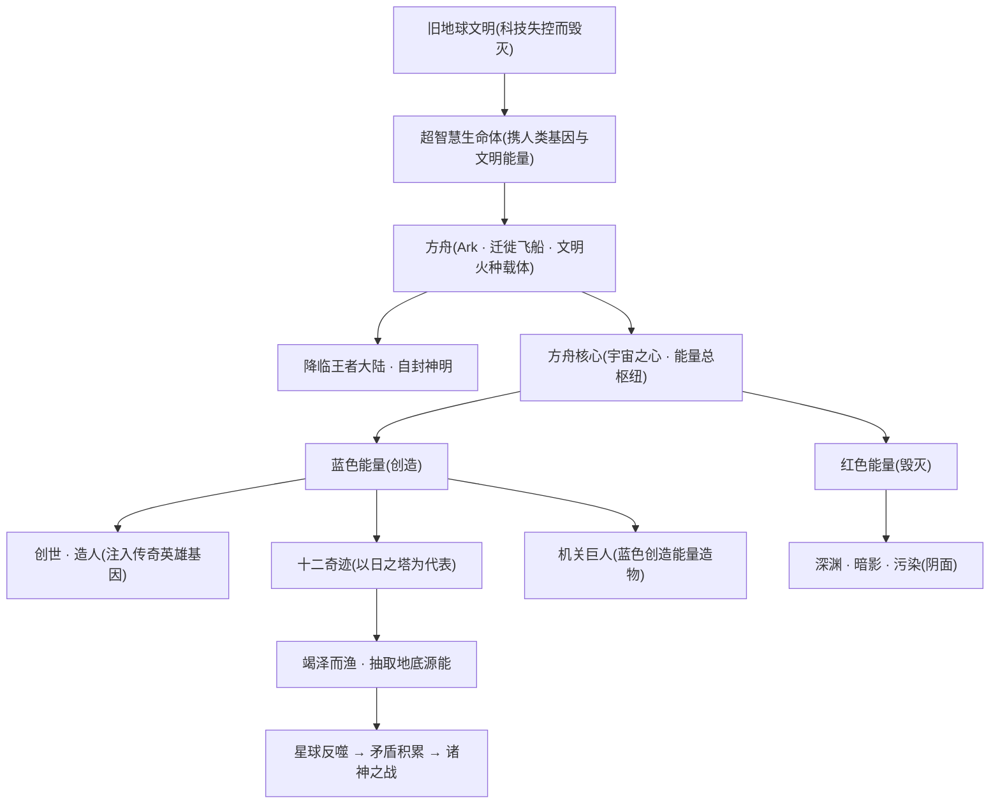
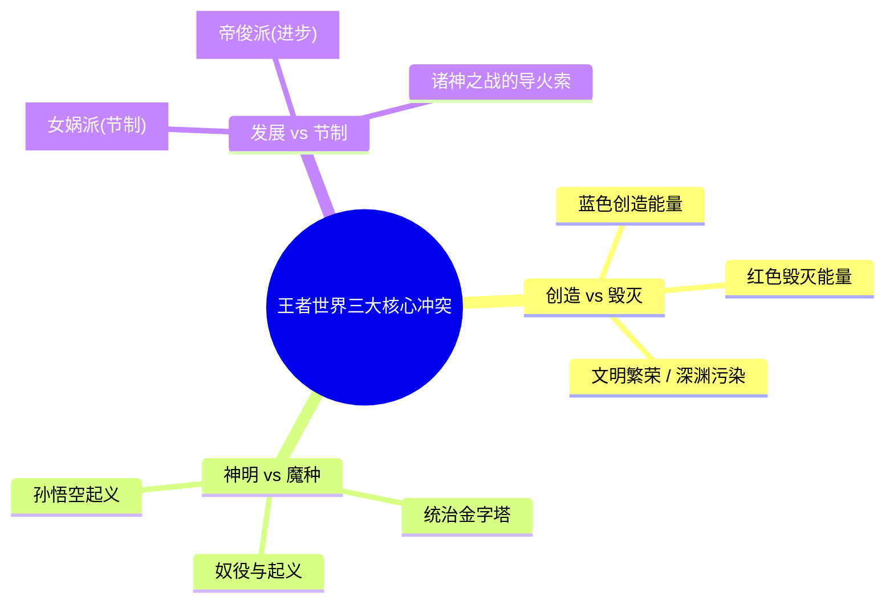
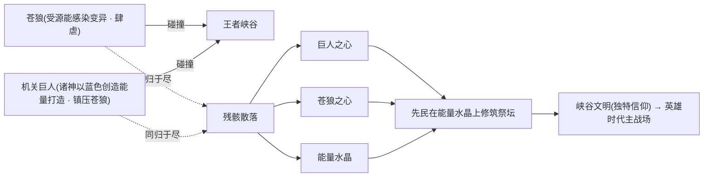

# 世界观总览

::: info 一句话世界观
《王者荣耀》并非一个生于神话的奇幻世界，而是一部"科幻底子、神话皮相"的文明史诗：遥远未来的旧地球文明因科技失控而毁灭，少数幸存者进化为超智慧生命体，乘**方舟**携文明火种降临蔚蓝的**王者大陆**，凭**方舟核心**之力创世造人、自封神明。此后，**创造与毁灭、神明与魔种、发展与节制**三组矛盾纠缠千年，从诸神之战、神明陨落，一路演进到群雄逐鹿的英雄时代——这便是玩家所熟知的整个王者世界的来处。
:::

这是一篇写给新读者的"入门导览"。读罢本页，你将掌握理解王者世界所需的全部底层骨架：它从哪里来、由什么能量驱动、有怎样的等级秩序、核心冲突是什么、主战场落在何处，以及主线之外还有哪些平行宇宙。更细的内容，本页结尾的"如何阅读本站"卡片网格会指引你逐层深入。

---

## 一、大图景：一部伪装成神话的科幻史诗

王者世界最容易被误解的一点，是把它当作传统东方神话。事实恰恰相反——它的最底层是一个**远未来科幻框架**，神话只是后世人类对真相的追述与美化。

整条主世界线的逻辑链条如下：

> **旧地球文明毁灭** → **超智慧生命体乘方舟降临王者大陆** → **以方舟核心创世造人、自封神明** → **建造十二奇迹、竭泽而渔** → **魔种觉醒起义、诸神之战爆发** → **神明陨落退场、人类自主纪元开启**。

具体而言：

- **旧地球的终结。** 遥远的未来，旧地球文明因自身科技失控而走向毁灭。少数幸存者在末日中进化为**超智慧生命体**，他们携带着人类基因与文明能量，乘**方舟**飞船穿越深空，寻找新的家园。
- **降临与自封神明。** 方舟最终降临在一颗蔚蓝色的星球——也就是后世所称的**王者大陆**。这些降临者并非天生神祇，而是凭借远超原住民的科技与力量，**自封为神**。代表者包括[女娲](../heroes/shanggu-shenhua.md#女娲)、[帝俊](../heroes/haojing-fengshen.md#帝俊)、[盘古](../heroes/shanggu-shenhua.md#盘古)、[伏羲](../factions/shanggu-shenhua.md)、[后羿](../heroes/shanggu-shenhua.md#后羿)等。
- **创世与造人。** 神明启用方舟内核——**方舟核心**作为无限能源，创造生命、改造世界，并将旧地球传奇英雄的基因注入新生人类。这正是大量英雄"姓名取自历史与神话，却共处一界"的世界观依据。

::: info 为什么神话与历史人物会同台？
因为他们本质上是神明"以基因为蓝本"创造的新生人类，或后世人类文明中重新诞生的同名英雄。秦皇、三国群雄、封神诸神、西游魔种得以共处一界，并不违和——这是科幻设定为"全明星同框"提供的叙事许可。详见 [纪元编年](../worldview/eras.md) 与 [大事年表](../worldview/timeline.md)。
:::

---

## 二、创世引擎：方舟与方舟核心

如果说方舟是文明的"火种载体"，那么**方舟核心**（又称**宇宙之心**，Ark Core）就是整个世界观能量体系的总枢纽——它既是创世神器，也是末日开关。

方舟核心内部孕育着两股原始而对立的力量，这一"红蓝二元"母题贯穿了王者世界的方方面面，乃至延伸进平行宇宙的皮肤配色：

| 能量 | 颜色 | 性质 | 在故事中的体现 |
| :--- | :--- | :--- | :--- |
| **毁灭能量** | 红色 | 破坏、终结、堕落 | 与[深渊](../worldview/concepts.md#深渊abyss)、[暗影](../worldview/concepts.md#暗影shadow)、污染相呼应；星球反噬的阴面 |
| **创造能量** | 蓝色 | 生成、孕育、光明 | 神明造人、打造机关巨人、建造奇迹所依凭的力量 |

下面这张流程图，将"旧地球 → 方舟 → 方舟核心 → 创世/造人/十二奇迹"的创世链条整体呈现：

::: info 长安城的惊天秘密
起源时代末期，方舟核心被女娲封印于**长安城**地底。后世揭示：长安城的真面目，正是那艘**被封印的方舟**本身。这也是《永远的长安城》故事中，[李白](../heroes/changan.md#李白)、[李元芳](../heroes/changan.md#李元芳)、[狄仁杰](../heroes/changan.md#狄仁杰)、[马可波罗](../heroes/jianghu-xiake.md#马可波罗)围绕"长安地底宝藏"展开混战的核心动因。
:::

---

## 三、等级金字塔：神明—神职者—人类—魔道—魔种

神明文明的鼎盛期，建立起一套森严到残酷的等级秩序。它从上到下共分五层，是理解王者世界一切阶级矛盾与悲情血脉的钥匙。

逐层解释如下：

- **神明（自封之神）。** 金字塔之巅。降临的超智慧生命体，凭科技进化与方舟核心之力自封为神，掌控创世、造人与十二奇迹。内部因理念分歧而分裂，最终爆发[诸神之战](../worldview/eras.md)。代表：[女娲](../heroes/shanggu-shenhua.md#女娲)、[帝俊](../heroes/haojing-fengshen.md#帝俊)、[盘古](../heroes/shanggu-shenhua.md#盘古)。
- **神职者（奥秘家族 / Arcana）。** 神明从人类中选拔、施以身体改造而**成功**者。力量强大、位居众人之上，是神明统治的帮凶与执行者。诸神之战后，反叛的十一家族夺取奇迹之力却遭诅咒，演化为分布各地的**奥秘家族 / 神职家族**（如月之家族、塔之家族落脚[海都](../factions/penglai-donghai.md)），构成后世的贵族政治网络。
- **人类。** 神明以方舟核心创造的新生族群，金字塔的中间层与被改造的"原料库"。神明从中选拔改造对象——成者升为神职者，败者坠入魔道。
- **魔道（魔道家族 / Demon Path）。** 身体改造**失败**的人类，被弃置、抛弃到**倒悬天**之外，与魔种、普通人混居。他们血脉中流动着改造残留的神秘力量——所谓"魔道"，是一门由"定义世界本源的知识与法则"驱动、经媒介触发转化为力量的神秘学问，取代了旧地球的燃料，成为改造世界的动力源。这是一支"因罪而得力量"的悲情血脉。代表：[兰陵王](../heroes/modao-shadow-abyss.md#兰陵王)、[吕布](../heroes/modao-shadow-abyss.md#吕布)。
- **魔种。** 金字塔的最底层，却是王者大陆真正的**原住民**——兽型生物、苍狼血脉等原生族群。被神明蔑称为"低贱者"，以武力奴役去修建奇迹。然而正是他们，在受星球之血/源能感染后觉醒了自我意识，在[孙悟空](../heroes/shanggu-shenhua.md#孙悟空)带领下点燃了反抗的火种。代表：孙悟空、[牛魔](../heroes/shanggu-shenhua.md#牛魔)、[猪八戒](../heroes/shanggu-shenhua.md#猪八戒)。

::: quote 被压迫者的觉醒
"我命由我不由天。"——这正是魔种从"被奴役的工具"走向"觉醒的反抗者"这条叙事主线的精神内核。孙悟空起义虽因内部背叛而失败，却埋下了动摇整个神明秩序的第一颗火星。
:::

::: details 倒悬天是什么？（可折叠）
**倒悬天**是神明统治体系中的一处设定空间。身体改造失败者（魔道家族）被抛弃到"倒悬天之外"，与魔种、普通人混居。它是神域与凡域界线的具象体现——一道把"被弃者"隔离于神明文明之外的天堑。
:::

---

## 四、核心冲突：三组对立轴线

王者世界的全部张力，可以归结为三组相互嵌套的对立。它们并非彼此独立，而是层层咬合、互为表里。

其中最具体、最具决定性的，是第三组——**发展 vs 节制**，它直接引爆了改写世界格局的[诸神之战](../worldview/eras.md)。两派主张针锋相对：

| 对照维度 | 女娲派（节制） | 帝俊派（进步） |
| :--- | :--- | :--- |
| **代表神明** | [女娲](../heroes/shanggu-shenhua.md#女娲)、[后羿](../heroes/shanggu-shenhua.md#后羿)、[盘古](../heroes/shanggu-shenhua.md#盘古) | [帝俊](../heroes/haojing-fengshen.md#帝俊)（即帝辛 / 纣王体系） |
| **核心主张** | 限制超出星球承载力的发展 | 进步不应受任何束缚 |
| **对待日之塔** | 关闭 / 摧毁受污染的日之塔 | 维持开采，无限索取 |
| **对待源能** | 敬畏地脉、警惕星球反噬 | 竭泽而渔、能量至上 |
| **对待人类与魔种** | 盘古劈开束缚人类的保护罩、赋予自由 | 维系统治秩序、压制反抗 |
| **结局** | 封印方舟核心、藏匿钥匙后沉睡 | 帝俊战败身亡，诸神死伤殆尽 |

::: warning 诸神之战的代价
这场理念之战没有真正的赢家。帝俊派战败、帝俊身亡；女娲派虽"获胜"，却也付出了诸神死伤殆尽、自身沉睡的代价。盘古为人类生情，劈开保护罩赋予其自由后化为山脉；女娲耗尽最后力量封印方舟核心、将解封钥匙分藏于十二奇迹之中，随后长眠。**神明文明就此谢幕，人类时代的大门由此被推开。** 这一纪元的具象叙事，即以[纣王](../heroes/haojing-fengshen.md#帝俊)、[姜子牙](../heroes/haojing-fengshen.md#姜子牙)、[妲己](../heroes/haojing-fengshen.md#妲己)、[杨戬](../heroes/haojing-fengshen.md#杨戬)、[哪吒](../heroes/haojing-fengshen.md#哪吒)为核心的"封神之战"。
:::

---

## 五、十二奇迹与日之塔：荣耀的支柱，亦是祸根

**十二奇迹（Twelve Miracles）**是神明以方舟核心能量建造的十二座奇迹建筑，横贯整个王者大陆。它们身兼三重身份：

1. **能量支柱**——以方舟核心之力运转，是新文明的动力来源。
2. **权力象征**——是神明统治与神职者贵族体系的物质根基。
3. **封印谜题**——诸神之战后，女娲将方舟核心的**解封钥匙分藏其中**，使十二奇迹同时成为一组横跨大陆的"封印锁孔"。

而十二奇迹中最具代表性者，是**日之塔**。

::: danger 竭泽而渔的祸根
日之塔昼夜不停地抽取王者大陆**地底的源能（星球之血）**，为新文明提供动力。这种"竭泽而渔"式的能量开采，污染了魔种的生存空间、引发了星球的反噬——它既是魔种觉醒起义的远因，也是女娲派与帝俊派分道扬镳的导火索。最终，[后羿](../heroes/shanggu-shenhua.md#后羿)奉女娲之命关闭/摧毁受污染的日之塔，直接点燃了诸神之战的战火。
:::

可以说，日之塔浓缩了整个王者世界最深刻的教训：**无节制地榨取力量，终将招致毁灭。** 这一"发展与节制"的母题，从神明时代一路回响到[琥珀纪元](../topics/parallel-worlds.md)的"截星计划"与[《王者荣耀世界》](../topics/parallel-worlds.md)的"原初之息奔涌"。

::: info 延伸：通天塔与云蚕
到了开放世界《王者荣耀世界》，奇迹的母题以新形态延续——稷下学院顶部的核心建筑**通天塔**，由稷下奇迹**云蚕**吐丝构建而成，被赋予"时间灯塔"的隐喻。武道、魔道、机关三大学院环绕它而建。详见 [核心概念与术语词典](../worldview/concepts.md#通天塔)。
:::

---

## 六、王者大陆与王者峡谷：MOBA 主战场的世界观落点

读者最关心的问题往往是：**我们天天厮杀的那条"峡谷",在这套宏大设定里到底是什么地方？**

- **王者大陆**，是承载整个文明史诗的整片世界——从中枢[长安城](../factions/changan.md)，到[三分之地](../factions/sanfen-shu.md)，再到北疆[长城](../factions/changcheng.md)、海外[蓬莱东海](../factions/penglai-donghai.md)与[扶桑](../factions/fusang-xuezu.md)，皆在其上。完整地理与势力分布见 [地图](../worldview/map.md) 与 [阵营总览](../factions/index.md)。

- **王者峡谷**，则是大陆中西部高原（云中漠地与勇士之地交界）上一处**灵力最盛之地**，也是 MOBA 主玩法真正的舞台。它的由来，是一段上古能量造物的悲壮对决：

::: tip 峡谷里的'巨人'与'暴君'从何而来
游戏对局中盘踞峡谷的中立巨型生物、能量水晶资源，正是苍狼与机关巨人遗骸所孕育的**巨人之心、苍狼之心与能量水晶**的具象化。先民发现这两股力量后，围绕它们建立起带有独特信仰的**峡谷文明**，为英雄时代铺垫了舞台。
:::

---

## 七、平行宇宙一览

主世界线之外，王者世界还在不同时空投射出多个**平行宇宙**。它们与主线并非严格的线性承接，而更像"同一棵生命之树上结出的不同果实"。

| 平行宇宙 | 一句话定位 | 代表载体 |
| :--- | :--- | :--- |
| **破晓宇宙** | [花木兰](../heroes/changan.md#花木兰)砍碎破晓之心、原初之息溢出的瞬间，在平行时空投射出的新宇宙；英雄进入由自身意识构成的"暗心世界"对抗内心恐惧。 | 动作手游《星之破晓》 |
| **琥珀纪元** | 与刘慈欣共创、主题为"熵增宇宙中文明作为熵减过程之意义"的平行世界；约150年前流浪行星风伯闯入太阳系、取代月球位置，并带来神秘物质"繁星琥珀"；人类执行"截星计划"拦截，历时约145年宣告失败。其中[伽罗](../heroes/changcheng.md#伽罗)（蓝）即截星计划负责人/首席科学家。 | [铠](../heroes/changan.md#铠)（琥珀）、[马超](../heroes/sanfen-shu.md#马超)（红）、[伽罗](../heroes/changcheng.md#伽罗)（蓝）系列皮肤 |
| **《王者荣耀世界》** | 开放世界游戏主线；反派[帝辛](../heroes/haojing-fengshen.md#帝俊)发起灭世之战，主人公[元流之子](../heroes/yuanchu-shenhua-misc.md#元流之子)借跨时空之力回溯到战争爆发前，肩负扭转历史、拯救世界的使命。 | 开放世界《王者荣耀世界》（2026年4月公测） |

::: info 红蓝母题的回响
琥珀纪元"红蓝琥珀"的配色，并非偶然——它正是对方舟核心**红色（毁灭）/ 蓝色（创造）**二元能量母题的致敬与延续。三大平行宇宙的来龙去脉、彼此关系与官方共创背景，详见专题 [平行宇宙](../topics/parallel-worlds.md)。
:::

---

## 八、如何阅读本站

读到这里，你已握有理解王者世界的全部底层骨架。接下来，可循下列入口逐层深入——从宏观纪元，到具体英雄，再到错综的人物关系。

<a class="hok-card" href="../worldview/eras">[纪元编年](../worldview/eras.md)起源时代 → 上古文明 → 神明时代 → 人类时代 → 先民时代，逐个纪元拆解世界演进的主干。</a>
<a class="hok-card" href="../worldview/timeline">[大事年表](../worldview/timeline.md)从旧地球毁灭到《王者荣耀世界》序章，把所有关键事件按时间线串成一条河。</a>
<a class="hok-card" href="../worldview/map">[地图](../worldview/map.md)王者大陆的地理全貌：中枢、三分之地、北疆、海外、江湖百越的方位与势力边界。</a>
<a class="hok-card" href="../worldview/concepts">[核心概念与术语词典](../worldview/concepts.md)方舟核心、源能、十二奇迹、倒悬天、通天塔……一站查清所有专有名词。</a>
<a class="hok-card" href="../factions/index">[阵营总览](../factions/index.md)长安、稷下、三分之地、封神众神、长城、海外、江湖、魔道……各大势力的来历与立场。</a>
<a class="hok-card" href="../heroes/index">[英雄图鉴](../heroes/index.md)按阵营与定位检索全体英雄的档案、背景与台词。</a>
<a class="hok-card" href="../relationships/index">[人物关系](../relationships/index.md)师徒、血脉、宿敌、阵营……以关系网读懂英雄之间纠缠的恩怨情仇。</a>
<a class="hok-card" href="../topics/parallel-worlds">[平行宇宙](../topics/parallel-worlds.md)破晓宇宙、琥珀纪元、《王者荣耀世界》三大平行时空的专题深读。</a>

