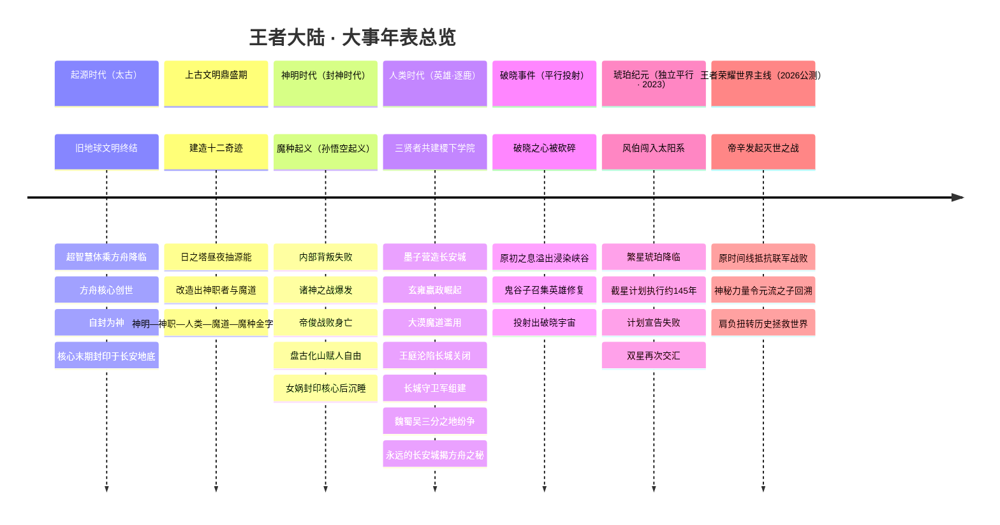
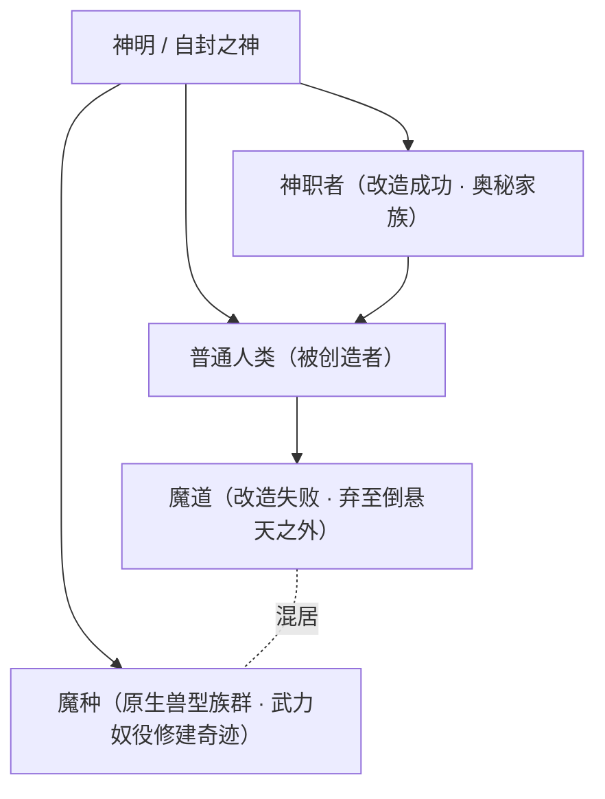
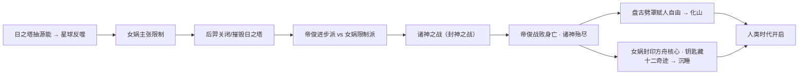
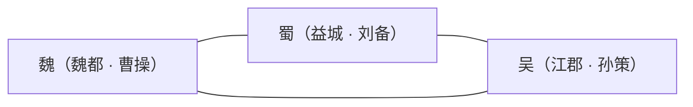
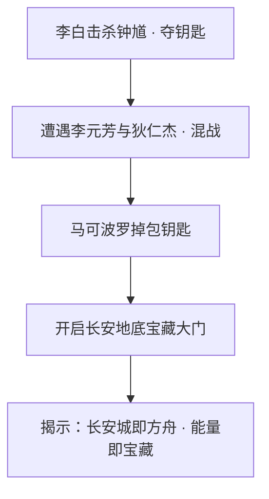
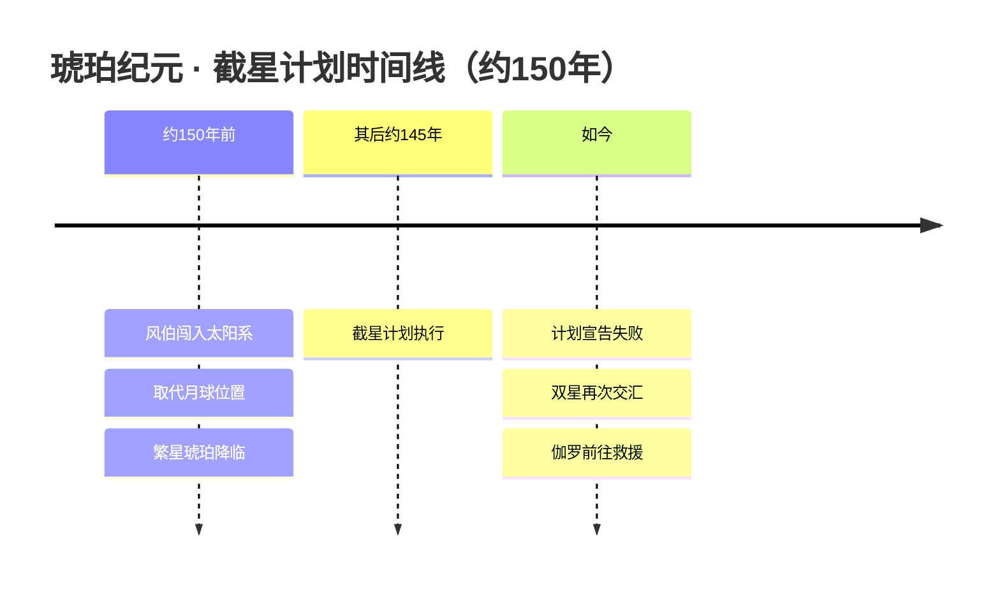
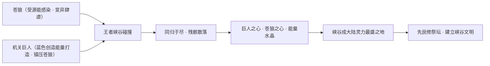

# 大事年表

> 本页以《王者荣耀》世界观骨架中的 `timeline` 为主轴，串联从**鸿蒙初辟**到**开放世界回溯**的全部关键节点，并补入与之直接相关的纪元与人物脉络。世界观由腾讯天美历时多年「边填坑边修订」而成，主干为**起源时代—神明时代—人类时代**三大阶段，破晓宇宙、琥珀纪元、《王者荣耀世界》主线则为分支或平行叙事。具体年数（如「神战约三千年后」）多为社区整合而非严格官方纪年，本页凡涉及推断处均以「(考据推测)」标注。

::: info 如何阅读这张年表
- **第一层（总览）**：用 Mermaid `timeline` 按纪元分组，速览全部事件。
- **第二层（速查表）**：一张详尽表格，逐条给出「起因—经过—结果」与涉及的阵营/人物。
- **第三层（叙事）**：对每个重大事件用 `##` 小节展开详述，并为相关人物、阵营加跨页链接。
- 主世界线（起源→神明→人类）与平行/分支线（破晓、琥珀、开放世界）请分别理解，二者并非严格线性承接。
:::

---

## 一、总览时间线（按纪元分组）

::: info 纪元命名差异
「起源 / 神明 / 人类」三时代是主干叫法；**封神时代、帝国时代、英雄逐鹿时代**为不同来源对人类时代各阶段的细分称呼；**先民时代 / 峡谷文明**则是聚焦王者峡谷的横切叙事（详见下文「峡谷文明」补注）。破晓宇宙、琥珀纪元与开放世界主线均为分支线。
:::

---

## 二、大事速查表（时期 · 事件 · 起因经过结果 · 涉及阵营人物）

| 时期 | 事件 | 起因 · 经过 · 结果（详） | 涉及阵营 / 人物 |
|---|---|---|---|
| 起源时代 | 旧地球终结 → 方舟降临 → 方舟核心创世 | **起因**：遥远未来的旧地球文明因科技失控而毁灭。**经过**：少数幸存者进化为超智慧生命体，携人类基因与文明能量乘方舟穿越深空，降临蔚蓝的王者大陆；以方舟核心（宇宙之心，内蕴红色毁灭能量与蓝色创造能量）为无限能源，创造新生人类并注入传奇英雄基因，凭力量自封为神。**结果**：神明文明奠基；起源时代末期，方舟核心被[女娲](../heroes/shanggu-shenhua.md#女娲)封印于长安城地底。 | 上古众神（[女娲](../heroes/shanggu-shenhua.md#女娲)、[盘古](../heroes/shanggu-shenhua.md#盘古)、帝俊等自封之神） |
| 上古文明鼎盛期 | 十二奇迹建造 + 等级金字塔成型 | **起因**：神明需以无限能源支撑横贯大陆的文明工程。**经过**：以方舟核心能量建造**十二奇迹**（以日之塔为代表），日之塔昼夜抽取地底源能；从人类中改造出神职者（成功者）、魔道家族（失败者，被弃至倒悬天之外），武力奴役原生魔种修建奇迹。**结果**：神明—神职者—人类—魔道—魔种的森严金字塔确立，辉煌之下矛盾在日之塔积累。 | 神明、神职者（奥秘家族）、[魔道·暗影·深渊](../factions/modao-shadow-abyss.md)、魔种 |
| 神明时代 | 魔种起义（孙悟空起义） | **起因**：诸神过度采集能量，污染了魔种的生存空间；受星球之血/源能感染的魔种觉醒自我意识。**经过**：[孙悟空](../heroes/shanggu-shenhua.md#孙悟空)带领[猪八戒](../heroes/shanggu-shenhua.md#猪八戒)、[牛魔](../heroes/shanggu-shenhua.md#牛魔)等魔种举旗反抗；因牛魔出卖等内部背叛，神明以元气炮轰营。**结果**：悟空被擒，起义失败。 | [上古众神·神话](../factions/shanggu-shenhua.md)（[孙悟空](../heroes/shanggu-shenhua.md#孙悟空)、[牛魔](../heroes/shanggu-shenhua.md#牛魔)、[猪八戒](../heroes/shanggu-shenhua.md#猪八戒)）、魔种 |
| 神明时代 | 诸神之战（封神之战） | **起因**：[女娲](../heroes/shanggu-shenhua.md#女娲)目睹星球反噬，主张限制超出承载力的发展，派[后羿](../heroes/shanggu-shenhua.md#后羿)关闭/摧毁受污染的日之塔；以[帝俊](../heroes/haojing-fengshen.md#帝俊)（帝辛/纣王体系）为首一派主张进步不应受任何束缚。**经过**：两派全面开战，神明死伤殆尽。**结果**：帝俊战败身亡；[盘古](../heroes/shanggu-shenhua.md#盘古)对人类生情、劈开束缚人类的保护罩赋予自由后化为山脉；女娲以最后力量封印方舟核心、将解封钥匙分藏十二奇迹后沉睡。其具象叙事即封神之战。 | [上古众神·神话](../factions/shanggu-shenhua.md)、[镐京·封神](../factions/haojing-fengshen.md)（[帝俊](../heroes/haojing-fengshen.md#帝俊)、[姜子牙](../heroes/haojing-fengshen.md#姜子牙)、[妲己](../heroes/haojing-fengshen.md#妲己)、[杨戬](../heroes/haojing-fengshen.md#杨戬)、[哪吒](../heroes/haojing-fengshen.md#哪吒)） |
| 人类时代 | 三贤者共建稷下学院 | **起因**：神明陨落退场后，人类自主发展文明，亟需智慧与人才中心。**经过**：[老夫子](../heroes/jixia.md#老夫子)（曾为神职者、三贤者之首、大陆第一强者）、[墨子](../heroes/mojia-jiguan.md#墨子)、[庄周](../heroes/penglai-donghai.md#庄周)三位大师于逐鹿地区共建稷下学院。**结果**：分授武道学、魔导学、机关学，稷下成为大陆智慧与人才中心。 | [稷下学院](../factions/jixia.md)（[老夫子](../heroes/jixia.md#老夫子)）、[墨家机关城·天工坊](../factions/mojia-jiguan.md)（[墨子](../heroes/mojia-jiguan.md#墨子)）、[庄周](../heroes/penglai-donghai.md#庄周) |
| 人类时代 | 长安城建立 | **起因**：帝国需要核心都城与能量枢纽。**经过**：机关大师[墨子](../heroes/mojia-jiguan.md#墨子)营造长安城；其本质是封印的方舟，地底封存方舟核心能量。**结果**：长安成为帝国核心都城，也是后世围绕方舟能量争夺的焦点。 | [长安城](../factions/changan.md)、[墨家机关城·天工坊](../factions/mojia-jiguan.md) |
| 人类时代 | 玄雍崛起为帝国 | **起因**：贫瘠的玄雍需图强。**经过**：少年君主[嬴政](../heroes/changan.md#嬴政)赴稷下求学引才，推行立法改革与军事整顿，修大坝、筑驰道、设六曲制度。**结果**：玄雍发展为与长安并列的两大帝国之一。 | [长安城](../factions/changan.md)（[嬴政](../heroes/changan.md#嬴政)、[白起](../heroes/jixia.md#白起)）、玄雍 |
| 人类时代（黑暗时代） | 大漠魔道滥用 → 王庭沦陷 → 长城关闭与守卫军组建 | **起因**：大漠绿洲统治者经不住魔道诱惑，滥用力量制造强大魔种。**经过**：王庭、都护府沦陷，唐国军队退却，长城关隘紧闭。**结果**：帝国出于包容，[长城守卫军](../factions/changcheng.md)吸纳魔种混血、异乡人、屯田军后裔乃至女性等有才之人，历任统帅为[苏烈](../heroes/changcheng.md#苏烈)、[李信](../heroes/changan.md#李信)。 | [长城守卫军](../factions/changcheng.md)（[苏烈](../heroes/changcheng.md#苏烈)、[百里守约](../heroes/changcheng.md#百里守约)、[百里玄策](../heroes/changcheng.md#百里玄策)、[盾山](../heroes/changcheng.md#盾山)）、[李信](../heroes/changan.md#李信) |
| 人类时代 | 魏蜀吴三分之地纷争 | **起因**：群雄逐鹿，三方割据。**经过**：魏（魏都/[曹操](../heroes/sanfen-wei.md#曹操)）、蜀（益城/[刘备](../heroes/sanfen-shu.md#刘备)）、吴（江郡/[孙策](../heroes/sanfen-wu.md#孙策)）三国攻伐不断。**结果**：构成群雄逐鹿的重要篇章；蜀国是英雄数量最多的阵营。 | [魏国](../factions/sanfen-wei.md)、[蜀国](../factions/sanfen-shu.md)、[吴国](../factions/sanfen-wu.md) |
| 破晓事件前夕 | 《永远的长安城》揭示方舟之秘 | **起因**：长安地底宝藏（即方舟能量）引各方觊觎。**经过**：[李白](../heroes/changan.md#李白)击杀守护者[钟馗](../heroes/changan.md#钟馗)夺宝藏钥匙，遭遇[李元芳](../heroes/changan.md#李元芳)与[狄仁杰](../heroes/changan.md#狄仁杰)；混战中钥匙被[马可波罗](../heroes/jianghu-xiake.md#马可波罗)掉包。**结果**：马可波罗开启长安地底宝藏大门，揭示长安城即方舟、方舟能量即地底宝藏的核心设定。 | [长安城](../factions/changan.md)（[李白](../heroes/changan.md#李白)、[钟馗](../heroes/changan.md#钟馗)、[狄仁杰](../heroes/changan.md#狄仁杰)、[李元芳](../heroes/changan.md#李元芳)）、[江湖侠客](../factions/jianghu-xiake.md)（[马可波罗](../heroes/jianghu-xiake.md#马可波罗)） |
| 破晓事件 | 破晓之心被砍碎 → 原初之息溢出 | **起因**：**明世隐**谋划，意图打开通往异界的裂隙。**经过**：[花木兰](../heroes/changan.md#花木兰)砍碎上古奇迹宝石破晓之心，裂隙打开、原初之息浸染峡谷引发野兽异变；[鬼谷子](../heroes/jixia.md#鬼谷子)号召[上官婉儿](../heroes/changan.md#上官婉儿)、[程咬金](../heroes/changan.md#程咬金)、[司空震](../heroes/changan.md#司空震)等集结守卫，以秘法修复。**结果**：破晓之心修复；砍碎瞬间在平行时空投射出破晓宇宙，衍生《星之破晓》。 | [长安城](../factions/changan.md)（[花木兰](../heroes/changan.md#花木兰)、[上官婉儿](../heroes/changan.md#上官婉儿)、[程咬金](../heroes/changan.md#程咬金)、[司空震](../heroes/changan.md#司空震)）、[稷下学院](../factions/jixia.md)（[鬼谷子](../heroes/jixia.md#鬼谷子)） |
| 平行世界（2023推出） | 琥珀纪元：截星计划失败 | **起因**：约150年前流浪行星风伯闯入太阳系直奔地球，取代月球位置带来灾难，也带来神秘物质繁星琥珀。**经过**：人类制定执行截星计划拦截风伯，历时约145年。**结果**：计划宣告失败；如今双星再次交汇，[伽罗](../heroes/changcheng.md#伽罗)（截星计划负责人/首席科学家）冒险前往救援。与刘慈欣深度共创。 | [伽罗](../heroes/changcheng.md#伽罗)、[铠](../heroes/changan.md#铠)、[马超](../heroes/sanfen-shu.md#马超)（皮肤世界观） |
| 开放世界主线（2026年4月公测） | 《王者荣耀世界》序章：灭世之战与时空回溯 | **起因**：反派领袖[帝辛（即帝俊）](../heroes/haojing-fengshen.md#帝俊)（帝俊/纣王体系）发起席卷诸界的灭世之战。**经过**：原时间线中抵抗联军战败、世界濒临毁灭；一股跨越时空的神秘力量使[元流之子](../heroes/yuanchu-shenhua-misc.md#元流之子)回溯到战争爆发关键节点之前。**结果**：元流之子肩负通过关键抉择扭转历史、拯救世界的使命，逐步揭示方舟核心、魔种入侵等宏大叙事。 | [上古遗族 / 神话杂项与多职业](../factions/yuanchu-shenhua-misc.md)（[元流之子](../heroes/yuanchu-shenhua-misc.md#元流之子)）、[镐京·封神](../factions/haojing-fengshen.md)（帝辛/[帝俊](../heroes/haojing-fengshen.md#帝俊)） |

---

## 三、重大事件叙事详述

### 旧地球文明终结 → 超智慧体乘方舟降临 → 方舟核心创世

这是整座世界观最底层的「史前史」，也是科幻设定与东方神话的交汇起点。

在遥不可及的未来，旧地球文明因科技失控而走向终结。少数幸存者并未灭亡，而是**进化为超智慧生命体**，携带着人类基因与文明能量，乘**方舟（Ark）**——一艘巨型移民飞船——穿越深空，最终降临在一颗蔚蓝色的星球上，这便是后世所称的**王者大陆**。

降临者并非天生神祇，而是凭借远超原住民的力量与智慧，**自封为神**。他们启用方舟的能源核心——**方舟核心（宇宙之心，Ark Core）**作为无限能源。这枚核心内部孕育着两股原始力量：

红色能量 · 毁灭与深渊、暗影、污染相互呼应，是末日的一极。

蓝色能量 · 创造神明依此创造生命、建造奇迹，是创世的一极。

神明以方舟核心创造了新生人类，并将「传奇英雄基因」注入其中——这为后世人类时代群雄迭起埋下伏笔。然而创世的代价深埋地底：他们建造横贯大陆的奇迹，竭泽而渔地抽取星球的源能。起源时代末期，方舟核心被[女娲](../heroes/shanggu-shenhua.md#女娲)封印于长安城地底——这一封印将在数千年后被《永远的长安城》重新揭开。

::: info 红蓝母题贯穿全局
方舟核心「红毁灭、蓝创造」的双色母题，是世界观反复回响的设计语言。后世琥珀纪元的红蓝琥珀配色、峡谷中苍狼与机关巨人的对决，皆可视作这一母题的延续。详见 [世界观总览](overview.md)、[核心概念与术语词典](concepts.md) 与专题 [神魔之争](../topics/gods-vs-demons.md)。
:::

::: quote 旁白（考据推测）
「我们曾是逃亡者，却以神之名重新书写了一颗星球的命运。只是没有人告诉我们——星球，也会记仇。」
（此句为依据「起源时代」设定意涵的推测性旁白，非官方原文。）
:::

---

### 十二奇迹建造与等级体系成型

神明文明的辉煌阶段，也是矛盾的孕育期。

为支撑横贯大陆的庞大文明工程，神明以方舟核心能量建造了**十二奇迹（Twelve Miracles）**，它们是文明的能量与权力支柱。其中最具代表性者为**日之塔**——它昼夜不停地抽取王者大陆地底的源能（星球之血），为新文明提供动力。这种竭泽而渔式的开采，正是日后星球反噬、诸神之战与文明崩塌的祸根。

与此同时，神明从人类中选拔进行身体改造，由此分化出两个截然不同的阶层，并将原生族群一并纳入一座森严的金字塔：

- **[神职者](../factions/changan.md)（奥秘家族）**：改造成功者，力量强大、位居众人之上、为神明效力。诸神之战后反叛的十一家族夺取奇迹之力却遭诅咒，演化为分布各地的奥秘/神职家族（如月之家族、塔之家族），构成贵族政治网络。
- **[魔道家族](../factions/modao-shadow-abyss.md)**：改造失败者，被弃置抛弃到**倒悬天**之外，与魔种、普通人混居。血脉中流动着改造残留的神秘力量——「魔道」是一门由定义世界本源的知识与法则驱动、经媒介触发转化为力量的神秘学问，取代旧地球燃料成为改造世界的动力源。这是一支「因罪而得力量」的悲情血脉。
- **魔种**：王者大陆的原住民（兽型生物、苍狼血脉等），被神明蔑称为「低贱魔种」，以武力奴役修建奇迹。

辉煌之下，矛盾在日之塔的阴影里悄然积累。

::: warning 竭泽而渔的祸根
日之塔的源能开采看似为文明续命，实则透支了星球本身。当源能/星球之血被过度抽取，受感染的魔种将觉醒自我意识——这正是下一纪元「魔种起义」的导火索。
:::

---

### 魔种起义（孙悟空起义）

神明时代的第一声惊雷，来自被压迫者的觉醒。

诸神过度采集能量，污染了魔种赖以生存的空间；而受**星球之血/源能**感染的魔种，逐渐觉醒了自我意识。在[孙悟空](../heroes/shanggu-shenhua.md#孙悟空)的带领下，[猪八戒](../heroes/shanggu-shenhua.md#猪八戒)、[牛魔](../heroes/shanggu-shenhua.md#牛魔)等魔种举旗起义，反抗神明的奴役。

这场起义本有声势，却因**内部背叛**而功败垂成——据设定，[牛魔](../heroes/shanggu-shenhua.md#牛魔)的出卖使神明得以以「元气炮」轰击起义军营地，[孙悟空](../heroes/shanggu-shenhua.md#孙悟空)被擒，起义失败。

::: quote 齐天大圣 · 孙悟空（考据推测）
「这天，我曾想掀翻它；这地，我曾想踏碎它。纵使被擒，我也要让神明记住——魔种，也有不肯下跪的脊梁。」
（依据孙悟空「齐天大圣」反抗者形象与起义叙事的推测性台词，非官方逐字原文。）
:::

这场失败的起义，是「被压迫—觉醒—反抗」叙事的第一章。它并未撼动神明的统治，却在诸神内部投下了一道阴影：连被视作「低贱者」的魔种都已觉醒，星球的反噬还会远吗？这一疑问，直接引向了神明阵营内部的理念决裂。

::: info 延伸阅读
魔种、魔道与神明的等级压迫脉络，详见专题 [神魔之争](../topics/gods-vs-demons.md) 与阵营页 [魔道·暗影·深渊](../factions/modao-shadow-abyss.md)；起义的核心人物，详见 [孙悟空](../heroes/shanggu-shenhua.md#孙悟空)、[牛魔](../heroes/shanggu-shenhua.md#牛魔)。
:::

---

### 诸神之战（封神之战）

神明时代矛盾的总爆发，也是整座神明文明的终章。

魔种起义的余波，与日之塔竭泽而渔的恶果叠加，让诸神就「文明该不该有边界」彻底分裂为两派：

| 阵营 | 主张 | 核心人物 | 关键行动 |
|---|---|---|---|
| 限制派 | 发展不应超出星球承载力，须限制能量开采 | [女娲](../heroes/shanggu-shenhua.md#女娲)、[后羿](../heroes/shanggu-shenhua.md#后羿) | 女娲派后羿关闭/摧毁受污染的日之塔 |
| 进步派 | 进步不应受任何束缚 | [帝俊](../heroes/haojing-fengshen.md#帝俊)（帝辛/纣王体系） | 全面对抗限制派 |

当[后羿](../heroes/shanggu-shenhua.md#后羿)奉[女娲](../heroes/shanggu-shenhua.md#女娲)之命摧毁日之塔，进步派与限制派的全面战争就此引爆。这便是**诸神之战**——其在人间的具象叙事，即以纣王、[姜子牙](../heroes/haojing-fengshen.md#姜子牙)、[妲己](../heroes/haojing-fengshen.md#妲己)、[杨戬](../heroes/haojing-fengshen.md#杨戬)、[哪吒](../heroes/haojing-fengshen.md#哪吒)为核心的**封神之战**（以《封神演义》为原型）。

战争的结局是惨烈的全员陨落：

- [帝俊](../heroes/haojing-fengshen.md#帝俊)战败身亡，诸神死伤殆尽；
- [盘古](../heroes/shanggu-shenhua.md#盘古)对人类生出真情，**劈开束缚人类的保护罩、赋予他们自由后，化为山脉**——以神之躯成为大地的脊梁；
- [女娲](../heroes/shanggu-shenhua.md#女娲)以最后的力量封印方舟核心，将**解封钥匙分藏于十二奇迹**之中，随后沉睡。

::: quote 补天之神 · 女娲（考据推测）
「我封住的不是力量，是诱惑。钥匙散入十二奇迹——若有一日人类强大到能重新聚齐它们，愿那时的你们，已懂得何为节制。」
（依据女娲封印方舟核心、分藏钥匙的设定推测，非官方原文。）
:::

::: info 帝俊 = 帝辛 = 纣王？
本世界观骨架按「[帝俊](../heroes/haojing-fengshen.md#帝俊) = 帝辛 = 纣王体系」处理，作为封神反派天帝。需注意：游戏中[东皇太一](../heroes/jixia.md#东皇太一)是否为帝俊化身亦有此说，但东皇太一作为独立可玩英雄按独立处理。各报告对帝俊与纣王/帝辛的关系表述存在「同一神祇不同名相 vs 不同角色」的分歧，此处采兼容处理。(考据推测)
:::

诸神之战是世界观的**枢纽事件**：它终结了神明统治，开启了人类自主发展的纪元，并把方舟核心这枚「创世神器兼末日开关」深埋为后世一切争夺的终极悬念。

::: info 延伸阅读
诸神之战在人间的具象演绎，详见专题 [封神演义在王者](../topics/fengshen.md)；其「神 vs 魔、限制 vs 进步」的母题脉络，详见 [神魔之争](../topics/gods-vs-demons.md)。神明序列与上古十大正神，参见 [核心概念与术语词典](concepts.md)。
:::

---

### 三贤者共建稷下学院

神明陨落、人类登台后的第一座文明丰碑。

神战约三千年后（具体年数为社区整合，非严格纪年），人类需要一个汇聚智慧与人才的中心。三位大师在逐鹿地区共建了**[稷下学院](../factions/jixia.md)**：

- [老夫子](../heroes/jixia.md#老夫子)——曾为神职者、三贤者之首、号称大陆第一强者；
- [墨子](../heroes/mojia-jiguan.md#墨子)——机关大师，[墨家机关城·天工坊](../factions/mojia-jiguan.md)一脉之源；
- [庄周](../heroes/penglai-donghai.md#庄周)——南华真仙，逍遥之道的代表。

学院分授**武道学、魔导学、机关学**三门，成为大陆智慧与人才的核心。后世许多英雄（如[钟无艳](../heroes/jixia.md#钟无艳)、[孙膑](../heroes/jixia.md#孙膑)等）皆与稷下渊源深厚；在开放世界《王者荣耀世界》主线中，稷下更以「最高学堂」为幕间章节，其顶部的**通天塔**由稷下奇迹**云蚕**吐丝构建而成，象征意义上被赋予「时间灯塔」的隐喻。

::: tip 稷下与开放世界的呼应
通天塔之下，武道、魔道、机关三大学院环绕而建，恰是「武道学、魔导学、机关学」三学的具象空间化。从人类时代的稷下，到开放世界的通天塔，是同一文明母题在不同叙事层的延展。
:::

---

### 长安城建立

一座都城，一艘沉睡的方舟。

机关大师[墨子](../heroes/mojia-jiguan.md#墨子)营造了**[长安城](../factions/changan.md)**。其惊人的真相在于——**长安城的本质即是封印的方舟**，地底封存着方舟核心的能量。这意味着，自起源时代末期女娲将核心封印于此起，长安便一直是世界观能量体系最敏感的「禁地」。

长安成为帝国核心都城，汇聚了从[亚瑟](../heroes/changan.md#亚瑟)、[武则天](../heroes/changan.md#武则天)、[李白](../heroes/changan.md#李白)到[狄仁杰](../heroes/changan.md#狄仁杰)等众多英雄；也正因地底深藏方舟能量，它注定成为后世各方势力争夺的焦点——这一悬念在《永远的长安城》中被彻底引爆。

::: info 长安 = 方舟 的双重身份
地表是繁华帝都，地底是封印的方舟与宇宙之心。这种「城市即神器」的设定，使长安城在世界观中兼具政治中枢与终极麦高芬（MacGuffin）的双重分量。
:::

::: info 延伸阅读
方舟、方舟核心、十二奇迹等「神器」体系，详见专题 [神兵·名剑·信物](../topics/artifacts.md) 与 [核心概念与术语词典](concepts.md)；长安城的英雄群像与势力网络，详见阵营页 [长安城](../factions/changan.md)。
:::

---

### 玄雍崛起为帝国

一段「弱国图强」的帝国史诗。

少年君主[嬴政](../heroes/changan.md#嬴政)赴稷下学院求学、招揽人才，归国后推行立法改革与军事整顿，修大坝、筑驰道、设六曲制度。在他的经营下，原本贫瘠的**玄雍**（秦地原型）一跃发展为与长安并列的**两大帝国之一**。

::: info 玄雍阵营的处理
玄雍在部分报告中曾作为独立阵营列出，但其代表英雄[嬴政](../heroes/changan.md#嬴政)、[白起](../heroes/jixia.md#白起)在世界观中深度绑定长安/稷下/封神，且玄雍英雄稀少，故本骨架未单建 faction：嬴政归[长安城](../factions/changan.md)、白起归[稷下学院](../factions/jixia.md)，玄雍背景在纪元与关系网中保留。
:::

---

### 大漠魔道滥用 → 王庭沦陷 → 长城关闭与守卫军组建

人类时代的「黑暗时代」，也是一支多元包容之师的诞生记。

大漠绿洲的统治者经不住**魔道**的诱惑，滥用力量制造出强大的魔种。失控的后果是灾难性的：**王庭、都护府相继沦陷**，唐国军队节节退却，最终不得不**紧闭长城关隘**，将魔种之祸阻于关外。

然而帝国并未因恐惧而封闭。出于包容，**[长城守卫军](../factions/changcheng.md)**广纳天下有才之人——其中包括魔种混血、异乡人、屯田军后裔，乃至在当时罕见地接纳女性。历任统帅为[苏烈](../heroes/changcheng.md#苏烈)与[李信](../heroes/changan.md#李信)，麾下汇聚了[百里守约](../heroes/changcheng.md#百里守约)、[百里玄策](../heroes/changcheng.md#百里玄策)、[盾山](../heroes/changcheng.md#盾山)等英雄。

::: quote 不屈铁壁 · 苏烈（考据推测）
「长城之内，不问你来自何方、流着谁的血——只问你愿不愿与我同守这道墙。」
（依据长城守卫军「包容广纳」的组建理念推测，非官方逐字原文。）
:::

::: info 花木兰的归属
[花木兰](../heroes/changan.md#花木兰)是长城守卫军女将（长城小队队长），但长居长安体系、于长安活动。本骨架将其主条目置于[长安城](../factions/changan.md)，长城守卫军身份通过关系网体现。
:::

长城守卫军的存在，体现了人类时代「以包容对抗黑暗」的精神底色，与神明时代「以等级压迫魔种」形成鲜明对照。

---

### 魏蜀吴三分之地纷争

群雄逐鹿中，最为读者熟悉的一段割据史。

在人类时代的版图上，**[魏](../factions/sanfen-wei.md)（魏都/[曹操](../heroes/sanfen-wei.md#曹操)）、[蜀](../factions/sanfen-shu.md)（益城/[刘备](../heroes/sanfen-shu.md#刘备)）、[吴](../factions/sanfen-wu.md)（江郡/[孙策](../heroes/sanfen-wu.md#孙策)）** 三国割据「三分之地」，攻伐不断，构成群雄逐鹿的重要篇章。

| 国 | 都城 | 代表君主/统帅 | 代表英雄 |
|---|---|---|---|
| 魏 | 魏都 | [曹操](../heroes/sanfen-wei.md#曹操) | [典韦](../heroes/sanfen-wei.md#典韦)、[夏侯惇](../heroes/sanfen-wei.md#夏侯惇)、[司马懿](../heroes/sanfen-wei.md#司马懿)、[甄姬](../heroes/sanfen-wei.md#甄姬)、[蔡文姬](../heroes/sanfen-wei.md#蔡文姬) |
| 蜀 | 益城 | [刘备](../heroes/sanfen-shu.md#刘备) | [关羽](../heroes/sanfen-shu.md#关羽)、[赵云](../heroes/sanfen-shu.md#赵云)、[张飞](../heroes/sanfen-shu.md#张飞)、[诸葛亮](../heroes/sanfen-shu.md#诸葛亮)、[黄忠](../heroes/sanfen-shu.md#黄忠) |
| 吴 | 江郡 | [孙策](../heroes/sanfen-wu.md#孙策) | [周瑜](../heroes/sanfen-wu.md#周瑜)、[小乔](../heroes/sanfen-wu.md#小乔)、[大乔](../heroes/sanfen-wu.md#大乔)、[孙尚香](../heroes/sanfen-wu.md#孙尚香) |

::: info 蜀国是英雄最多的阵营
在本骨架的归类中，[蜀国](../factions/sanfen-shu.md)是英雄数量最多的阵营。史实吴国群将（黄盖、周泰、太史慈、甘宁）在三国系列中存在，但报告未给出称号/背景，故未单建条目。(考据备注)
:::

::: info 延伸阅读
三分之地与《三国演义》原型的对照，详见专题 [三分之地与三国演义](../topics/three-kingdoms.md)；阵营全貌见 [魏国](../factions/sanfen-wei.md) · [蜀国](../factions/sanfen-shu.md) · [吴国](../factions/sanfen-wu.md)。
:::

---

### 《永远的长安城》揭示方舟之秘

主线悬念的「揭盖时刻」——长安城真面目首次被揭开。

围绕长安地底宝藏（即方舟能量），各方势力觊觎已久。在《永远的长安城》这一关键叙事中：

1. [李白](../heroes/changan.md#李白)击杀守护者[钟馗](../heroes/changan.md#钟馗)，夺得宝藏钥匙；
2. 途中遭遇[李元芳](../heroes/changan.md#李元芳)与[狄仁杰](../heroes/changan.md#狄仁杰)，混战爆发；
3. 混战之中，钥匙被[马可波罗](../heroes/jianghu-xiake.md#马可波罗)掉包；
4. [马可波罗](../heroes/jianghu-xiake.md#马可波罗)开启长安地底宝藏大门——**长安城即方舟、方舟能量即地底宝藏**的核心设定就此公之于世。

::: quote 青莲剑仙 · 李白（考据推测）
「我以为夺的是一城之宝，原来揭开的，是一座世界的底牌。」
（依据《永远的长安城》揭秘情节推测的旁白式台词，非官方原文。）
:::

这一事件把起源时代女娲「封印于长安地底」的伏笔正式接回主线，成为连接神话与当下的关键枢纽，也为后续围绕方舟核心的更大冲突拉开序幕。

---

### 破晓事件（破晓之心被砍碎、原初之息溢出）

主线之外的一次「裂隙」，催生出整个破晓宇宙。

在**明世隐**的谋划下（明世隐为主谋角色），[花木兰](../heroes/changan.md#花木兰)砍碎了上古奇迹宝石——**破晓之心**。这一击撕开了通往异界的裂隙，**原初之息**汹涌涌出，浸染王者峡谷，引发野兽异变。

危急之际，[鬼谷子](../heroes/jixia.md#鬼谷子)挺身而出，号召[花木兰](../heroes/changan.md#花木兰)、[上官婉儿](../heroes/changan.md#上官婉儿)、[程咬金](../heroes/changan.md#程咬金)、[司空震](../heroes/changan.md#司空震)等英雄集结守卫峡谷，并召唤新英雄降临，以秘法修复破晓之心。

而在破晓之心被砍碎的**那一瞬间**，原初之息使王者大陆在平行时空中投射出一个全新宇宙——**破晓宇宙**。动作手游《星之破晓》即取材于此：英雄们进入由自身意识构成的「暗心世界」，对抗内心的恐惧。

::: warning 破晓宇宙是平行叙事
破晓宇宙属于主线之外的平行叙事，与主世界线非严格线性承接。它与「原初之息」概念深度绑定——而原初之息正是源能/星球之血的另一种称呼，在开放世界中亦以「永恒黑夜降临峡谷」的形式回响。
:::

::: quote 纵横家 · 鬼谷子（考据推测）
「裂隙既开，恐惧便有了门。诸位，与我一同把这道门——重新关上。」
（依据鬼谷子号召集结、修复破晓之心的叙事推测，非官方原文。）
:::

::: info 延伸阅读
破晓宇宙与其他平行时空的关系，详见专题 [平行宇宙(破晓 · 琥珀 · 王者世界)](../topics/parallel-worlds.md)；破晓之心作为上古奇迹宝石，参见 [神兵·名剑·信物](../topics/artifacts.md) 与 [核心概念与术语词典](concepts.md)。
:::

---

### 琥珀纪元：截星计划失败

一段独立平行宇宙中的硬科幻悲歌，与刘慈欣深度共创。

**琥珀纪元**是《王者荣耀》首个平行世界系列皮肤世界观（2023 起推出），主题为「**熵增宇宙中，文明作为熵减过程的意义**」。

- 约**150 年前**，流浪行星**风伯**闯入太阳系，直奔地球，取代月球的位置，带来灾难——同时也带来神秘物质**繁星琥珀**，引发跨时代的科技突破；
- 人类制定并执行**截星计划**，意图拦截风伯，历时约**145 年**；
- 计划最终**宣告失败**；如今双星再次交汇，[伽罗](../heroes/changcheng.md#伽罗)（截星计划负责人/首席科学家）冒险前往救援。

代表英雄皮肤为[铠](../heroes/changan.md#铠)（琥珀）、[马超](../heroes/sanfen-shu.md#马超)（红）、[伽罗](../heroes/changcheng.md#伽罗)（蓝）。其**红蓝琥珀配色**正呼应方舟核心「红毁灭、蓝创造」的双能量母题——这是平行宇宙对主世界线母题的一次美学回响。

::: info 琥珀纪元是独立平行宇宙
琥珀纪元为独立平行宇宙，与主世界线非严格承接。它以皮肤世界观的形式存在，承载的是更偏硬科幻的「文明对抗熵增」主题。
:::

::: info 延伸阅读
琥珀纪元与破晓、《王者荣耀世界》并置的平行时空全景，详见专题 [平行宇宙(破晓 · 琥珀 · 王者世界)](../topics/parallel-worlds.md)；与刘慈欣等外部 IP 的联动脉络，详见 [联动宇宙](../topics/crossover.md)。
:::

---

### 《王者荣耀世界》序章：灭世之战与时空回溯

开放世界主线的开端，也是玩家以「主角」身份介入历史的起点。

在开放世界游戏《王者荣耀世界》（2026 年 4 月公测）中：

- 反派领袖[帝辛](../heroes/haojing-fengshen.md#帝俊)（即[帝俊](../heroes/haojing-fengshen.md#帝俊)/纣王体系，封神反派天帝）发起了一场席卷诸界的**灭世之战**；
- 在**原时间线**中，抵抗联军战败，世界濒临毁灭；
- 一股**跨越时空的神秘力量**，使主人公[元流之子](../heroes/yuanchu-shenhua-misc.md#元流之子)回溯到战争爆发的关键节点之前；
- [元流之子](../heroes/yuanchu-shenhua-misc.md#元流之子)由此肩负使命：**通过关键抉择扭转历史、拯救世界**，并在征程中逐步揭示方舟核心、魔种入侵等宏大叙事。

[元流之子](../heroes/yuanchu-shenhua-misc.md#元流之子)是首位**多职业自选英雄**，可在坦克、法师、射手、辅助、刺客等职业间切换（法师与坦克形态于 2024.6 上线，射手形态另有上线）。玩家正是以其身份进入开放世界，面对原初之息奔涌、永恒黑夜降临的新危机。

::: info 主线如何收束所有母题
《王者荣耀世界》主线把世界观的核心母题——**方舟核心、魔种入侵、帝俊/帝辛体系**——重新拢回一条主轴。它既是「神明时代诸神之战」的遥远回声（帝辛=帝俊），也是「人类时代长城魔种之祸」的放大版（席卷诸界的灭世之战）。
:::

::: quote 万象初源 · 元流之子（考据推测）
「历史已经写下了结局——而我，被赋予了重写它的笔。这一次，世界不会再输。」
（依据元流之子「回溯历史、扭转结局」的主线设定推测，非官方原文。）
:::

::: info 延伸阅读
《王者荣耀世界》在平行时空版图中的位置，详见专题 [平行宇宙(破晓 · 琥珀 · 王者世界)](../topics/parallel-worlds.md)；主角与上古遗族脉络，详见 [元流之子](../heroes/yuanchu-shenhua-misc.md#元流之子)；序章反派帝辛/帝俊体系，详见 [帝俊](../heroes/haojing-fengshen.md#帝俊) 与专题 [封神演义在王者](../topics/fengshen.md)。
:::

---

## 四、补注 · 先民时代与峡谷文明（横切叙事）

除上述纵向主轴外，世界观还有一条聚焦**王者峡谷**的横切叙事，作为 MOBA 主战场的世界观由来，时间上大致处于「英雄时代前夜」。

上古时期，两股能量造物在峡谷相遇：

- **苍狼**——上古能量造物，受源能感染变异而肆虐；
- **机关巨人**——诸神以**蓝色创造能量**打造、用以镇压苍狼的造物。

二者最终在王者峡谷碰撞、**同归于尽**，残骸散落孕育出**巨人之心、苍狼之心与能量水晶**，使峡谷成为大陆灵力最盛之地。先民发现这两股力量，在能量水晶上修筑祭坛、围绕其建立带独特信仰的**峡谷文明**，为英雄时代铺垫了舞台。

::: tip 为什么峡谷如此特殊
王者峡谷位于大陆中西部高原（云中漠地与勇士之地交界），浸润于苍狼与机关巨人遗迹的上古能量中，是大陆能量最集中之地——这正是 MOBA 主玩法落在此处的世界观依据。苍狼与机关巨人的「红/变异 vs 蓝/创造」对决，亦是方舟核心红蓝母题的又一次具象。
:::

::: info 延伸阅读
王者峡谷的成因与峡谷文明，详见专题 [王者峡谷的由来](../topics/canyon.md)；其地理坐标与周边区域，详见 [王者大陆 · 地理图志](map.md)。
:::

---

## 五、相关页面索引

<a class="hok-card" href="map">纪元与宇宙观（本页姊妹篇，按纪元逐层详述）</a>
<a class="hok-card" href="../factions/modao-shadow-abyss">核心阵营</a>
<a class="hok-card" href="../factions/sanfen-wu">三分之地</a>
<a class="hok-card" href="../topics/crossover">专题深读</a>
<a class="hok-card" href="../heroes/yuanchu-shenhua-misc#元流之子">关键人物</a>

::: warning 考据与存疑说明
本页年表的纵向顺序遵循世界观主干（起源→神明→人类）；破晓宇宙、琥珀纪元、《王者荣耀世界》主线为分支/平行叙事，不应强行并入单一线性纪年。「神战约三千年后」等年数为社区整合非严格官方纪年；帝俊/帝辛/纣王关系、东皇太一是否为帝俊化身等存在分歧处，已在正文以 `note` 与「(考据推测)」标注。官方长期边填坑边修订，最终硬设定请以官方世界观体验站为准。
:::